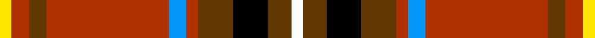

In pattern [WGKGRBRGRY](/stripes/wgkgrbrgry/).

This was sourced from register-of-tartans.  It is a [10 stripe tartan](/stripes/stripes10/).

Original link https://www.tartanregister.gov.uk/tartanDetails.aspx?ref=11491

## Register references

External register numbers recorded for this tartan.

- Scottish Register of Tartans: [11491](https://www.tartanregister.gov.uk/tartanDetails.aspx?ref=11491)

## Thread count
Y/4 R6 T6 R42 B6 R4 T12 K12 T8 W/4

## Palette
Each colour and the base-6 reference it is a variant of.

| Colour | Shade | Base |
|---|---|---|
| B | <code style="background-color:#0596FA;">#0596FA</code> `oklch(66.0% 0.180 248.9)` <small>#0596FA</small> | B <code style="background-color:#2A418A;">#2A418A</code> |
| K | <code style="background-color:#000000;">#000000</code> `oklch(0.0% 0.000 0.0)` <small>#000000</small> | K <code style="background-color:#000000;">#000000</code> |
| R | <code style="background-color:#B03000;">#B03000</code> `oklch(50.3% 0.171 36.3)` <small>#B03000</small> | R <code style="background-color:#CC0000;">#CC0000</code> |
| T | <code style="background-color:#603800;">#603800</code> `oklch(38.1% 0.084 66.7)` <small>#603800</small> | G <code style="background-color:#006100;">#006100</code> |
| W | <code style="background-color:#FFFFFF;">#FFFFFF</code> `oklch(100.0% 0.000 89.9)` <small>#FFFFFF</small> | W <code style="background-color:#F7F7F7;">#F7F7F7</code> |
| Y | <code style="background-color:#FFE600;">#FFE600</code> `oklch(91.7% 0.192 101.4)` <small>#FFE600</small> | Y <code style="background-color:#F2BF00;">#F2BF00</code> |

## Nearest tartans

The nearest existing variants by ΔTartan distance, with this tartan at the top so the swatches line up against it.

ΔTartan

Tartan

Sett

—

<a href="/ttd/edit/#slug=w2dy4k6dy6r2b3r21dy3r3ly2~x2">Hello Kitty Red</a> <a class="nn-out" href="/setts/s10/w2dy4k6dy6r2b3r21dy3r3ly2~x2/" title="open its dictionary page">↗</a>

0.68

<a href="/ttd/edit/#slug=r13y1k3ly1dg4r1k2y1w1~x4">Gillespie</a> <a class="nn-out" href="/setts/s9/r13y1k3ly1dg4r1k2y1w1~x4/" title="open its dictionary page">↗</a>

0.73

<a href="/ttd/edit/#slug=w2k1b2lb1dg4r1dg4r3k3r12lb1r2k1~x4">Peacock (Personal)</a> <a class="nn-out" href="/setts/s13/w2k1b2lb1dg4r1dg4r3k3r12lb1r2k1~x4/" title="open its dictionary page">↗</a>

0.73

<a href="/ttd/edit/#slug=r3db1r1db2r12b1r1k4w1dg6r1~x4">McLinden, Thomas (Personal)</a> <a class="nn-out" href="/setts/s11/r3db1r1db2r12b1r1k4w1dg6r1~x4/" title="open its dictionary page">↗</a>

0.73

<a href="/ttd/edit/#slug=r13t1k3ly1g4r1k2t1w1~x4">Gillespie</a> <a class="nn-out" href="/setts/s9/r13t1k3ly1g4r1k2t1w1~x4/" title="open its dictionary page">↗</a>

0.93

<a href="/ttd/edit/#slug=w1k1r8g1r1db8r1g8r1db1r8k1ly1~x6">Robieson (Name)</a> <a class="nn-out" href="/setts/s13/w1k1r8g1r1db8r1g8r1db1r8k1ly1~x6/" title="open its dictionary page">↗</a>

0.94

<a href="/ttd/edit/#slug=k2t6w1r14k1r14w1k6dg10lo1dg2lo2~x2">Ogg of Tarragann</a> <a class="nn-out" href="/setts/s12/k2t6w1r14k1r14w1k6dg10lo1dg2lo2~x2/" title="open its dictionary page">↗</a>

0.95

<a href="/ttd/edit/#slug=k2t6w1r14k1r14w1k6g10lo1g2lo2~x2">Ogg of Tarragann (Personal)</a> <a class="nn-out" href="/setts/s12/k2t6w1r14k1r14w1k6g10lo1g2lo2~x2/" title="open its dictionary page">↗</a>

0.98

<a href="/ttd/edit/#slug=w1k1r8dg1r1k8r1dg8r1k1r8k1ly1~x6">Robieson</a> <a class="nn-out" href="/setts/s13/w1k1r8dg1r1k8r1dg8r1k1r8k1ly1~x6/" title="open its dictionary page">↗</a>

1.05

<a href="/ttd/edit/#slug=r3lo15g4dt6w2r30dt6ly3~x2">Round Table Sweden</a> <a class="nn-out" href="/setts/s8/r3lo15g4dt6w2r30dt6ly3~x2/" title="open its dictionary page">↗</a>

1.06

<a href="/ttd/edit/#slug=lo7k3db4k3r21k2r4k2w4~x2">Castle Stewart (District)</a> <a class="nn-out" href="/setts/s9/lo7k3db4k3r21k2r4k2w4~x2/" title="open its dictionary page">↗</a>

## Neighbour map

Every grey dot is one of 14299 variants placed by the first two principal components of the ΔTartan feature space (44% of its variance). Red is this tartan; blue dots are its nearest — click one to open its page.

<svg viewBox="0 0 640 380" role="img" style="max-width:100%;height:auto;border:1px solid #e0e0e0;border-radius:4px;display:block" xmlns="http://www.w3.org/2000/svg"><image href="/nn/cloud.v1.png" width="640" height="380"/><a href="/setts/s9/r13y1k3ly1dg4r1k2y1w1~x4/"><circle cx="247.7" cy="104.9" r="4" fill="#3465a4"><title>Gillespie</title></circle></a><a href="/setts/s13/w2k1b2lb1dg4r1dg4r3k3r12lb1r2k1~x4/"><circle cx="200.6" cy="106.1" r="4" fill="#3465a4"><title>Peacock (Personal)</title></circle></a><a href="/setts/s11/r3db1r1db2r12b1r1k4w1dg6r1~x4/"><circle cx="249.0" cy="107.5" r="4" fill="#3465a4"><title>McLinden, Thomas (Personal)</title></circle></a><a href="/setts/s9/r13t1k3ly1g4r1k2t1w1~x4/"><circle cx="232.7" cy="100.2" r="4" fill="#3465a4"><title>Gillespie</title></circle></a><a href="/setts/s13/w1k1r8g1r1db8r1g8r1db1r8k1ly1~x6/"><circle cx="190.3" cy="126.2" r="4" fill="#3465a4"><title>Robieson (Name)</title></circle></a><a href="/setts/s12/k2t6w1r14k1r14w1k6dg10lo1dg2lo2~x2/"><circle cx="201.9" cy="113.0" r="4" fill="#3465a4"><title>Ogg of Tarragann</title></circle></a><a href="/setts/s12/k2t6w1r14k1r14w1k6g10lo1g2lo2~x2/"><circle cx="203.3" cy="112.6" r="4" fill="#3465a4"><title>Ogg of Tarragann (Personal)</title></circle></a><a href="/setts/s13/w1k1r8dg1r1k8r1dg8r1k1r8k1ly1~x6/"><circle cx="167.4" cy="111.2" r="4" fill="#3465a4"><title>Robieson</title></circle></a><a href="/setts/s8/r3lo15g4dt6w2r30dt6ly3~x2/"><circle cx="230.2" cy="120.1" r="4" fill="#3465a4"><title>Round Table Sweden</title></circle></a><a href="/setts/s9/lo7k3db4k3r21k2r4k2w4~x2/"><circle cx="238.4" cy="145.9" r="4" fill="#3465a4"><title>Castle Stewart (District)</title></circle></a><circle cx="216.3" cy="119.5" r="5" fill="#c00000"/></svg>

ID: /setts/s10/w2dy4k6dy6r2b3r21dy3r3ly2~x2/
