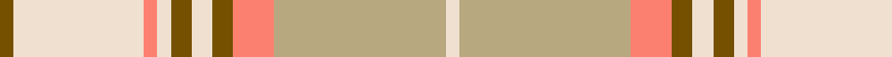

**Bands:** [GWYWGWGYYW](/stripes/gwywgwgyyw/) · **Stripes:** [Y W LR W Y W Y LR LY W](/stripes/stripes10/) Y W LR W Y W Y LR LY W

This was sourced from tartans-authority.  It is a [10 band tartan](/bands/bands10/).

Original link http://www.tartansauthority.com/tartan-ferret/display/8165/

## Thread count
T/4 W38 LR4 W4 T6 W6 T6 LR12 LG50 W/4

## Palette
Each colour and its ΔE from the base-6 reference it is a variant of.

| Colour | Shade | Base | ΔE (OKLab) |
|---|---|---|---|
| LG | <code style="background-color:#B8A880;">#B8A880</code> `#B8A880` | Y <code style="background-color:#F2BF00;">#F2BF00</code> | 0.14 |
| LR | <code style="background-color:#FC8070;">#FC8070</code> `#FC8070` | Y <code style="background-color:#F2BF00;">#F2BF00</code> | 0.19 |
| T | <code style="background-color:#745000;">#745000</code> `#745000` | G <code style="background-color:#006100;">#006100</code> | 0.14 |
| W | <code style="background-color:#F0E0D0;">#F0E0D0</code> `#F0E0D0` | W <code style="background-color:#F7F7F7;">#F7F7F7</code> | 0.07 |

## Nearest tartans

The nearest existing variants by ΔTartan distance.

1. [Clyde Trade Tartan Tartan Number: 1296. Earliest known date: pre 1992 See Strathclyde District See products available Copyright © Blair Urquhart, Comrie, 2015](/setts/s10/lb4n2lb18r2n5o16r2o2r2o2~x2/) — ΔT 1.37
1. [Clyde](/setts/s10/lb4n2lb18r2n5y16r2y2r2y2~x2/) — ΔT 1.46
1. [North American Sheep Breeders Association](/setts/s7/o2w1lo17o14w15o2w2~x2/) — ΔT 1.62
1. [Sakura (Japanese Four Seasons)](/setts/s14/lp6w2lp25dy2w9lg2lg4lg2w9lg2lg15dy2lg2dy4~x2/) — ΔT 1.64
1. [Nike Golf Light](/setts/s17/r5w20lr1w2lr1w2lr2w2lr5o2lr2o2lr2o3lr2o10w3~x2/) — ΔT 1.66
1. [Bannockbane Grey #2](/setts/s8/lo2dy2lo15w10dy2o15dy2o2~x2/) — ΔT 1.71
1. [Rutlin (Personal)](/setts/s9/y6db2y1w17y1db2y16lo27dg2~x2/) — ΔT 1.77
1. [Cairngorm](/setts/s6/n2w2ly7lb14n2w2~x2/) — ΔT 1.78
1. [Qatar Airways](/setts/s12/m3o2m6o21lr2o4lr3o3lr4o2lr13w2~x2/) — ΔT 1.82
1. [Commonwealth Games - 2014](/setts/s11/g28lo18db4lo18r3r2r3r2r3r2r3~x2/) — ΔT 1.89

## Neighbour map

Every grey dot is one of 14313 variants placed by the first two principal components of the ΔTartan feature space (44% of its variance). Red is this tartan; blue dots are its nearest — click one to open its page.

<svg viewBox="0 0 640 380" role="img" style="max-width:100%;height:auto;border:1px solid #e0e0e0;border-radius:4px;display:block" xmlns="http://www.w3.org/2000/svg"><image href="/nn/cloud.v1.png" width="640" height="380"/><a href="/setts/s10/lb4n2lb18r2n5o16r2o2r2o2~x2/"><circle cx="263.9" cy="186.8" r="4" fill="#3465a4"><title>Clyde Trade Tartan Tartan Number: 1296. Earliest known date: pre 1992 See Strathclyde District See products available Copyright © Blair Urquhart, Comrie, 2015</title></circle></a><a href="/setts/s10/lb4n2lb18r2n5y16r2y2r2y2~x2/"><circle cx="250.5" cy="180.2" r="4" fill="#3465a4"><title>Clyde</title></circle></a><a href="/setts/s7/o2w1lo17o14w15o2w2~x2/"><circle cx="275.3" cy="201.6" r="4" fill="#3465a4"><title>North American Sheep Breeders Association</title></circle></a><a href="/setts/s14/lp6w2lp25dy2w9lg2lg4lg2w9lg2lg15dy2lg2dy4~x2/"><circle cx="194.9" cy="135.9" r="4" fill="#3465a4"><title>Sakura (Japanese Four Seasons)</title></circle></a><a href="/setts/s17/r5w20lr1w2lr1w2lr2w2lr5o2lr2o2lr2o3lr2o10w3~x2/"><circle cx="277.5" cy="113.0" r="4" fill="#3465a4"><title>Nike Golf Light</title></circle></a><a href="/setts/s8/lo2dy2lo15w10dy2o15dy2o2~x2/"><circle cx="214.7" cy="214.1" r="4" fill="#3465a4"><title>Bannockbane Grey #2</title></circle></a><a href="/setts/s9/y6db2y1w17y1db2y16lo27dg2~x2/"><circle cx="252.7" cy="127.9" r="4" fill="#3465a4"><title>Rutlin (Personal)</title></circle></a><a href="/setts/s6/n2w2ly7lb14n2w2~x2/"><circle cx="263.3" cy="213.8" r="4" fill="#3465a4"><title>Cairngorm</title></circle></a><a href="/setts/s12/m3o2m6o21lr2o4lr3o3lr4o2lr13w2~x2/"><circle cx="307.8" cy="176.9" r="4" fill="#3465a4"><title>Qatar Airways</title></circle></a><a href="/setts/s11/g28lo18db4lo18r3r2r3r2r3r2r3~x2/"><circle cx="253.5" cy="138.8" r="4" fill="#3465a4"><title>Commonwealth Games - 2014</title></circle></a><circle cx="266.4" cy="155.7" r="5" fill="#c00000"/></svg>

ID: /setts/s10/w2ly25lr6y3w3y3w2lr2w19y2~x2/
