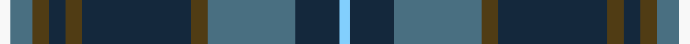

In pattern [WBBGBGBGBW](/stripes/wbbgbgbgbw/).

This was sourced from register-of-tartans.  It is a [10 stripe tartan](/stripes/stripes10/).

Original link https://www.tartanregister.gov.uk/tartanDetails.aspx?ref=11637

## Register references

External register numbers recorded for this tartan.

- Scottish Register of Tartans: [11637](https://www.tartanregister.gov.uk/tartanDetails.aspx?ref=11637)

## Thread count
W/4 B8 T6 DN6 T6 DN40 T6 B32 DN16 LB/4

## Palette
Each colour and the base-6 reference it is a variant of.

| Colour | Shade | Base |
|---|---|---|
| B | <code style="background-color:#496F81;">#496F81</code> `oklch(52.0% 0.051 229.3)` <small>#496F81</small> | B <code style="background-color:#2A418A;">#2A418A</code> |
| DN | <code style="background-color:#14283C;">#14283C</code> `oklch(27.1% 0.046 249.9)` <small>#14283C</small> | B <code style="background-color:#2A418A;">#2A418A</code> |
| LB | <code style="background-color:#82CFFD;">#82CFFD</code> `oklch(82.2% 0.100 236.0)` <small>#82CFFD</small> | W <code style="background-color:#F7F7F7;">#F7F7F7</code> |
| T | <code style="background-color:#503C14;">#503C14</code> `oklch(37.0% 0.062 81.8)` <small>#503C14</small> | G <code style="background-color:#006100;">#006100</code> |
| W | <code style="background-color:#F8F8F8;">#F8F8F8</code> `oklch(97.9% 0.000 89.9)` <small>#F8F8F8</small> | W <code style="background-color:#F7F7F7;">#F7F7F7</code> |

## Nearest tartans

The nearest existing variants by ΔTartan distance.

1. [American Society of Travel Agents, The (2001)](/setts/s11/db4y32db4y4db32m6db32dg4db3dg32w4/) — ΔT 0.65
1. [Donegal](/setts/s10/y3g17db3g3db3dr5db18r2db8r2~x2/) — ΔT 0.72
1. [Manroth (Personal)](/setts/s9/dg15db20k2r4k2db20dg15k2ly2~x2/) — ΔT 0.77
1. [Tennessee](/setts/s10/r2db10w1m1dg1r1dg6m1dg10w1~x2/) — ΔT 0.77
1. [Scottish Chamber Orchestra, The](/setts/s9/lt3dt20k3dt2k5dt2k3y15r2~x2/) — ΔT 0.80
1. [Donegal Irish County Tartan Tartan Number: 2247. Earliest known date: 1996 One of a series of Irish District tartans designed by Polly Wittering of the House of Edgar, with colours reminiscent of the Country with soft warm colours dominating. See products available Copyright © Blair Urquhart, Comrie, 2015](/setts/s10/lo3g17n3g3n3k5n18r2n8r2~x2/) — ΔT 0.80
1. [American Society of Travel Agents, The](/setts/s11/db2y18db2y2db20r3db18g2db2g18w2/) — ΔT 0.86
1. [Harkness Hunting](/setts/s10/dg21db4w4db32dg12ly4dg8r4dg6db12/) — ΔT 0.87
1. [Scott #2](/setts/s10/dg8w1dg1r1dg4k4db8k1db1k1~x2/) — ΔT 0.87
1. [Kilkenny Irish County Tartan Tartan Number: 2280. Earliest known date: 1995 One of a series of Irish District tartans designed by Polly Wittering of the House of Edgar, with colours reminiscent of the Country with soft warm colours dominating. See products available Copyright © Blair Urquhart, Comrie, 2015](/setts/s13/dg25o2db25ly5dg3dp3dg3ly5db25o2dg27dp5dg2~x2/) — ΔT 0.88

## Neighbour map

Every grey dot is one of 14299 variants placed by the first two principal components of the ΔTartan feature space (44% of its variance). Red is this tartan; blue dots are its nearest — click one to open its page.

<svg viewBox="0 0 640 380" role="img" style="max-width:100%;height:auto;border:1px solid #e0e0e0;border-radius:4px;display:block" xmlns="http://www.w3.org/2000/svg"><image href="/nn/cloud.v1.png" width="640" height="380"/><a href="/setts/s11/db4y32db4y4db32m6db32dg4db3dg32w4/"><circle cx="234.4" cy="170.3" r="4" fill="#3465a4"><title>American Society of Travel Agents, The (2001)</title></circle></a><a href="/setts/s10/y3g17db3g3db3dr5db18r2db8r2~x2/"><circle cx="259.1" cy="190.8" r="4" fill="#3465a4"><title>Donegal</title></circle></a><a href="/setts/s9/dg15db20k2r4k2db20dg15k2ly2~x2/"><circle cx="270.6" cy="202.7" r="4" fill="#3465a4"><title>Manroth (Personal)</title></circle></a><a href="/setts/s10/r2db10w1m1dg1r1dg6m1dg10w1~x2/"><circle cx="262.2" cy="170.6" r="4" fill="#3465a4"><title>Tennessee</title></circle></a><a href="/setts/s9/lt3dt20k3dt2k5dt2k3y15r2~x2/"><circle cx="221.5" cy="177.9" r="4" fill="#3465a4"><title>Scottish Chamber Orchestra, The</title></circle></a><a href="/setts/s10/lo3g17n3g3n3k5n18r2n8r2~x2/"><circle cx="249.0" cy="184.4" r="4" fill="#3465a4"><title>Donegal Irish County Tartan Tartan Number: 2247. Earliest known date: 1996 One of a series of Irish District tartans designed by Polly Wittering of the House of Edgar, with colours reminiscent of the Country with soft warm colours dominating. See products available Copyright © Blair Urquhart, Comrie, 2015</title></circle></a><a href="/setts/s11/db2y18db2y2db20r3db18g2db2g18w2/"><circle cx="263.8" cy="178.8" r="4" fill="#3465a4"><title>American Society of Travel Agents, The</title></circle></a><a href="/setts/s10/dg21db4w4db32dg12ly4dg8r4dg6db12/"><circle cx="240.6" cy="203.2" r="4" fill="#3465a4"><title>Harkness Hunting</title></circle></a><a href="/setts/s10/dg8w1dg1r1dg4k4db8k1db1k1~x2/"><circle cx="221.3" cy="198.9" r="4" fill="#3465a4"><title>Scott #2</title></circle></a><a href="/setts/s13/dg25o2db25ly5dg3dp3dg3ly5db25o2dg27dp5dg2~x2/"><circle cx="263.7" cy="161.5" r="4" fill="#3465a4"><title>Kilkenny Irish County Tartan Tartan Number: 2280. Earliest known date: 1995 One of a series of Irish District tartans designed by Polly Wittering of the House of Edgar, with colours reminiscent of the Country with soft warm colours dominating. See products available Copyright © Blair Urquhart, Comrie, 2015</title></circle></a><circle cx="255.6" cy="183.7" r="5" fill="#c00000"/></svg>

ID: /setts/s10/w2n4dy3dt3dy3dt20dy3n16dt8lt2~x2/
