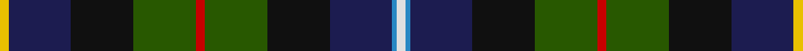

This page is one **sett** — a single exact thread-count. It belongs to the [tartan](/tartans/w2t1db14k14dg14r2dg14k14db14ly2/)
(the same proportion at any scale), whose colour order is pattern [WBBKGRGKBY](/stripes/wbbkgrgkby/).

Sourced from tartans-authority.  It is a [10 stripe tartan](/stripes/stripes10/).

Original link http://www.tartansauthority.com/tartan-ferret/display/7008/

## Register references

External register numbers recorded for this tartan.

- Scottish Tartans Authority (ITI): 7008

## Thread count
Y/4 DB28 K28 G28 R4 G28 K28 DB28 B2 LN/4

## Palette

Palette: <strong>Tartan Register</strong>
<table><thead><tr><th>Colour</th><th>Threads</th><th>Shade</th><th>Base</th><th>OKLCh</th></tr></thead><tbody><tr><td>Y/</td><td style="text-align:right;font-variant-numeric:tabular-nums">4</td><td><code style="background-color:#E8C000;">#E8C000</code> <small style="color:#888">#E8C000</small></td><td>Y <code style="background-color:#F2BF00;">#F2BF00</code></td><td><small style="color:#888">oklch(81.9% 0.168 93.7)</small></td></tr><tr><td>DB</td><td style="text-align:right;font-variant-numeric:tabular-nums">28</td><td><code style="background-color:#1C1C50;">#1C1C50</code> <small style="color:#888">#1C1C50</small></td><td>B <code style="background-color:#2A418A;">#2A418A</code></td><td><small style="color:#888">oklch(26.2% 0.093 277.9)</small></td></tr><tr><td>K</td><td style="text-align:right;font-variant-numeric:tabular-nums">28</td><td><code style="background-color:#101010;">#101010</code> <small style="color:#888">#101010</small></td><td>K <code style="background-color:#000000;">#000000</code></td><td><small style="color:#888">oklch(17.3% 0.000 89.9)</small></td></tr><tr><td>G</td><td style="text-align:right;font-variant-numeric:tabular-nums">28</td><td><code style="background-color:#285800;">#285800</code> <small style="color:#888">#285800</small></td><td>G <code style="background-color:#006100;">#006100</code></td><td><small style="color:#888">oklch(41.0% 0.122 135.8)</small></td></tr><tr><td>R</td><td style="text-align:right;font-variant-numeric:tabular-nums">4</td><td><code style="background-color:#C80000;">#C80000</code> <small style="color:#888">#C80000</small></td><td>R <code style="background-color:#CC0000;">#CC0000</code></td><td><small style="color:#888">oklch(52.3% 0.215 29.2)</small></td></tr><tr><td>G</td><td style="text-align:right;font-variant-numeric:tabular-nums">28</td><td><code style="background-color:#285800;">#285800</code> <small style="color:#888">#285800</small></td><td>G <code style="background-color:#006100;">#006100</code></td><td><small style="color:#888">oklch(41.0% 0.122 135.8)</small></td></tr><tr><td>K</td><td style="text-align:right;font-variant-numeric:tabular-nums">28</td><td><code style="background-color:#101010;">#101010</code> <small style="color:#888">#101010</small></td><td>K <code style="background-color:#000000;">#000000</code></td><td><small style="color:#888">oklch(17.3% 0.000 89.9)</small></td></tr><tr><td>DB</td><td style="text-align:right;font-variant-numeric:tabular-nums">28</td><td><code style="background-color:#1C1C50;">#1C1C50</code> <small style="color:#888">#1C1C50</small></td><td>B <code style="background-color:#2A418A;">#2A418A</code></td><td><small style="color:#888">oklch(26.2% 0.093 277.9)</small></td></tr><tr><td>B</td><td style="text-align:right;font-variant-numeric:tabular-nums">2</td><td><code style="background-color:#2888C4;">#2888C4</code> <small style="color:#888">#2888C4</small></td><td>B <code style="background-color:#2A418A;">#2A418A</code></td><td><small style="color:#888">oklch(60.1% 0.125 241.5)</small></td></tr><tr><td>LN/</td><td style="text-align:right;font-variant-numeric:tabular-nums">4</td><td><code style="background-color:#E0E0E0;">#E0E0E0</code> <small style="color:#888">#E0E0E0</small></td><td>W <code style="background-color:#F7F7F7;">#F7F7F7</code></td><td><small style="color:#888">oklch(90.7% 0.000 89.9)</small></td></tr></tbody></table>

## Nearest tartans

The nearest existing variants by ΔTartan distance, with this tartan at the top so the swatches line up against it.

ΔTartan

Tartan

Sett

—

<a href="/ttd/edit/#slug=w2t1db14k14dg14r2dg14k14db14ly2~x2">Erskine Veterans (Corporate)</a> <a class="nn-out" href="/setts/s10/w2t1db14k14dg14r2dg14k14db14ly2~x2/" title="open its dictionary page">↗</a>

0.99

<a href="/ttd/edit/#slug=r3k1dg12k12db12dbi3db12k12dg12k1ly3~x2">Gow Hunting</a> <a class="nn-out" href="/setts/s11/r3k1dg12k12db12dbi3db12k12dg12k1ly3~x2/" title="open its dictionary page">↗</a>

1.02

<a href="/ttd/edit/#slug=w2b1db14k14dg14r2dg14k14db14ly2~x2">Erskine Veterans</a> <a class="nn-out" href="/setts/s10/w2b1db14k14dg14r2dg14k14db14ly2~x2/" title="open its dictionary page">↗</a>

1.03

<a href="/ttd/edit/#slug=r3k1g12k12dbi12db3dbi12k12g12k1ly3~x2">Gow Hunting (Clan)</a> <a class="nn-out" href="/setts/s11/r3k1g12k12dbi12db3dbi12k12g12k1ly3~x2/" title="open its dictionary page">↗</a>

1.09

<a href="/ttd/edit/#slug=n11r3n2o3k12dg20ly2k12n11lo3~x2">Wisconsin (US State)</a> <a class="nn-out" href="/setts/s10/n11r3n2o3k12dg20ly2k12n11lo3~x2/" title="open its dictionary page">↗</a>

1.17

<a href="/ttd/edit/#slug=r3k2dp12w2dp12k12g12lo2g12k2r1db2~x2">Rust (Personal)</a> <a class="nn-out" href="/setts/s12/r3k2dp12w2dp12k12g12lo2g12k2r1db2~x2/" title="open its dictionary page">↗</a>

1.23

<a href="/setts/s14/r4ly3g12k16dy5db20k4w2~x2/">Iowa</a>

1.23

<a href="/ttd/edit/#slug=g12k16dy5db20k4w2k4db20dy5k16g12ly3r4ly3~x2">Iowa American District Tartan Tartan Number: 6051. Earliest known date: 2004 Iowa has a rich history of Scottish influence in the towns and cities. The Iowa Scottish Heritage Society desired to give to the people of Iowa a tartan that symbolizes the state. Blue for the sky, rivers &amp; lakes, Green for the fields our farmers plant. Black for the rich soil for which we are blessed. White for the snow. Red for the barns and the wild rose. Brown for the earth. Yellow for corn and the Goldfinch. Adopted by the State of Iowa General Assembly, resolution No 149 by Heaton &amp; Whitaker. See products available Copyright © Blair Urquhart, Comrie, 2015</a> <a class="nn-out" href="/setts/s14/g12k16dy5db20k4w2k4db20dy5k16g12ly3r4ly3~x2/" title="open its dictionary page">↗</a>

1.26

<a href="/ttd/edit/#slug=k10dg9w2dg9k10r1db8dp12k3~x2">Hunter Graham</a> <a class="nn-out" href="/setts/s9/k10dg9w2dg9k10r1db8dp12k3~x2/" title="open its dictionary page">↗</a>

1.27

<a href="/ttd/edit/#slug=k4r1k3r2lo3k12dg10dgi18db3o3db3~x2">Blake (Personal)</a> <a class="nn-out" href="/setts/s11/k4r1k3r2lo3k12dg10dgi18db3o3db3~x2/" title="open its dictionary page">↗</a>

1.28

<a href="/setts/s14/r2k8ly1k8g13db13lo1r2~x2/">Sey</a>

## Neighbour map

Every grey dot is one of 14359 variants placed by the first two principal components of the ΔTartan feature space (44% of its variance). Red is this tartan; blue dots are its nearest — click one to open its page.

<svg viewBox="0 0 640 380" role="img" style="max-width:100%;height:auto;border:1px solid #e0e0e0;border-radius:4px;display:block" xmlns="http://www.w3.org/2000/svg"><image href="/nn/cloud.v1.png" width="640" height="380"/><a href="/setts/s11/r3k1dg12k12db12dbi3db12k12dg12k1ly3~x2/"><circle cx="135.2" cy="186.7" r="4" fill="#3465a4"><title>Gow Hunting</title></circle></a><a href="/setts/s10/w2b1db14k14dg14r2dg14k14db14ly2~x2/"><circle cx="148.9" cy="183.1" r="4" fill="#3465a4"><title>Erskine Veterans</title></circle></a><a href="/setts/s11/r3k1g12k12dbi12db3dbi12k12g12k1ly3~x2/"><circle cx="122.4" cy="179.4" r="4" fill="#3465a4"><title>Gow Hunting (Clan)</title></circle></a><a href="/setts/s10/n11r3n2o3k12dg20ly2k12n11lo3~x2/"><circle cx="99.1" cy="160.6" r="4" fill="#3465a4"><title>Wisconsin (US State)</title></circle></a><a href="/setts/s12/r3k2dp12w2dp12k12g12lo2g12k2r1db2~x2/"><circle cx="114.5" cy="136.8" r="4" fill="#3465a4"><title>Rust (Personal)</title></circle></a><a href="/setts/s14/r4ly3g12k16dy5db20k4w2~x2/"><circle cx="84.4" cy="145.9" r="4" fill="#3465a4"><title>Iowa</title></circle></a><a href="/setts/s14/g12k16dy5db20k4w2k4db20dy5k16g12ly3r4ly3~x2/"><circle cx="84.4" cy="145.9" r="4" fill="#3465a4"><title>Iowa American District Tartan Tartan Number: 6051. Earliest known date: 2004 Iowa has a rich history of Scottish influence in the towns and cities. The Iowa Scottish Heritage Society desired to give to the people of Iowa a tartan that symbolizes the state. Blue for the sky, rivers &amp; lakes, Green for the fields our farmers plant. Black for the rich soil for which we are blessed. White for the snow. Red for the barns and the wild rose. Brown for the earth. Yellow for corn and the Goldfinch. Adopted by the State of Iowa General Assembly, resolution No 149 by Heaton &amp; Whitaker. See products available Copyright © Blair Urquhart, Comrie, 2015</title></circle></a><a href="/setts/s9/k10dg9w2dg9k10r1db8dp12k3~x2/"><circle cx="145.3" cy="210.6" r="4" fill="#3465a4"><title>Hunter Graham</title></circle></a><a href="/setts/s11/k4r1k3r2lo3k12dg10dgi18db3o3db3~x2/"><circle cx="134.9" cy="132.2" r="4" fill="#3465a4"><title>Blake (Personal)</title></circle></a><a href="/setts/s14/r2k8ly1k8g13db13lo1r2~x2/"><circle cx="145.2" cy="156.0" r="4" fill="#3465a4"><title>Sey</title></circle></a><circle cx="127.0" cy="167.9" r="5" fill="#c00000"/></svg>

ID: /setts/s10/w2t1db14k14dg14r2dg14k14db14ly2~x2/
