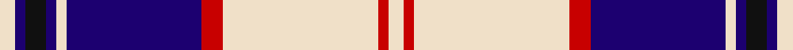

In pattern [WBKBWBRWRW](/stripes/wbkbwbrwrw/).

This was sourced from tartans-authority.  It is a [10 stripe tartan](/stripes/stripes10/).

Original link http://www.tartansauthority.com/tartan-ferret/display/7592/

## Also known as

This cloth is also recorded under:

- Harris, Royal Blue

## Attestations

This cloth appears in 2 source records; the oldest owns this page.

- March 2008 — Harris, Royal Blue (Dance) (tartans-authority, [record](http://www.tartansauthority.com/tartan-ferret/display/7592/))
- undated — Harris Royal Blue (register-of-tartans, [record](https://www.tartanregister.gov.uk/tartanDetails.aspx?ref=5616))

## Register references

External register numbers recorded for this tartan.

- Scottish Register of Tartans: [5616](https://www.tartanregister.gov.uk/tartanDetails.aspx?ref=5616)
- Scottish Tartans Authority (ITI): 7592

## Thread count
W/6 DB4 K8 DB4 W4 DB52 R8 W60 R4 W/6

## Palette
Each colour and the base-6 reference it is a variant of.

| Colour | Shade | Base |
|---|---|---|
| DB | <code style="background-color:#1C0070;">#1C0070</code> `oklch(26.3% 0.162 277.1)` <small>#1C0070</small> | B <code style="background-color:#2A418A;">#2A418A</code> |
| K | <code style="background-color:#101010;">#101010</code> `oklch(17.3% 0.000 89.9)` <small>#101010</small> | K <code style="background-color:#000000;">#000000</code> |
| R | <code style="background-color:#C80000;">#C80000</code> `oklch(52.3% 0.215 29.2)` <small>#C80000</small> | R <code style="background-color:#CC0000;">#CC0000</code> |
| W | <code style="background-color:#F0E0C8;">#F0E0C8</code> `oklch(91.3% 0.036 78.1)` <small>#F0E0C8</small> | W <code style="background-color:#F7F7F7;">#F7F7F7</code> |

## Nearest tartans

The nearest existing variants by ΔTartan distance.

1. [Clemens and August (Personal)](/setts/s8/w32db3r4db3r8db32w3db4~x2/) — ΔT 0.97
1. [Hannay (Clan)](/setts/s10/k9lb4k2lb4k2lb30k9lb4b14lo2~x2/) — ΔT 0.97
1. [Buckleigh Dress (Fashion)](/setts/s10/k3r1k1w20k10r2k2w2k2r2~x4/) — ΔT 1.04
1. [Lord Arran (Corporate)](/setts/s9/r3dy1w12dy2db2dy2db14w2db2~x2/) — ΔT 1.04
1. [Hannay](/setts/s10/k9w4k2w4k2w30k9w4db14ly2~x2/) — ΔT 1.08
1. [Hannay](/setts/s10/k9w4k2w4k2w29k9w4b14lo2~x2/) — ΔT 1.17
1. [Hanna Personal Tartan Tartan Number: 619. Earliest known date: 1987 Found in a the Hanna family bible of a civil war veteran by Charles Milton Hanna, Freeport, PA, USA, who sent information to the Scottish Tartan Society in 1987. The STS records the blue square as blue 4 and white 2, which gives a tweed like pattern to that section. See products available Copyright © Blair Urquhart, Comrie, 2015](/setts/s13/k8w13db2w1db2w1db2w1db2w1db2w1db2~x2/) — ΔT 1.21
1. [Eildon/Longniddry Blue Dress Fashion Tartan Tartan Number: 4799. Earliest known date: 01/01/1980 A Dancers' Fancy from Dalgliesh. This appears under three different names - Longniddry #5486, Eildon #4799 and Harmony Eildon #87 (original Scottish Tartans Authority references). Needs resolving. Sample in Scottish Tartans Authority's Dalgety Collection. /Threadcount and colours aren't 100% original. Generated manually./ See products available Copyright © Blair Urquhart, Comrie, 2015](/setts/s8/db30t2w2t2db4t10w25db4~x2/) — ΔT 1.23
1. [Yudo (Corporate)](/setts/s9/k2r9w2db2w4db2w2db20w2~x4/) — ΔT 1.24
1. [Hanna (Bible)](/setts/s13/k16w25db4w2db4w2db4w2db4w2db4w2db4~x2/) — ΔT 1.26

## Neighbour map

Every grey dot is one of 14299 variants placed by the first two principal components of the ΔTartan feature space (44% of its variance). Red is this tartan; blue dots are its nearest — click one to open its page.

<svg viewBox="0 0 640 380" role="img" style="max-width:100%;height:auto;border:1px solid #e0e0e0;border-radius:4px;display:block" xmlns="http://www.w3.org/2000/svg"><image href="/nn/cloud.v1.png" width="640" height="380"/><a href="/setts/s8/w32db3r4db3r8db32w3db4~x2/"><circle cx="228.8" cy="148.1" r="4" fill="#3465a4"><title>Clemens and August (Personal)</title></circle></a><a href="/setts/s10/k9lb4k2lb4k2lb30k9lb4b14lo2~x2/"><circle cx="252.5" cy="131.2" r="4" fill="#3465a4"><title>Hannay (Clan)</title></circle></a><a href="/setts/s10/k3r1k1w20k10r2k2w2k2r2~x4/"><circle cx="285.2" cy="118.8" r="4" fill="#3465a4"><title>Buckleigh Dress (Fashion)</title></circle></a><a href="/setts/s9/r3dy1w12dy2db2dy2db14w2db2~x2/"><circle cx="225.2" cy="143.2" r="4" fill="#3465a4"><title>Lord Arran (Corporate)</title></circle></a><a href="/setts/s10/k9w4k2w4k2w30k9w4db14ly2~x2/"><circle cx="243.1" cy="130.9" r="4" fill="#3465a4"><title>Hannay</title></circle></a><a href="/setts/s10/k9w4k2w4k2w29k9w4b14lo2~x2/"><circle cx="234.3" cy="128.0" r="4" fill="#3465a4"><title>Hannay</title></circle></a><a href="/setts/s13/k8w13db2w1db2w1db2w1db2w1db2w1db2~x2/"><circle cx="242.9" cy="134.0" r="4" fill="#3465a4"><title>Hanna Personal Tartan Tartan Number: 619. Earliest known date: 1987 Found in a the Hanna family bible of a civil war veteran by Charles Milton Hanna, Freeport, PA, USA, who sent information to the Scottish Tartan Society in 1987. The STS records the blue square as blue 4 and white 2, which gives a tweed like pattern to that section. See products available Copyright © Blair Urquhart, Comrie, 2015</title></circle></a><a href="/setts/s8/db30t2w2t2db4t10w25db4~x2/"><circle cx="244.1" cy="146.8" r="4" fill="#3465a4"><title>Eildon/Longniddry Blue Dress Fashion Tartan Tartan Number: 4799. Earliest known date: 01/01/1980 A Dancers' Fancy from Dalgliesh. This appears under three different names - Longniddry #5486, Eildon #4799 and Harmony Eildon #87 (original Scottish Tartans Authority references). Needs resolving. Sample in Scottish Tartans Authority's Dalgety Collection. /Threadcount and colours aren't 100% original. Generated manually./ See products available Copyright © Blair Urquhart, Comrie, 2015</title></circle></a><a href="/setts/s9/k2r9w2db2w4db2w2db20w2~x4/"><circle cx="259.3" cy="147.0" r="4" fill="#3465a4"><title>Yudo (Corporate)</title></circle></a><a href="/setts/s13/k16w25db4w2db4w2db4w2db4w2db4w2db4~x2/"><circle cx="229.9" cy="133.5" r="4" fill="#3465a4"><title>Hanna (Bible)</title></circle></a><circle cx="258.8" cy="113.1" r="5" fill="#c00000"/></svg>

ID: /setts/s10/w3db2k4db2w2db26r4w30r2w3~x2/
