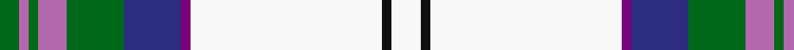

In pattern [GRGRGBBWKW](/patterns/grgrgbbwkw/).

This was sourced from tartans-authority.  It is a [10 stripes tartan](/stripes/stripes10/).

Original link http://www.tartansauthority.com/tartan-ferret/display/6567/

## Thread count
G/8 Pa4 G4 Pa12 G24 DB24 P4 W80 K4 W/12

## Palette
Each colour and its ΔE from the base-6 reference it is a variant of.

| Colour | Shade | Base | ΔE (OKLab) |
|---|---|---|---|
| DB | <code style="background-color:#2C2C80;">#2C2C80</code> `#2C2C80` | B <code style="background-color:#2A418A;">#2A418A</code> | 0.06 |
| G | <code style="background-color:#006818;">#006818</code> `#006818` | G <code style="background-color:#006100;">#006100</code> | 0.02 |
| K | <code style="background-color:#101010;">#101010</code> `#101010` | K <code style="background-color:#000000;">#000000</code> | 0.17 |
| P | <code style="background-color:#780078;">#780078</code> `#780078` | B <code style="background-color:#2A418A;">#2A418A</code> | 0.17 |
| Pa | <code style="background-color:#B468AC;">#B468AC</code> `#B468AC` | R <code style="background-color:#CC0000;">#CC0000</code> | 0.21 |
| W | <code style="background-color:#F8F8F8;">#F8F8F8</code> `#F8F8F8` | W <code style="background-color:#F7F7F7;">#F7F7F7</code> | 0.00 |

## Nearest tartans

The nearest existing variants by ΔTartan distance.

1. [Musselburgh Dress (Dance)](/setts/s9/b14ba1bb3g1bb3ba1bb4w24r1x4~b5c8ca8-ba2c2c80-bb5c5c5c-g289c18-re87878-wf8f8f8/) — ΔT 0.99
1. [Stewart Dress Clan Tartan Tartan Number: 1790. Earliest known date: 19th century The 'Dress' version of James Logan's 'Royal Stewart' which D.C.Stewart compared to 200 year old silk scarf with the remark, "that the design had been well maintained". In this pattern the blue is joined to the black and the yellow and white are of equal size. The red stripe on the white, not present here, signifies a 'Victoria' sett. The Dress Stewart tartan alongside its 'formal' partner, the Royal Stewart, is known throughout the world as a symbol of Scotland. See products available Copyright © Blair Urquhart, Comrie, 2015](/setts/s12/w31b4k6y2k2w2k2g7r4k2r2w2x2~b2c2c80-g006818-k101010-rc80000-we0e0e0-ye8c000/) — ΔT 1.05
1. [Stuart/Stewart Dress Royal](/setts/s12/w31b4k6y2k2w2k2g7r4k2r2w2x2~b2c4084-g005020-k101010-rdc0000-we0e0e0-ye8c000/) — ΔT 1.06
1. [Edinburgh Dress (Dance)](/setts/s10/w4k2w30g3b3g3b7ba14g3r3x2~b780078-ba2c2c80-g006818-k101010-rc80000-wfcfcfc/) — ΔT 1.08
1. [Nimah, Carissa & Bassem (Personal)](/setts/s7/w50g15b10r2b10ga8y3x2~b202060-g048888-ga146400-rdc0000-wf8f4d0-yffff00/) — ΔT 1.08
1. [Edinburgh, dress](/setts/s10/w4k2w30g3b3g3b7ba14g3r3x2~b800080-ba304080-g008000-k000000-rc00000-we0e0e0/) — ΔT 1.09
1. [Ben Vorlich](/setts/s11/w68y3w3y8w3y3r24b16ra3b20y3x2~b1c1c1c-r858585-ra70000c-we0e0e0-yb8b8b8/) — ΔT 1.11
1. [Pritchard](/setts/s11/w24b2k2y1k1w1g6ba4g1ba1w1x4~b00008c-ba683c8c-g146400-k000000-wfcfcfc-yc89800/) — ΔT 1.12
1. [Strathyre dress](/setts/s10/w49g11r2g3w2ga10ra9g2ra6w2x2~g003c14-ga2a2303-rdc0000-rac464fa-we0e0e0/) — ΔT 1.13
1. [Henderson Dress (Clan?)](/setts/s9/w1b6w4b1w16k1g4k6y1x2~b2888c4-g006818-k101010-wfcfcfc-ye8c000/) — ΔT 1.15

## Neighbour map

Every grey dot is one of 15726 variants placed by the first two principal components of the ΔTartan feature space (44% of its variance). Red is this tartan; blue dots are its nearest — click one to open its page.

<svg viewBox="0 0 640 380" role="img" style="max-width:100%;height:auto;border:1px solid #e0e0e0;border-radius:4px;display:block" xmlns="http://www.w3.org/2000/svg"><image href="/nn/cloud.v1.png" width="640" height="380"/><a href="/setts/s9/b14ba1bb3g1bb3ba1bb4w24r1x4~b5c8ca8-ba2c2c80-bb5c5c5c-g289c18-re87878-wf8f8f8/"><circle cx="224.1" cy="76.2" r="4" fill="#3465a4"><title>Musselburgh Dress (Dance)</title></circle></a><a href="/setts/s12/w31b4k6y2k2w2k2g7r4k2r2w2x2~b2c2c80-g006818-k101010-rc80000-we0e0e0-ye8c000/"><circle cx="219.3" cy="67.7" r="4" fill="#3465a4"><title>Stewart Dress Clan Tartan Tartan Number: 1790. Earliest known date: 19th century The 'Dress' version of James Logan's 'Royal Stewart' which D.C.Stewart compared to 200 year old silk scarf with the remark, &quot;that the design had been well maintained&quot;. In this pattern the blue is joined to the black and the yellow and white are of equal size. The red stripe on the white, not present here, signifies a 'Victoria' sett. The Dress Stewart tartan alongside its 'formal' partner, the Royal Stewart, is known throughout the world as a symbol of Scotland. See products available Copyright © Blair Urquhart, Comrie, 2015</title></circle></a><a href="/setts/s12/w31b4k6y2k2w2k2g7r4k2r2w2x2~b2c4084-g005020-k101010-rdc0000-we0e0e0-ye8c000/"><circle cx="219.6" cy="67.4" r="4" fill="#3465a4"><title>Stuart/Stewart Dress Royal</title></circle></a><a href="/setts/s10/w4k2w30g3b3g3b7ba14g3r3x2~b780078-ba2c2c80-g006818-k101010-rc80000-wfcfcfc/"><circle cx="171.3" cy="87.1" r="4" fill="#3465a4"><title>Edinburgh Dress (Dance)</title></circle></a><a href="/setts/s7/w50g15b10r2b10ga8y3x2~b202060-g048888-ga146400-rdc0000-wf8f4d0-yffff00/"><circle cx="216.9" cy="93.1" r="4" fill="#3465a4"><title>Nimah, Carissa &amp; Bassem (Personal)</title></circle></a><a href="/setts/s10/w4k2w30g3b3g3b7ba14g3r3x2~b800080-ba304080-g008000-k000000-rc00000-we0e0e0/"><circle cx="180.1" cy="92.1" r="4" fill="#3465a4"><title>Edinburgh, dress</title></circle></a><a href="/setts/s11/w68y3w3y8w3y3r24b16ra3b20y3x2~b1c1c1c-r858585-ra70000c-we0e0e0-yb8b8b8/"><circle cx="231.3" cy="80.4" r="4" fill="#3465a4"><title>Ben Vorlich</title></circle></a><a href="/setts/s11/w24b2k2y1k1w1g6ba4g1ba1w1x4~b00008c-ba683c8c-g146400-k000000-wfcfcfc-yc89800/"><circle cx="275.9" cy="45.9" r="4" fill="#3465a4"><title>Pritchard</title></circle></a><a href="/setts/s10/w49g11r2g3w2ga10ra9g2ra6w2x2~g003c14-ga2a2303-rdc0000-rac464fa-we0e0e0/"><circle cx="278.5" cy="76.9" r="4" fill="#3465a4"><title>Strathyre dress</title></circle></a><a href="/setts/s9/w1b6w4b1w16k1g4k6y1x2~b2888c4-g006818-k101010-wfcfcfc-ye8c000/"><circle cx="212.3" cy="117.0" r="4" fill="#3465a4"><title>Henderson Dress (Clan?)</title></circle></a><circle cx="220.0" cy="74.8" r="5" fill="#c00000"/></svg>

ID: /setts/s10/w3k1w20b1ba6g6r3g1r1g2x4~b780078-ba2c2c80-g006818-k101010-rb468ac-wf8f8f8/
