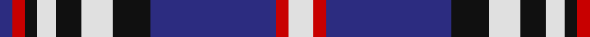

In pattern [BRKWKWKBRW](/patterns/brkwkwkbrw/).

This was sourced from house-of-tartan.  It is a [10 stripes tartan](/stripes/stripes10/).

Original link http://www.house-of-tartan.scotland.net/house/TartanViewjs.asp?colr=Def&tnam=561

## Thread count
DB/4 R4 K4 LN6 K8 LN10 K12 DB40 R4 LN/8

## Palette
Each colour and its ΔE from the base-6 reference it is a variant of.

| Colour | Shade | Base | ΔE (OKLab) |
|---|---|---|---|
| DB | <code style="background-color:#2C2C80;">#2C2C80</code> `#2C2C80` | B <code style="background-color:#2A418A;">#2A418A</code> | 0.06 |
| K | <code style="background-color:#101010;">#101010</code> `#101010` | K <code style="background-color:#000000;">#000000</code> | 0.17 |
| LN | <code style="background-color:#E0E0E0;">#E0E0E0</code> `#E0E0E0` | W <code style="background-color:#F7F7F7;">#F7F7F7</code> | 0.07 |
| R | <code style="background-color:#C80000;">#C80000</code> `#C80000` | R <code style="background-color:#CC0000;">#CC0000</code> | 0.01 |

## Nearest tartans

The nearest existing variants by ΔTartan distance.

1. [Scottish Knights Templar MTS (Corp)](/setts/s10/w4r2b20k6w5k4w3k2r2b2~b2c2c80-k101010-rc80000-wc0c0c0~x2/) — ΔT 0.40
1. [Scottish Knights Templar, of M.T.S.](/setts/s10/w4r2b20k6w5k4w3k2r2b2~b304080-k000000-rc00000-we0e0e0~x2/) — ΔT 0.44
1. [Kinnaird](/setts/s8/w33k4w4k5w4k7b41r4~b304080-k000000-rc00000-wc0c0c0~x2/) — ΔT 0.88
1. [Hydro-Electric](/setts/s10/b11k4w5k1r3k1w5k4b11r1~b2c2c80-k101010-rc80000-wfcfcfc~x4/) — ΔT 0.95
1. [Hanna of Stirlingshire (Clan)](/setts/s10/r1k1y2k2y2k1y4k1b9ya1~b1c0070-k101010-r880000-yb8b8b8-yad09800~x4/) — ΔT 1.04
1. [Lord Arran (Corporate)](/setts/s9/r3g1w12g2b2g2b14w2b2~b2c2c80-g604000-r880000-we0e0e0~x2/) — ΔT 1.06
1. [Highlands School (N. Carolina) Corporate Tartan Tartan Number: 2109. Earliest known date: 1990 Highlands in North Carolina is the home of the Scottish Tartans Society's Museum Extension. The school tartan was designed by Bob Martin who is a 'Fellow of the Society'. Blue and Gold are the school colours. See products available Copyright © Blair Urquhart, Comrie, 2015](/setts/s8/y12b2y2b30ba3b2ba13w4~b2c2c80-ba202060-we0e0e0-ye8c000~x2/) — ΔT 1.08
1. [Thompson Variant](/setts/s10/r1k1w2k2w2k1w4k1b9y1~b2c2c80-k101010-rc80000-wc0c0c0-yd09800~x4/) — ΔT 1.10
1. [Halesowen #2](/setts/s8/w9b3y3b24ba24y2ba2y2~b1c0070-ba003c64-we0e0e0-ye8c000~x2/) — ΔT 1.10
1. [Mearns Castle High School](/setts/s13/w15b2w2b2w2b13r13b2wa2b2w2b2wa2~b141e46-r960028-w98c8e8-waffffff~x4/) — ΔT 1.10

## Neighbour map

Every grey dot is one of 15726 variants placed by the first two principal components of the ΔTartan feature space (44% of its variance). Red is this tartan; blue dots are its nearest — click one to open its page.

<svg viewBox="0 0 640 380" role="img" style="max-width:100%;height:auto;border:1px solid #e0e0e0;border-radius:4px;display:block" xmlns="http://www.w3.org/2000/svg"><image href="/nn/cloud.v1.png" width="640" height="380"/><a href="/setts/s10/w4r2b20k6w5k4w3k2r2b2~b2c2c80-k101010-rc80000-wc0c0c0~x2/"><circle cx="205.8" cy="162.8" r="4" fill="#3465a4"><title>Scottish Knights Templar MTS (Corp)</title></circle></a><a href="/setts/s10/w4r2b20k6w5k4w3k2r2b2~b304080-k000000-rc00000-we0e0e0~x2/"><circle cx="187.0" cy="156.2" r="4" fill="#3465a4"><title>Scottish Knights Templar, of M.T.S.</title></circle></a><a href="/setts/s8/w33k4w4k5w4k7b41r4~b304080-k000000-rc00000-wc0c0c0~x2/"><circle cx="199.8" cy="160.0" r="4" fill="#3465a4"><title>Kinnaird</title></circle></a><a href="/setts/s10/b11k4w5k1r3k1w5k4b11r1~b2c2c80-k101010-rc80000-wfcfcfc~x4/"><circle cx="191.0" cy="173.7" r="4" fill="#3465a4"><title>Hydro-Electric</title></circle></a><a href="/setts/s10/r1k1y2k2y2k1y4k1b9ya1~b1c0070-k101010-r880000-yb8b8b8-yad09800~x4/"><circle cx="144.8" cy="149.7" r="4" fill="#3465a4"><title>Hanna of Stirlingshire (Clan)</title></circle></a><a href="/setts/s9/r3g1w12g2b2g2b14w2b2~b2c2c80-g604000-r880000-we0e0e0~x2/"><circle cx="222.4" cy="146.3" r="4" fill="#3465a4"><title>Lord Arran (Corporate)</title></circle></a><a href="/setts/s8/y12b2y2b30ba3b2ba13w4~b2c2c80-ba202060-we0e0e0-ye8c000~x2/"><circle cx="257.4" cy="157.3" r="4" fill="#3465a4"><title>Highlands School (N. Carolina) Corporate Tartan Tartan Number: 2109. Earliest known date: 1990 Highlands in North Carolina is the home of the Scottish Tartans Society's Museum Extension. The school tartan was designed by Bob Martin who is a 'Fellow of the Society'. Blue and Gold are the school colours. See products available Copyright © Blair Urquhart, Comrie, 2015</title></circle></a><a href="/setts/s10/r1k1w2k2w2k1w4k1b9y1~b2c2c80-k101010-rc80000-wc0c0c0-yd09800~x4/"><circle cx="146.0" cy="147.6" r="4" fill="#3465a4"><title>Thompson Variant</title></circle></a><a href="/setts/s8/w9b3y3b24ba24y2ba2y2~b1c0070-ba003c64-we0e0e0-ye8c000~x2/"><circle cx="198.7" cy="167.6" r="4" fill="#3465a4"><title>Halesowen #2</title></circle></a><a href="/setts/s13/w15b2w2b2w2b13r13b2wa2b2w2b2wa2~b141e46-r960028-w98c8e8-waffffff~x4/"><circle cx="155.4" cy="149.7" r="4" fill="#3465a4"><title>Mearns Castle High School</title></circle></a><circle cx="194.5" cy="157.4" r="5" fill="#c00000"/></svg>

ID: /setts/s10/w4r2b20k6w5k4w3k2r2b2~b2c2c80-k101010-rc80000-we0e0e0~x2/
