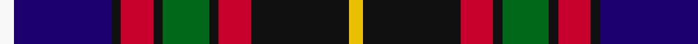

In pattern [WBKRKGKRKY](/patterns/wbkrkgkrky/).

This was sourced from register-of-tartans.  It is a [10 stripes tartan](/stripes/stripes10/).

Original link https://www.tartanregister.gov.uk/tartanDetails.aspx?ref=5294

## Attestations

This cloth appears in 2 source records; the oldest owns this page.

- 01/07/2005 — Tantallon (register-of-tartans, [record](https://www.tartanregister.gov.uk/tartanDetails.aspx?ref=5294))
- Jul. 2005 — Tantallon (Corporate) (tartans-authority, [record](http://www.tartansauthority.com/tartan-ferret/display/6849/))

## Thread count
W/6 DB42 K4 R14 K4 G20 K4 R14 K42 Y/6

## Palette
Each colour and its ΔE from the base-6 reference it is a variant of.

| Colour | Shade | Base | ΔE (OKLab) |
|---|---|---|---|
| DB | <code style="background-color:#1C0070;">#1C0070</code> `#1C0070` | B <code style="background-color:#2A418A;">#2A418A</code> | 0.14 |
| G | <code style="background-color:#006818;">#006818</code> `#006818` | G <code style="background-color:#006100;">#006100</code> | 0.02 |
| K | <code style="background-color:#101010;">#101010</code> `#101010` | K <code style="background-color:#000000;">#000000</code> | 0.17 |
| R | <code style="background-color:#C8002C;">#C8002C</code> `#C8002C` | R <code style="background-color:#CC0000;">#CC0000</code> | 0.03 |
| W | <code style="background-color:#F8F8F8;">#F8F8F8</code> `#F8F8F8` | W <code style="background-color:#F7F7F7;">#F7F7F7</code> | 0.00 |
| Y | <code style="background-color:#E8C000;">#E8C000</code> `#E8C000` | Y <code style="background-color:#F2BF00;">#F2BF00</code> | 0.02 |

## Nearest tartans

The nearest existing variants by ΔTartan distance.

1. [Tantallon #2](/setts/s10/w6b44k4r14k4g20k4r14k44y6-b000064-g005020-k101010-rdc0000-we0e0e0-ye8c000/) — ΔT 0.24
1. [Crozier/Crosser](/setts/s11/w8b10r6b44y8k6g34r14k4r14y4-b000048-g044028-k000000-rc80000-wfcfcfc-ydcbc00/) — ΔT 0.52
1. [Asman, Dress (Name)](/setts/s11/b8y6b44r12w4ra12w4k12k40ra6k8-b2c2c80-k101010-r888888-rac80000-wfcfcfc-ye8c000/) — ΔT 0.64
1. [Royal Dornoch Golf Club, The](/setts/s10/r24b44g10b6y6b6g34ba18bb14r4-b000048-ba3474fc-bb4c0000-g005020-rfa4b00-yd8b000/) — ΔT 0.71
1. [Dean/Dundas (Melbourne, Australia) (Personal)](/setts/s9/r34k10b8k12y10ba62k10g12b6-b666666-ba271b86-g509721-k120a01-rdd1212-yf9c75c/) — ΔT 0.72
1. [Fowdar (Personal)](/setts/s12/k9w6k46b24r8b6r6b6r16g6r6y6-b000080-g488214-k101010-rcc1100-wffffff-yeeee00/) — ΔT 0.83
1. [Scottish Cultural Society (Corporate](/setts/s9/b16g32k64y8k8ba32w8ba8w16-b6c0070-ba1c0070-g006818-k101010-wc0c0c0-yd09800/) — ΔT 0.86
1. [Dean/Dundas (Personal)](/setts/s9/r34k10w8k12y10b62k10g12w6-b2c2c80-g289c18-k101010-rc80000-we0e0e0-yfccc00/) — ΔT 0.94
1. [Loch Etive](/setts/s8/w6g4r42k52b36k4b6y6-b2c2c80-g289c18-k101010-rc80000-wc0c0c0-yfccc00/) — ΔT 0.94
1. [Wcwm 1873-4](/setts/s11/r24b4r8b8r4b16ba56k16bb4k12y4-b3c2010-ba640064-bb0000e0-k000000-r8c8c8c-yc89800/) — ΔT 0.95

## Neighbour map

Every grey dot is one of 15726 variants placed by the first two principal components of the ΔTartan feature space (44% of its variance). Red is this tartan; blue dots are its nearest — click one to open its page.

<svg viewBox="0 0 640 380" role="img" style="max-width:100%;height:auto;border:1px solid #e0e0e0;border-radius:4px;display:block" xmlns="http://www.w3.org/2000/svg"><image href="/nn/cloud.v1.png" width="640" height="380"/><a href="/setts/s10/w6b44k4r14k4g20k4r14k44y6-b000064-g005020-k101010-rdc0000-we0e0e0-ye8c000/"><circle cx="120.2" cy="138.8" r="4" fill="#3465a4"><title>Tantallon #2</title></circle></a><a href="/setts/s11/w8b10r6b44y8k6g34r14k4r14y4-b000048-g044028-k000000-rc80000-wfcfcfc-ydcbc00/"><circle cx="101.7" cy="128.6" r="4" fill="#3465a4"><title>Crozier/Crosser</title></circle></a><a href="/setts/s11/b8y6b44r12w4ra12w4k12k40ra6k8-b2c2c80-k101010-r888888-rac80000-wfcfcfc-ye8c000/"><circle cx="141.3" cy="131.5" r="4" fill="#3465a4"><title>Asman, Dress (Name)</title></circle></a><a href="/setts/s10/r24b44g10b6y6b6g34ba18bb14r4-b000048-ba3474fc-bb4c0000-g005020-rfa4b00-yd8b000/"><circle cx="92.5" cy="148.7" r="4" fill="#3465a4"><title>Royal Dornoch Golf Club, The</title></circle></a><a href="/setts/s9/r34k10b8k12y10ba62k10g12b6-b666666-ba271b86-g509721-k120a01-rdd1212-yf9c75c/"><circle cx="128.0" cy="136.7" r="4" fill="#3465a4"><title>Dean/Dundas (Melbourne, Australia) (Personal)</title></circle></a><a href="/setts/s12/k9w6k46b24r8b6r6b6r16g6r6y6-b000080-g488214-k101010-rcc1100-wffffff-yeeee00/"><circle cx="114.7" cy="134.9" r="4" fill="#3465a4"><title>Fowdar (Personal)</title></circle></a><a href="/setts/s9/b16g32k64y8k8ba32w8ba8w16-b6c0070-ba1c0070-g006818-k101010-wc0c0c0-yd09800/"><circle cx="103.7" cy="164.0" r="4" fill="#3465a4"><title>Scottish Cultural Society (Corporate</title></circle></a><a href="/setts/s9/r34k10w8k12y10b62k10g12w6-b2c2c80-g289c18-k101010-rc80000-we0e0e0-yfccc00/"><circle cx="118.2" cy="132.1" r="4" fill="#3465a4"><title>Dean/Dundas (Personal)</title></circle></a><a href="/setts/s8/w6g4r42k52b36k4b6y6-b2c2c80-g289c18-k101010-rc80000-wc0c0c0-yfccc00/"><circle cx="154.3" cy="135.3" r="4" fill="#3465a4"><title>Loch Etive</title></circle></a><a href="/setts/s11/r24b4r8b8r4b16ba56k16bb4k12y4-b3c2010-ba640064-bb0000e0-k000000-r8c8c8c-yc89800/"><circle cx="145.0" cy="116.4" r="4" fill="#3465a4"><title>Wcwm 1873-4</title></circle></a><circle cx="113.4" cy="139.9" r="5" fill="#c00000"/></svg>

ID: /setts/s10/w6b42k4r14k4g20k4r14k42y6-b1c0070-g006818-k101010-rc8002c-wf8f8f8-ye8c000/
