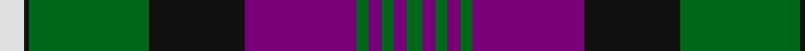

In pattern [GBGBGBKGKW](/stripes/gbgbgbkgkw/).

This was sourced from house-of-tartan.  It is a [10 stripe tartan](/stripes/stripes10/).

Original link http://www.house-of-tartan.scotland.net/house/TartanViewjs.asp?colr=Def&tnam=716

## Thread count
LN/12 K2 G58 K46 P54 G6 P6 G6 P6 G/8

## Palette
Each colour and its ΔE from the base-6 reference it is a variant of.

| Colour | Shade | Base | ΔE (OKLab) |
|---|---|---|---|
| G | <code style="background-color:#006818;">#006818</code> `#006818` | G <code style="background-color:#006100;">#006100</code> | 0.02 |
| K | <code style="background-color:#101010;">#101010</code> `#101010` | K <code style="background-color:#000000;">#000000</code> | 0.17 |
| LN | <code style="background-color:#E0E0E0;">#E0E0E0</code> `#E0E0E0` | W <code style="background-color:#F7F7F7;">#F7F7F7</code> | 0.07 |
| P | <code style="background-color:#780078;">#780078</code> `#780078` | B <code style="background-color:#2A418A;">#2A418A</code> | 0.17 |

## Nearest tartans

The nearest existing variants by ΔTartan distance.

1. [Rennie (Personal)](/setts/s10/w6k1y28k24dp25y3dp3y3dp3y4~x2/) — ΔT 0.54
1. [Queen of Scots](/setts/s9/g22k3g1k3g2p8m1p8m16~x2/) — ΔT 0.78
1. [Rennie](/setts/s10/w6k1g29k23p27g3p3g3p3g4~x2/) — ΔT 0.89
1. [Pride of Scotland Silver](/setts/s12/k9o2k2n2o18n2k2r1k1k19n33r2~x2/) — ΔT 1.05
1. [Urbino (Fashion)](/setts/s10/dg3dp2dg2dp2dg2dp20k20dg22k1o3~x4/) — ΔT 1.06
1. [Greater St Louis Area Firefighters Highland Guard](/setts/s9/n3r3k38n25ly3n6r7n3ly2~x2/) — ΔT 1.10
1. [Madras 3 (Fashion)](/setts/s9/k6db49g10k2g10k2lo26k2g2~x2/) — ΔT 1.14
1. [Kunbi](/setts/s8/k76dt11k3ly6k3dt13k11o76/) — ΔT 1.17
1. [Carson Red (Personal)](/setts/s8/n19r2n3r2n3k43r22g3~x2/) — ΔT 1.22
1. [Christmas Morning](/setts/s9/g3r12g15r2w1db30w1g2r2~x2/) — ΔT 1.25

## Neighbour map

Every grey dot is one of 14299 variants placed by the first two principal components of the ΔTartan feature space (44% of its variance). Red is this tartan; blue dots are its nearest — click one to open its page.

<svg viewBox="0 0 640 380" role="img" style="max-width:100%;height:auto;border:1px solid #e0e0e0;border-radius:4px;display:block" xmlns="http://www.w3.org/2000/svg"><image href="/nn/cloud.v1.png" width="640" height="380"/><a href="/setts/s10/w6k1y28k24dp25y3dp3y3dp3y4~x2/"><circle cx="251.0" cy="139.9" r="4" fill="#3465a4"><title>Rennie (Personal)</title></circle></a><a href="/setts/s9/g22k3g1k3g2p8m1p8m16~x2/"><circle cx="231.4" cy="148.7" r="4" fill="#3465a4"><title>Queen of Scots</title></circle></a><a href="/setts/s10/w6k1g29k23p27g3p3g3p3g4~x2/"><circle cx="218.3" cy="121.3" r="4" fill="#3465a4"><title>Rennie</title></circle></a><a href="/setts/s12/k9o2k2n2o18n2k2r1k1k19n33r2~x2/"><circle cx="291.6" cy="119.2" r="4" fill="#3465a4"><title>Pride of Scotland Silver</title></circle></a><a href="/setts/s10/dg3dp2dg2dp2dg2dp20k20dg22k1o3~x4/"><circle cx="239.7" cy="143.5" r="4" fill="#3465a4"><title>Urbino (Fashion)</title></circle></a><a href="/setts/s9/n3r3k38n25ly3n6r7n3ly2~x2/"><circle cx="271.1" cy="144.6" r="4" fill="#3465a4"><title>Greater St Louis Area Firefighters Highland Guard</title></circle></a><a href="/setts/s9/k6db49g10k2g10k2lo26k2g2~x2/"><circle cx="254.1" cy="122.5" r="4" fill="#3465a4"><title>Madras 3 (Fashion)</title></circle></a><a href="/setts/s8/k76dt11k3ly6k3dt13k11o76/"><circle cx="298.7" cy="139.4" r="4" fill="#3465a4"><title>Kunbi</title></circle></a><a href="/setts/s8/n19r2n3r2n3k43r22g3~x2/"><circle cx="284.9" cy="147.7" r="4" fill="#3465a4"><title>Carson Red (Personal)</title></circle></a><a href="/setts/s9/g3r12g15r2w1db30w1g2r2~x2/"><circle cx="261.0" cy="112.0" r="4" fill="#3465a4"><title>Christmas Morning</title></circle></a><circle cx="243.4" cy="132.8" r="5" fill="#c00000"/></svg>

ID: /setts/s10/w6k1g29k23dp27g3dp3g3dp3g4~x2/
