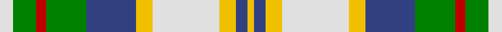

In pattern [WGRGBYWYBY](/stripes/wgrgbywyby/).

This was sourced from weddslist.  It is a [10 stripe tartan](/stripes/stripes10/).

Original link http://www.weddslist.com/cgi-bin/tartans/pg.pl?source=sts

## Also known as

This cloth is also recorded under:

- John, Hamilton Gray

## Attestations

This cloth appears in 2 source records; the oldest owns this page.

- undated — John, Hamilton Gray (weddslist, [record](http://www.weddslist.com/cgi-bin/tartans/pg.pl?source=sts))
- undated — John Hamilton Gray Commemorative Tartan Tartan Number: 1808. Earliest known date: pre 2003 One of the Fathers of the Confederation. Born Prince Edward Island in 1881. Premier in 1863. Died in 1887 See products available Copyright © Blair Urquhart, Comrie, 2015 (house-of-tartan, [record](http://www.house-of-tartan.scotland.net/house/TartanViewjs.asp?colr=Def&tnam=1808))

## Thread count
LN/8 G14 R6 G24 B30 Y10 LN40 Y10 B7 Y/4

## Palette
Each colour and the base-6 reference it is a variant of.

| Colour | Shade | Base |
|---|---|---|
| B | <code style="background-color:#304080;">#304080</code> `oklch(39.4% 0.109 270.2)` <small>#304080</small> | B <code style="background-color:#2A418A;">#2A418A</code> |
| G | <code style="background-color:#008000;">#008000</code> `oklch(52.0% 0.177 142.5)` <small>#008000</small> | G <code style="background-color:#006100;">#006100</code> |
| LN | <code style="background-color:#E0E0E0;">#E0E0E0</code> `oklch(90.7% 0.000 89.9)` <small>#E0E0E0</small> | W <code style="background-color:#F7F7F7;">#F7F7F7</code> |
| R | <code style="background-color:#C00000;">#C00000</code> `oklch(50.7% 0.208 29.2)` <small>#C00000</small> | R <code style="background-color:#CC0000;">#CC0000</code> |
| Y | <code style="background-color:#F0C000;">#F0C000</code> `oklch(82.7% 0.169 90.5)` <small>#F0C000</small> | Y <code style="background-color:#F2BF00;">#F2BF00</code> |

## Nearest tartans

The nearest existing variants by ΔTartan distance.

1. [Gray, Sir John Hamilton (Commem)](/setts/s10/w4dt6r3dt10n14lo6w18lo6n4lo2~x2/) — ΔT 0.91
1. [Coulter Dress (Personal)](/setts/s8/r6w20g12o3g8t20k2t3~x2/) — ΔT 1.01
1. [Ainslie, Lake](/setts/s7/db6w10g10r2ly3r1db3~x2/) — ΔT 1.09
1. [Northern Ontario](/setts/s7/dy17g5db2w12db2ly4g7~x4/) — ΔT 1.10
1. [Fredericton](/setts/s12/p3t1w9r6g5t2w2t2w2t2g12ly2~x2/) — ΔT 1.13
1. [Gillies Dress Green](/setts/s10/lo12k3g24r12g24k32w44g4w8g4/) — ΔT 1.13
1. [Fredericton District Tartan Tartan Number: 96. Earliest known date: 1967 Fredericton, capital city of New Brunswick, takes its name from Prince Frederick, the second son of King George III. The tartan was designed and woven by the Loomcrofters of Frederickton who weave in their own homes on their own looms. (From 'District Tartans', G. Teall and P. Smith, 1992) See products available Copyright © Blair Urquhart, Comrie, 2015](/setts/s12/dp3t1w9r6g5t2w2t2w2t2g12ly2~x2/) — ΔT 1.16
1. [Hayama Shirt Honten, The](/setts/s12/k4g4k2g14k6w3k6w2w4w2w15r3~x2/) — ΔT 1.17
1. [Gaelic College of St.Anns](/setts/s9/g8r1g4dy2w4t3w1t3w4~x8/) — ΔT 1.17
1. [Hayama Shirt Honten, The](/setts/s12/k4g4k2g12k6w3k6o2w4o2w15r3~x2/) — ΔT 1.21

## Neighbour map

Every grey dot is one of 14299 variants placed by the first two principal components of the ΔTartan feature space (44% of its variance). Red is this tartan; blue dots are its nearest — click one to open its page.

<svg viewBox="0 0 640 380" role="img" style="max-width:100%;height:auto;border:1px solid #e0e0e0;border-radius:4px;display:block" xmlns="http://www.w3.org/2000/svg"><image href="/nn/cloud.v1.png" width="640" height="380"/><a href="/setts/s10/w4dt6r3dt10n14lo6w18lo6n4lo2~x2/"><circle cx="65.8" cy="162.0" r="4" fill="#3465a4"><title>Gray, Sir John Hamilton (Commem)</title></circle></a><a href="/setts/s8/r6w20g12o3g8t20k2t3~x2/"><circle cx="82.4" cy="153.0" r="4" fill="#3465a4"><title>Coulter Dress (Personal)</title></circle></a><a href="/setts/s7/db6w10g10r2ly3r1db3~x2/"><circle cx="72.8" cy="171.0" r="4" fill="#3465a4"><title>Ainslie, Lake</title></circle></a><a href="/setts/s7/dy17g5db2w12db2ly4g7~x4/"><circle cx="103.4" cy="175.6" r="4" fill="#3465a4"><title>Northern Ontario</title></circle></a><a href="/setts/s12/p3t1w9r6g5t2w2t2w2t2g12ly2~x2/"><circle cx="104.6" cy="125.3" r="4" fill="#3465a4"><title>Fredericton</title></circle></a><a href="/setts/s10/lo12k3g24r12g24k32w44g4w8g4/"><circle cx="107.2" cy="134.7" r="4" fill="#3465a4"><title>Gillies Dress Green</title></circle></a><a href="/setts/s12/dp3t1w9r6g5t2w2t2w2t2g12ly2~x2/"><circle cx="103.5" cy="124.5" r="4" fill="#3465a4"><title>Fredericton District Tartan Tartan Number: 96. Earliest known date: 1967 Fredericton, capital city of New Brunswick, takes its name from Prince Frederick, the second son of King George III. The tartan was designed and woven by the Loomcrofters of Frederickton who weave in their own homes on their own looms. (From 'District Tartans', G. Teall and P. Smith, 1992) See products available Copyright © Blair Urquhart, Comrie, 2015</title></circle></a><a href="/setts/s12/k4g4k2g14k6w3k6w2w4w2w15r3~x2/"><circle cx="80.7" cy="147.5" r="4" fill="#3465a4"><title>Hayama Shirt Honten, The</title></circle></a><a href="/setts/s9/g8r1g4dy2w4t3w1t3w4~x8/"><circle cx="115.3" cy="187.9" r="4" fill="#3465a4"><title>Gaelic College of St.Anns</title></circle></a><a href="/setts/s12/k4g4k2g12k6w3k6o2w4o2w15r3~x2/"><circle cx="83.4" cy="151.5" r="4" fill="#3465a4"><title>Hayama Shirt Honten, The</title></circle></a><circle cx="89.5" cy="156.2" r="5" fill="#c00000"/></svg>

ID: /setts/s10/w8g14r6g24db30ly10w40ly10db7ly4/
