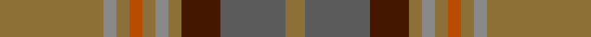

In pattern [GBBGRGRGRG](/stripes/gbbgrgrgrg/).

This was sourced from tartans-authority.  It is a [10 stripe tartan](/stripes/stripes10/).

Original link http://www.tartansauthority.com/tartan-ferret/display/1742/

## Thread count
LT/32 Na4 LT4 DO4 LT4 Na4 LT4 DR12 N20 LT/6

## Palette
Each colour and the base-6 reference it is a variant of.

| Colour | Shade | Base |
|---|---|---|
| DO | <code style="background-color:#B84C00;">#B84C00</code> `oklch(55.1% 0.156 45.5)` <small>#B84C00</small> | R <code style="background-color:#CC0000;">#CC0000</code> |
| DR | <code style="background-color:#441800;">#441800</code> `oklch(27.3% 0.076 46.3)` <small>#441800</small> | B <code style="background-color:#2A418A;">#2A418A</code> |
| LT | <code style="background-color:#8C7038;">#8C7038</code> `oklch(56.0% 0.082 83.0)` <small>#8C7038</small> | G <code style="background-color:#006100;">#006100</code> |
| N | <code style="background-color:#5C5C5C;">#5C5C5C</code> `oklch(47.5% 0.000 89.9)` <small>#5C5C5C</small> | B <code style="background-color:#2A418A;">#2A418A</code> |
| Na | <code style="background-color:#888888;">#888888</code> `oklch(62.7% 0.000 89.9)` <small>#888888</small> | R <code style="background-color:#CC0000;">#CC0000</code> |

## Nearest tartans

The nearest existing variants by ΔTartan distance.

1. [Jardine of Castlemilk Family Tartan Tartan Number: 1432. Earliest known date: c.1978 The chiefly house is Jardine of Applegirth, a baronetcy created in 1672. The Jardines of Castlemilk in Dumfriesshire settled there in the early fourteenth century. The tartan is approved by Col Jardine. The darker brown is recorded as "J.Br", and the lighter as "Olive Br" in the Lyon Books. See products available Copyright © Blair Urquhart, Comrie, 2015](/setts/s8/o9o9y9o1t1o9t1o1~x4/) — ΔT 1.35
1. [Jardine, of Castlemilk](/setts/s8/dr9o9n9r1db1o9db1r1~x4/) — ΔT 1.56
1. [Pubcrawlers (Corporate)](/setts/s7/g3dy4g2dy22n5r16ly3~x2/) — ΔT 1.58
1. [Hanna of Leith (yellow line)](/setts/s10/dy9n4dy2n4dy2n30dy9n4t14lo2~x2/) — ΔT 1.75
1. [Harmony 5](/setts/s12/g9r3g4o3g3o4g3dp11o30r3o4g3~x2/) — ΔT 1.76
1. [Sandbaggers (Corporate)](/setts/s13/lr6n3o7n2o5n8o5n15o18r2o2ly2b3~x2/) — ΔT 1.79
1. [John Muir Way](/setts/s8/dy35dg19r3y8r3dg8r3t3~x2/) — ΔT 1.80
1. [Rikaco Eve (Fashion)](/setts/s10/g4n4g2lo36n14lo2t4g7r5lo3~x2/) — ΔT 1.81
1. [Earle's Flame (Fashion)](/setts/s8/do10y24r3y3r24dg3y6do6~x2/) — ΔT 1.82
1. [Tasmanian](/setts/s11/r5lp2y24lr2y2lr2y6lr8r6lr8ly4~x2/) — ΔT 1.84

## Neighbour map

Every grey dot is one of 14299 variants placed by the first two principal components of the ΔTartan feature space (44% of its variance). Red is this tartan; blue dots are its nearest — click one to open its page.

<svg viewBox="0 0 640 380" role="img" style="max-width:100%;height:auto;border:1px solid #e0e0e0;border-radius:4px;display:block" xmlns="http://www.w3.org/2000/svg"><image href="/nn/cloud.v1.png" width="640" height="380"/><a href="/setts/s8/o9o9y9o1t1o9t1o1~x4/"><circle cx="315.6" cy="241.0" r="4" fill="#3465a4"><title>Jardine of Castlemilk Family Tartan Tartan Number: 1432. Earliest known date: c.1978 The chiefly house is Jardine of Applegirth, a baronetcy created in 1672. The Jardines of Castlemilk in Dumfriesshire settled there in the early fourteenth century. The tartan is approved by Col Jardine. The darker brown is recorded as &quot;J.Br&quot;, and the lighter as &quot;Olive Br&quot; in the Lyon Books. See products available Copyright © Blair Urquhart, Comrie, 2015</title></circle></a><a href="/setts/s8/dr9o9n9r1db1o9db1r1~x4/"><circle cx="291.8" cy="233.7" r="4" fill="#3465a4"><title>Jardine, of Castlemilk</title></circle></a><a href="/setts/s7/g3dy4g2dy22n5r16ly3~x2/"><circle cx="317.1" cy="215.4" r="4" fill="#3465a4"><title>Pubcrawlers (Corporate)</title></circle></a><a href="/setts/s10/dy9n4dy2n4dy2n30dy9n4t14lo2~x2/"><circle cx="396.8" cy="215.8" r="4" fill="#3465a4"><title>Hanna of Leith (yellow line)</title></circle></a><a href="/setts/s12/g9r3g4o3g3o4g3dp11o30r3o4g3~x2/"><circle cx="271.4" cy="174.8" r="4" fill="#3465a4"><title>Harmony 5</title></circle></a><a href="/setts/s13/lr6n3o7n2o5n8o5n15o18r2o2ly2b3~x2/"><circle cx="310.3" cy="209.5" r="4" fill="#3465a4"><title>Sandbaggers (Corporate)</title></circle></a><a href="/setts/s8/dy35dg19r3y8r3dg8r3t3~x2/"><circle cx="302.0" cy="206.0" r="4" fill="#3465a4"><title>John Muir Way</title></circle></a><a href="/setts/s10/g4n4g2lo36n14lo2t4g7r5lo3~x2/"><circle cx="356.1" cy="164.8" r="4" fill="#3465a4"><title>Rikaco Eve (Fashion)</title></circle></a><a href="/setts/s8/do10y24r3y3r24dg3y6do6~x2/"><circle cx="341.6" cy="261.5" r="4" fill="#3465a4"><title>Earle's Flame (Fashion)</title></circle></a><a href="/setts/s11/r5lp2y24lr2y2lr2y6lr8r6lr8ly4~x2/"><circle cx="293.0" cy="176.1" r="4" fill="#3465a4"><title>Tasmanian</title></circle></a><circle cx="348.2" cy="222.5" r="5" fill="#c00000"/></svg>

ID: /setts/s10/y16o2y2o2y2o2y2do6n10y3~x2/
