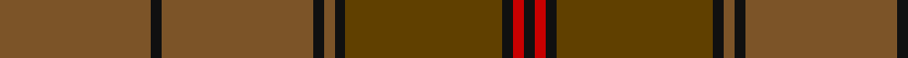

In pattern [GKGKGKGKRK](/stripes/gkgkgkgkrk/).

This was sourced from tartans-authority.  It is a [10 stripe tartan](/stripes/stripes10/).

Original link http://www.tartansauthority.com/tartan-ferret/display/1196/

## Also known as

This cloth is also recorded under:

- Ulster (District

## Attestations

This cloth appears in 2 source records; the oldest owns this page.

- 1590-1650 — Ulster (Peat) (District (tartans-authority, [record](http://www.tartansauthority.com/tartan-ferret/display/1196/))
- 01/01/1600 — Ulster (Peat) (register-of-tartans, [record](https://www.tartanregister.gov.uk/tartanDetails.aspx?ref=4196))

## Register references

External register numbers recorded for this tartan.

- Scottish Register of Tartans: [4196](https://www.tartanregister.gov.uk/tartanDetails.aspx?ref=4196)
- Scottish Tartans Authority (ITI): 1196
- Scottish Tartans World Register: 1196

## Thread count
Ta/56 K4 Ta56 K4 Ta4 K4 T58 K4 R4 K/4

## Palette
Each colour and its ΔE from the base-6 reference it is a variant of.

| Colour | Shade | Base | ΔE (OKLab) |
|---|---|---|---|
| K | <code style="background-color:#101010;">#101010</code> `#101010` | K <code style="background-color:#000000;">#000000</code> | 0.17 |
| R | <code style="background-color:#C80000;">#C80000</code> `#C80000` | R <code style="background-color:#CC0000;">#CC0000</code> | 0.01 |
| T | <code style="background-color:#604000;">#604000</code> `#604000` | G <code style="background-color:#006100;">#006100</code> | 0.14 |
| Ta | <code style="background-color:#7C5428;">#7C5428</code> `#7C5428` | G <code style="background-color:#006100;">#006100</code> | 0.16 |

## Nearest tartans

The nearest existing variants by ΔTartan distance.

1. [Historic Scotland Corporate Tartan Tartan Number: 2122. Earliest known date: 1988 Custodians at Historic Scotland properties throughout Scotland, including Edinburgh Castle, wear this distinctive tartan. See products available Copyright © Blair Urquhart, Comrie, 2015](/setts/s9/k2y7k1y9dy21o2dy1o1dy2~x2/) — ΔT 1.09
1. [Williams (Fashion)](/setts/s11/dy50do6o3do3y3do3dt10dy8do3dy6y3~x2/) — ΔT 1.42
1. [Glen Clova #2 (Fashion)](/setts/s12/dr39dy4dr6lo2dr2w2dr2dy12dr6dr2dr6lo2~x2/) — ΔT 1.57
1. [Huntsman](/setts/s8/y3dy3y4k4dy14k3y41g2~x2/) — ΔT 1.77
1. [Wicklow, County (District)](/setts/s10/do1n2g6n1do3t1n12do1n1g1~x4/) — ΔT 1.79
1. [Tricor (Corporate)](/setts/s7/y23o4dy6g6y4lb1y4~x4/) — ΔT 1.91
1. [MacAlister of Glenbarr Clan Tartan Tartan Number: 910. Earliest known date: pre 1984 This version of the MacAlister of Glenbarr tartan is the same as the MacGillivray hunting tartan. This sample was taken from a piece woven by Lochcarron Weavers around 1984. See products available Copyright © Blair Urquhart, Comrie, 2015](/setts/s14/g4dy2g2dy2g2dy3db1dy1g4dy1db1dy12db2dy3~x2/) — ΔT 1.92
1. [Isaia (Fashion)](/setts/s7/o80o8o4dy4lr4dy45n8/) — ΔT 1.95
1. [Redwoods](/setts/s9/y4r18dy2r2dy5k2dy15r1y4~x2/) — ΔT 1.98
1. [MacAlister of Glenbarr Hunting](/setts/s14/g20dy3g6dy6g6dy8db2dy2g20dy2db2dy46db3dy8~x2/) — ΔT 1.99

## Neighbour map

Every grey dot is one of 14299 variants placed by the first two principal components of the ΔTartan feature space (44% of its variance). Red is this tartan; blue dots are its nearest — click one to open its page.

<svg viewBox="0 0 640 380" role="img" style="max-width:100%;height:auto;border:1px solid #e0e0e0;border-radius:4px;display:block" xmlns="http://www.w3.org/2000/svg"><image href="/nn/cloud.v1.png" width="640" height="380"/><a href="/setts/s9/k2y7k1y9dy21o2dy1o1dy2~x2/"><circle cx="457.3" cy="212.9" r="4" fill="#3465a4"><title>Historic Scotland Corporate Tartan Tartan Number: 2122. Earliest known date: 1988 Custodians at Historic Scotland properties throughout Scotland, including Edinburgh Castle, wear this distinctive tartan. See products available Copyright © Blair Urquhart, Comrie, 2015</title></circle></a><a href="/setts/s11/dy50do6o3do3y3do3dt10dy8do3dy6y3~x2/"><circle cx="527.7" cy="193.4" r="4" fill="#3465a4"><title>Williams (Fashion)</title></circle></a><a href="/setts/s12/dr39dy4dr6lo2dr2w2dr2dy12dr6dr2dr6lo2~x2/"><circle cx="463.3" cy="166.9" r="4" fill="#3465a4"><title>Glen Clova #2 (Fashion)</title></circle></a><a href="/setts/s8/y3dy3y4k4dy14k3y41g2~x2/"><circle cx="499.9" cy="192.6" r="4" fill="#3465a4"><title>Huntsman</title></circle></a><a href="/setts/s10/do1n2g6n1do3t1n12do1n1g1~x4/"><circle cx="455.6" cy="245.1" r="4" fill="#3465a4"><title>Wicklow, County (District)</title></circle></a><a href="/setts/s7/y23o4dy6g6y4lb1y4~x4/"><circle cx="506.5" cy="221.6" r="4" fill="#3465a4"><title>Tricor (Corporate)</title></circle></a><a href="/setts/s14/g4dy2g2dy2g2dy3db1dy1g4dy1db1dy12db2dy3~x2/"><circle cx="467.8" cy="247.7" r="4" fill="#3465a4"><title>MacAlister of Glenbarr Clan Tartan Tartan Number: 910. Earliest known date: pre 1984 This version of the MacAlister of Glenbarr tartan is the same as the MacGillivray hunting tartan. This sample was taken from a piece woven by Lochcarron Weavers around 1984. See products available Copyright © Blair Urquhart, Comrie, 2015</title></circle></a><a href="/setts/s7/o80o8o4dy4lr4dy45n8/"><circle cx="442.2" cy="184.4" r="4" fill="#3465a4"><title>Isaia (Fashion)</title></circle></a><a href="/setts/s9/y4r18dy2r2dy5k2dy15r1y4~x2/"><circle cx="412.1" cy="233.4" r="4" fill="#3465a4"><title>Redwoods</title></circle></a><a href="/setts/s14/g20dy3g6dy6g6dy8db2dy2g20dy2db2dy46db3dy8~x2/"><circle cx="498.7" cy="208.2" r="4" fill="#3465a4"><title>MacAlister of Glenbarr Hunting</title></circle></a><circle cx="480.9" cy="219.9" r="5" fill="#c00000"/></svg>

ID: /setts/s10/y28k2y28k2y2k2dy29k2r2k2~x2/
