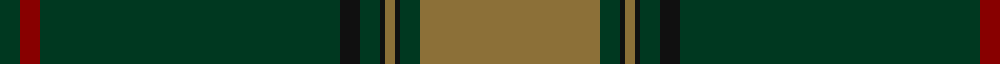

**Bands:** [GGKGKGKGRG](/stripes/ggkgkgkgrg/) · **Stripes:** [Y DG K Y K DG K DG R DG](/stripes/stripes10/) Y DG K Y K DG K DG R DG

This was sourced from tartans-authority.  It is a [10 band tartan](/bands/bands10/).

Original link http://www.tartansauthority.com/tartan-ferret/display/4222/

## Thread count
DG/4 DR4 DG60 K4 DG4 K1 LT2 K1 DG4 LT/36

## Palette
Each colour and its ΔE from the base-6 reference it is a variant of.

| Colour | Shade | Base | ΔE (OKLab) |
|---|---|---|---|
| DG | <code style="background-color:#003820;">#003820</code> `#003820` | G <code style="background-color:#006100;">#006100</code> | 0.15 |
| DR | <code style="background-color:#880000;">#880000</code> `#880000` | R <code style="background-color:#CC0000;">#CC0000</code> | 0.15 |
| K | <code style="background-color:#101010;">#101010</code> `#101010` | K <code style="background-color:#000000;">#000000</code> | 0.17 |
| LT | <code style="background-color:#8C7038;">#8C7038</code> `#8C7038` | G <code style="background-color:#006100;">#006100</code> | 0.18 |

## Nearest tartans

The nearest existing variants by ΔTartan distance.

1. [Semper](/setts/s8/g16dg1y4dg41y1dg6g2dg2~x2/) — ΔT 1.40
1. [Hayden (Dublin) (Personal)](/setts/s10/dg60dg5w5lo5dg9dp4dg5dg5dg1lo5~x2/) — ΔT 1.41
1. [New House Highland (Corporate)](/setts/s18/lo3k1r22k1r1k10dg1r1dg11k1r4k1dg8k1r4k1dg48k1~x2/) — ΔT 1.44
1. [Semper](/setts/s8/g16dg1lg4dg41lg1dg6g2dg2~x2/) — ΔT 1.46
1. [Dark Lochnagar](/setts/s10/do6o1do40n1do12o12n6o2r2o4~x2/) — ΔT 1.55
1. [Klappert Original (Personal)](/setts/s9/r1k1n30k6n1k6dy8k1r1~x2/) — ΔT 1.55
1. [Roast Den, The](/setts/s9/y62do12lg1y4dg2y4lg1do12dg12~x2/) — ΔT 1.55
1. [Melrose Newbigging Grey (Name)](/setts/s10/n1k6n35k6n2dp3n1k6n2w1~x2/) — ΔT 1.62
1. [MacWilliam Hunting](/setts/s6/dy2dg44k10r1db16r1~x2/) — ΔT 1.65
1. [Celtic (New) Corporate Sport Tartan Tartan Number: 2232. Earliest known date: 1842 Should have a white line (?). See products available Copyright © Blair Urquhart, Comrie, 2015](/setts/s8/g44k2g2k2g3k12db10r3~x2/) — ΔT 1.68

## Neighbour map

Every grey dot is one of 14313 variants placed by the first two principal components of the ΔTartan feature space (44% of its variance). Red is this tartan; blue dots are its nearest — click one to open its page.

<svg viewBox="0 0 640 380" role="img" style="max-width:100%;height:auto;border:1px solid #e0e0e0;border-radius:4px;display:block" xmlns="http://www.w3.org/2000/svg"><image href="/nn/cloud.v1.png" width="640" height="380"/><a href="/setts/s8/g16dg1y4dg41y1dg6g2dg2~x2/"><circle cx="513.0" cy="158.1" r="4" fill="#3465a4"><title>Semper</title></circle></a><a href="/setts/s10/dg60dg5w5lo5dg9dp4dg5dg5dg1lo5~x2/"><circle cx="428.5" cy="97.0" r="4" fill="#3465a4"><title>Hayden (Dublin) (Personal)</title></circle></a><a href="/setts/s18/lo3k1r22k1r1k10dg1r1dg11k1r4k1dg8k1r4k1dg48k1~x2/"><circle cx="438.3" cy="92.4" r="4" fill="#3465a4"><title>New House Highland (Corporate)</title></circle></a><a href="/setts/s8/g16dg1lg4dg41lg1dg6g2dg2~x2/"><circle cx="503.9" cy="153.3" r="4" fill="#3465a4"><title>Semper</title></circle></a><a href="/setts/s10/do6o1do40n1do12o12n6o2r2o4~x2/"><circle cx="504.0" cy="146.9" r="4" fill="#3465a4"><title>Dark Lochnagar</title></circle></a><a href="/setts/s9/r1k1n30k6n1k6dy8k1r1~x2/"><circle cx="426.6" cy="149.9" r="4" fill="#3465a4"><title>Klappert Original (Personal)</title></circle></a><a href="/setts/s9/y62do12lg1y4dg2y4lg1do12dg12~x2/"><circle cx="415.1" cy="108.5" r="4" fill="#3465a4"><title>Roast Den, The</title></circle></a><a href="/setts/s10/n1k6n35k6n2dp3n1k6n2w1~x2/"><circle cx="476.0" cy="126.3" r="4" fill="#3465a4"><title>Melrose Newbigging Grey (Name)</title></circle></a><a href="/setts/s6/dy2dg44k10r1db16r1~x2/"><circle cx="428.2" cy="155.3" r="4" fill="#3465a4"><title>MacWilliam Hunting</title></circle></a><a href="/setts/s8/g44k2g2k2g3k12db10r3~x2/"><circle cx="420.0" cy="164.9" r="4" fill="#3465a4"><title>Celtic (New) Corporate Sport Tartan Tartan Number: 2232. Earliest known date: 1842 Should have a white line (?). See products available Copyright © Blair Urquhart, Comrie, 2015</title></circle></a><circle cx="471.5" cy="124.4" r="5" fill="#c00000"/></svg>

ID: /setts/s10/y36dg4k1y2k1dg4k4dg60r4dg4/
