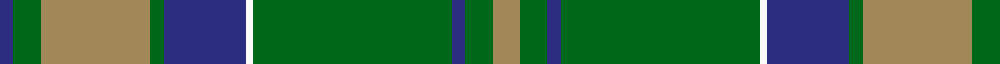

In pattern [BGYGBWGBGY](/patterns/bgygbwgbgy/).

This was sourced from tartans-authority.  It is a [10 stripes tartan](/stripes/stripes10/).

Original link http://www.tartansauthority.com/tartan-ferret/display/8574/

## Thread count
DB/4 G8 LT32 G4 DB24 W2 G58 DB4 G8 LT/8

## Palette
Each colour and its ΔE from the base-6 reference it is a variant of.

| Colour | Shade | Base | ΔE (OKLab) |
|---|---|---|---|
| DB | <code style="background-color:#2C2C80;">#2C2C80</code> `#2C2C80` | B <code style="background-color:#2A418A;">#2A418A</code> | 0.06 |
| G | <code style="background-color:#006818;">#006818</code> `#006818` | G <code style="background-color:#006100;">#006100</code> | 0.02 |
| LT | <code style="background-color:#A08858;">#A08858</code> `#A08858` | Y <code style="background-color:#F2BF00;">#F2BF00</code> | 0.21 |
| W | <code style="background-color:#FCFCFC;">#FCFCFC</code> `#FCFCFC` | W <code style="background-color:#F7F7F7;">#F7F7F7</code> | 0.01 |

## Nearest tartans

The nearest existing variants by ΔTartan distance.

1. [Gray Htg (Name)](/setts/s11/k3w1g29r8ra2r2ra2r2ra8g7k2x2~g006818-k101010-r888888-ra981c70-we0e0e0/) — ΔT 1.14
1. [New Mexico](/setts/s8/r1g16b2g10b22y4r2y1x2~b304080-g008000-rc00000-yf0c000/) — ΔT 1.16
1. [McKirgan (Name)](/setts/s11/g2b2w1r2w1b3g1b12g18w1r2x2~b506878-g285800-rc80000-we0e0e0/) — ΔT 1.16
1. [Gray Hunting Family Tartan Tartan Number: 1079. Earliest known date: 1990 There is also a Gray tartan designed by Mrs G. Gray some years earlier. See products available Copyright © Blair Urquhart, Comrie, 2015](/setts/s11/k3w1g29r8ra2r2ra2r2ra8g7k2x2~g006818-k101010-r888888-raa00048-we0e0e0/) — ΔT 1.19
1. [MacAuliffe/McAucliffe](/setts/s8/g38w2g6b24r6b2r3b2x2~b2c4084-g005020-rc87814-we0e0e0/) — ΔT 1.24
1. [Leatherneck, U.S.Marine Corps](/setts/s8/g28r2g2r2g8b24ga3r2x2~b304080-g008000-ga908000-rc00000/) — ΔT 1.25
1. [Armstrong](/setts/s10/r3b12k1b1k1b2k12g30k1g2x2~b2c2c80-g006818-k101010-rc80000/) — ΔT 1.27
1. [Johnston/Johnstone](/setts/s14/y3g2k1g30b24k2b2k2b2k2b24g30k1g2x2~b1870a4-g007800-k000000-ye8c000/) — ΔT 1.29
1. [Johnston (Clan)](/setts/s8/y3g2k1g30b24k2b2k2x2~b1870a4-g007800-k000000-ye8c000/) — ΔT 1.30
1. [Maine State District Tartan Tartan Number: 502. Earliest known date: 1965 Maine tartan is the oldest of America's tartans. It was woven by the Maine Spinning Company which has now gone out of business. When the tartan was first introduced it was reported in the Glasgow Herald (30.12.65) that it had been 'duly accredited by the State of Maine'. The State archives, however, are unable to locate the authorization. It is now marketed by the Maine Tartan and Tweed company, who hold the copyright. See products available Copyright © Blair Urquhart, Comrie, 2015](/setts/s11/b2r2g33ba2b2ba6b2ba2b21r2g2x2~b5c8ca8-ba202060-g006818-rc80000/) — ΔT 1.30

## Neighbour map

Every grey dot is one of 15726 variants placed by the first two principal components of the ΔTartan feature space (44% of its variance). Red is this tartan; blue dots are its nearest — click one to open its page.

<svg viewBox="0 0 640 380" role="img" style="max-width:100%;height:auto;border:1px solid #e0e0e0;border-radius:4px;display:block" xmlns="http://www.w3.org/2000/svg"><image href="/nn/cloud.v1.png" width="640" height="380"/><a href="/setts/s11/k3w1g29r8ra2r2ra2r2ra8g7k2x2~g006818-k101010-r888888-ra981c70-we0e0e0/"><circle cx="332.7" cy="111.9" r="4" fill="#3465a4"><title>Gray Htg (Name)</title></circle></a><a href="/setts/s8/r1g16b2g10b22y4r2y1x2~b304080-g008000-rc00000-yf0c000/"><circle cx="286.8" cy="162.3" r="4" fill="#3465a4"><title>New Mexico</title></circle></a><a href="/setts/s11/g2b2w1r2w1b3g1b12g18w1r2x2~b506878-g285800-rc80000-we0e0e0/"><circle cx="326.6" cy="150.0" r="4" fill="#3465a4"><title>McKirgan (Name)</title></circle></a><a href="/setts/s11/k3w1g29r8ra2r2ra2r2ra8g7k2x2~g006818-k101010-r888888-raa00048-we0e0e0/"><circle cx="334.7" cy="112.0" r="4" fill="#3465a4"><title>Gray Hunting Family Tartan Tartan Number: 1079. Earliest known date: 1990 There is also a Gray tartan designed by Mrs G. Gray some years earlier. See products available Copyright © Blair Urquhart, Comrie, 2015</title></circle></a><a href="/setts/s8/g38w2g6b24r6b2r3b2x2~b2c4084-g005020-rc87814-we0e0e0/"><circle cx="362.0" cy="174.1" r="4" fill="#3465a4"><title>MacAuliffe/McAucliffe</title></circle></a><a href="/setts/s8/g28r2g2r2g8b24ga3r2x2~b304080-g008000-ga908000-rc00000/"><circle cx="338.9" cy="183.2" r="4" fill="#3465a4"><title>Leatherneck, U.S.Marine Corps</title></circle></a><a href="/setts/s10/r3b12k1b1k1b2k12g30k1g2x2~b2c2c80-g006818-k101010-rc80000/"><circle cx="337.2" cy="134.4" r="4" fill="#3465a4"><title>Armstrong</title></circle></a><a href="/setts/s14/y3g2k1g30b24k2b2k2b2k2b24g30k1g2x2~b1870a4-g007800-k000000-ye8c000/"><circle cx="340.8" cy="124.5" r="4" fill="#3465a4"><title>Johnston/Johnstone</title></circle></a><a href="/setts/s8/y3g2k1g30b24k2b2k2x2~b1870a4-g007800-k000000-ye8c000/"><circle cx="327.9" cy="138.9" r="4" fill="#3465a4"><title>Johnston (Clan)</title></circle></a><a href="/setts/s11/b2r2g33ba2b2ba6b2ba2b21r2g2x2~b5c8ca8-ba202060-g006818-rc80000/"><circle cx="314.1" cy="146.9" r="4" fill="#3465a4"><title>Maine State District Tartan Tartan Number: 502. Earliest known date: 1965 Maine tartan is the oldest of America's tartans. It was woven by the Maine Spinning Company which has now gone out of business. When the tartan was first introduced it was reported in the Glasgow Herald (30.12.65) that it had been 'duly accredited by the State of Maine'. The State archives, however, are unable to locate the authorization. It is now marketed by the Maine Tartan and Tweed company, who hold the copyright. See products available Copyright © Blair Urquhart, Comrie, 2015</title></circle></a><circle cx="339.1" cy="146.4" r="5" fill="#c00000"/></svg>

ID: /setts/s10/y4g4b2g29w1b12g2y16g4b2x2~b2c2c80-g006818-wfcfcfc-ya08858/
