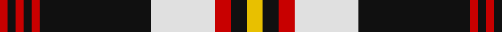

In pattern [RKRKRKWRKY](/patterns/rkrkrkwrky/).

This was sourced from house-of-tartan.  It is a [10 stripes tartan](/stripes/stripes10/).

Original link http://www.house-of-tartan.scotland.net/house/TartanViewjs.asp?colr=Def&tnam=1607

## Thread count
R/2 K2 R2 K2 R2 K28 LN16 R4 K4 Y/4

## Palette
Each colour and its ΔE from the base-6 reference it is a variant of.

| Colour | Shade | Base | ΔE (OKLab) |
|---|---|---|---|
| K | <code style="background-color:#101010;">#101010</code> `#101010` | K <code style="background-color:#000000;">#000000</code> | 0.17 |
| LN | <code style="background-color:#E0E0E0;">#E0E0E0</code> `#E0E0E0` | W <code style="background-color:#F4F4F0;">#F4F4F0</code> | 0.06 |
| R | <code style="background-color:#C80000;">#C80000</code> `#C80000` | R <code style="background-color:#C80000;">#C80000</code> | 0.00 |
| Y | <code style="background-color:#E8C000;">#E8C000</code> `#E8C000` | Y <code style="background-color:#E8C000;">#E8C000</code> | 0.00 |

ID: /setts/s10/y4k4r4w16k28r2k2r2k2r2-k101010-rc80000-we0e0e0-ye8c000/
