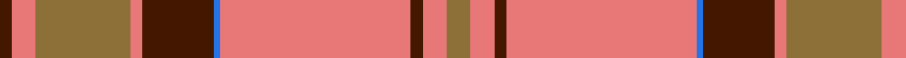

This page is one **sett** — a single exact thread-count. It belongs to the [tartan](/tartans/lt4lr4dr2lr32b1dr12lr2lt16lr4dr2/)
(the same proportion at any scale), whose colour order is pattern [BRGRBBRBRG](/stripes/brgrbbrbrg/).

Sourced from register-of-tartans.  It is a [10 stripe tartan](/stripes/stripes10/).

Original link https://www.tartanregister.gov.uk/tartanDetails.aspx?ref=4574

## Register references

External register numbers recorded for this tartan.

- Scottish Register of Tartans: [4574](https://www.tartanregister.gov.uk/tartanDetails.aspx?ref=4574)
- Scottish Tartans Authority (ITI): 4265

## Thread count
LT/8 LR8 DR4 LR64 B2 DR24 LR4 LT32 LR8 DR/4

## Palette
Each colour and the base-6 reference it is a variant of.

| Colour | Shade | Base |
|---|---|---|
| B | <code style="background-color:#2474E8;">#2474E8</code> `oklch(57.8% 0.192 258.7)` <small>#2474E8</small> | B <code style="background-color:#2A418A;">#2A418A</code> |
| DR | <code style="background-color:#441800;">#441800</code> `oklch(27.3% 0.076 46.3)` <small>#441800</small> | B <code style="background-color:#2A418A;">#2A418A</code> |
| LR | <code style="background-color:#E87878;">#E87878</code> `oklch(70.0% 0.139 21.2)` <small>#E87878</small> | R <code style="background-color:#CC0000;">#CC0000</code> |
| LT | <code style="background-color:#8C7038;">#8C7038</code> `oklch(56.0% 0.082 83.0)` <small>#8C7038</small> | G <code style="background-color:#006100;">#006100</code> |

## Nearest tartans

The nearest existing variants by ΔTartan distance, with this tartan at the top so the swatches line up against it.

ΔTartan

Tartan

Sett

—

<a href="/ttd/edit/#slug=y4r4do2r32b1do12r2y16r4do2~x2">Wcwm 9275-1626</a> <a class="nn-out" href="/setts/s10/y4r4do2r32b1do12r2y16r4do2~x2/" title="open its dictionary page">↗</a>

0.94

<a href="/ttd/edit/#slug=r5p2r2g42r5p36r70p2ly2r7g2~x2">MacPherson of Cluny</a> <a class="nn-out" href="/setts/s11/r5p2r2g42r5p36r70p2ly2r7g2~x2/" title="open its dictionary page">↗</a>

0.99

<a href="/ttd/edit/#slug=k3o6lr13r2lr2r32lr1r2lr2~x2">Fueglistal (Aargau) (Personal)</a> <a class="nn-out" href="/setts/s9/k3o6lr13r2lr2r32lr1r2lr2~x2/" title="open its dictionary page">↗</a>

1.03

<a href="/ttd/edit/#slug=r6w1r24db6g2db1g2db1g12r1~x2">Chisholm</a> <a class="nn-out" href="/setts/s10/r6w1r24db6g2db1g2db1g12r1~x2/" title="open its dictionary page">↗</a>

1.03

<a href="/ttd/edit/#slug=r56w2db6w2g32r11db6w5">Spens</a> <a class="nn-out" href="/setts/s8/r56w2db6w2g32r11db6w5/" title="open its dictionary page">↗</a>

1.05

<a href="/ttd/edit/#slug=r6db1r1dg28r4db8w1r32dg1r4dg2~x2">MacDonell of Keppoch (artefact)</a> <a class="nn-out" href="/setts/s11/r6db1r1dg28r4db8w1r32dg1r4dg2~x2/" title="open its dictionary page">↗</a>

1.08

<a href="/ttd/edit/#slug=r4t1db1r32t2r2db12r2g16r4t1r4db2~x2">MacGillivray</a> <a class="nn-out" href="/setts/s13/r4t1db1r32t2r2db12r2g16r4t1r4db2~x2/" title="open its dictionary page">↗</a>

1.10

<a href="/ttd/edit/#slug=r6lb1r24dp6dg2dp1dg2dp1dg12r1">Chisholm D</a> <a class="nn-out" href="/setts/s10/r6lb1r24dp6dg2dp1dg2dp1dg12r1/" title="open its dictionary page">↗</a>

1.11

<a href="/ttd/edit/#slug=r28db12r3g20p1g2p1g2r7~x2">Carrick</a> <a class="nn-out" href="/setts/s9/r28db12r3g20p1g2p1g2r7~x2/" title="open its dictionary page">↗</a>

1.11

<a href="/ttd/edit/#slug=g2r2db1r24t1db6r3g12r4db1~x2">MacDonell of Keppoch</a> <a class="nn-out" href="/setts/s10/g2r2db1r24t1db6r3g12r4db1~x2/" title="open its dictionary page">↗</a>

1.13

<a href="/ttd/edit/#slug=r3dp1r1dg21r3dp18r35dp1ly1r4dg1">MacPherson Of Cluny</a> <a class="nn-out" href="/setts/s11/r3dp1r1dg21r3dp18r35dp1ly1r4dg1/" title="open its dictionary page">↗</a>

## Neighbour map

Every grey dot is one of 14299 variants placed by the first two principal components of the ΔTartan feature space (44% of its variance). Red is this tartan; blue dots are its nearest — click one to open its page.

<svg viewBox="0 0 640 380" role="img" style="max-width:100%;height:auto;border:1px solid #e0e0e0;border-radius:4px;display:block" xmlns="http://www.w3.org/2000/svg"><image href="/nn/cloud.v1.png" width="640" height="380"/><a href="/setts/s11/r5p2r2g42r5p36r70p2ly2r7g2~x2/"><circle cx="368.3" cy="100.3" r="4" fill="#3465a4"><title>MacPherson of Cluny</title></circle></a><a href="/setts/s9/k3o6lr13r2lr2r32lr1r2lr2~x2/"><circle cx="413.3" cy="112.3" r="4" fill="#3465a4"><title>Fueglistal (Aargau) (Personal)</title></circle></a><a href="/setts/s10/r6w1r24db6g2db1g2db1g12r1~x2/"><circle cx="364.7" cy="123.0" r="4" fill="#3465a4"><title>Chisholm</title></circle></a><a href="/setts/s8/r56w2db6w2g32r11db6w5/"><circle cx="360.3" cy="123.9" r="4" fill="#3465a4"><title>Spens</title></circle></a><a href="/setts/s11/r6db1r1dg28r4db8w1r32dg1r4dg2~x2/"><circle cx="374.9" cy="104.2" r="4" fill="#3465a4"><title>MacDonell of Keppoch (artefact)</title></circle></a><a href="/setts/s13/r4t1db1r32t2r2db12r2g16r4t1r4db2~x2/"><circle cx="395.5" cy="103.0" r="4" fill="#3465a4"><title>MacGillivray</title></circle></a><a href="/setts/s10/r6lb1r24dp6dg2dp1dg2dp1dg12r1/"><circle cx="373.1" cy="125.5" r="4" fill="#3465a4"><title>Chisholm D</title></circle></a><a href="/setts/s9/r28db12r3g20p1g2p1g2r7~x2/"><circle cx="338.1" cy="137.4" r="4" fill="#3465a4"><title>Carrick</title></circle></a><a href="/setts/s10/g2r2db1r24t1db6r3g12r4db1~x2/"><circle cx="395.6" cy="130.2" r="4" fill="#3465a4"><title>MacDonell of Keppoch</title></circle></a><a href="/setts/s11/r3dp1r1dg21r3dp18r35dp1ly1r4dg1/"><circle cx="368.7" cy="103.5" r="4" fill="#3465a4"><title>MacPherson Of Cluny</title></circle></a><circle cx="361.3" cy="114.7" r="5" fill="#c00000"/></svg>

ID: /setts/s10/y4r4do2r32b1do12r2y16r4do2~x2/
