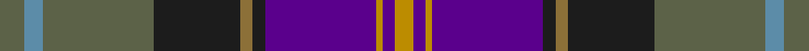

This page is one **sett** — a single exact thread-count. It belongs to the [tartan](/tartans/y4t3y18dt14y2dt2dp18lo1dp2lo3/)
(the same proportion at any scale), whose colour order is pattern [GBGBGBBYBY](/stripes/gbgbgbbyby/).

Sourced from register-of-tartans.  It is a [10 stripe tartan](/stripes/stripes10/).

Original link https://www.tartanregister.gov.uk/tartanDetails.aspx?ref=11331

## Register references

External register numbers recorded for this tartan.

- Scottish Register of Tartans: [11331](https://www.tartanregister.gov.uk/tartanDetails.aspx?ref=11331)

## Thread count
N/8 B6 N36 K28 LT4 K4 P36 DY2 P4 DY/6

## Palette

Palette: <strong>Tartan Register</strong> <small style="color:#888">(5 of 6 colours)</small>
<table><thead><tr><th>Colour</th><th>Threads</th><th>Shade</th><th>Base</th><th>OKLCh</th></tr></thead><tbody><tr><td>N/</td><td style="text-align:right;font-variant-numeric:tabular-nums">8</td><td><code style="background-color:#5C6248;">#5C6248</code> <small style="color:#888">#5C6248</small></td><td>G <code style="background-color:#006100;">#006100</code></td><td><small style="color:#888">oklch(48.3% 0.040 118.5)</small></td></tr><tr><td>B</td><td style="text-align:right;font-variant-numeric:tabular-nums">6</td><td><code style="background-color:#5C8CA8;">#5C8CA8</code> <small style="color:#888">#5C8CA8</small></td><td>B <code style="background-color:#2A418A;">#2A418A</code></td><td><small style="color:#888">oklch(61.7% 0.067 235.0)</small></td></tr><tr><td>N</td><td style="text-align:right;font-variant-numeric:tabular-nums">36</td><td><code style="background-color:#5C6248;">#5C6248</code> <small style="color:#888">#5C6248</small></td><td>G <code style="background-color:#006100;">#006100</code></td><td><small style="color:#888">oklch(48.3% 0.040 118.5)</small></td></tr><tr><td>K</td><td style="text-align:right;font-variant-numeric:tabular-nums">28</td><td><code style="background-color:#1C1C1C;">#1C1C1C</code> <small style="color:#888">#1C1C1C</small></td><td>B <code style="background-color:#2A418A;">#2A418A</code></td><td><small style="color:#888">oklch(22.6% 0.000 89.9)</small></td></tr><tr><td>LT</td><td style="text-align:right;font-variant-numeric:tabular-nums">4</td><td><code style="background-color:#8C7038;">#8C7038</code> <small style="color:#888">#8C7038</small></td><td>G <code style="background-color:#006100;">#006100</code></td><td><small style="color:#888">oklch(56.0% 0.082 83.0)</small></td></tr><tr><td>K</td><td style="text-align:right;font-variant-numeric:tabular-nums">4</td><td><code style="background-color:#1C1C1C;">#1C1C1C</code> <small style="color:#888">#1C1C1C</small></td><td>B <code style="background-color:#2A418A;">#2A418A</code></td><td><small style="color:#888">oklch(22.6% 0.000 89.9)</small></td></tr><tr><td>P</td><td style="text-align:right;font-variant-numeric:tabular-nums">36</td><td><code style="background-color:#5A008C;">#5A008C</code> <small style="color:#888">#5A008C</small></td><td>B <code style="background-color:#2A418A;">#2A418A</code></td><td><small style="color:#888">oklch(37.0% 0.191 306.3)</small></td></tr><tr><td>DY</td><td style="text-align:right;font-variant-numeric:tabular-nums">2</td><td><code style="background-color:#BC8C00;">#BC8C00</code> <small style="color:#888">#BC8C00</small></td><td>Y <code style="background-color:#F2BF00;">#F2BF00</code></td><td><small style="color:#888">oklch(66.8% 0.137 84.1)</small></td></tr><tr><td>P</td><td style="text-align:right;font-variant-numeric:tabular-nums">4</td><td><code style="background-color:#5A008C;">#5A008C</code> <small style="color:#888">#5A008C</small></td><td>B <code style="background-color:#2A418A;">#2A418A</code></td><td><small style="color:#888">oklch(37.0% 0.191 306.3)</small></td></tr><tr><td>DY/</td><td style="text-align:right;font-variant-numeric:tabular-nums">6</td><td><code style="background-color:#BC8C00;">#BC8C00</code> <small style="color:#888">#BC8C00</small></td><td>Y <code style="background-color:#F2BF00;">#F2BF00</code></td><td><small style="color:#888">oklch(66.8% 0.137 84.1)</small></td></tr></tbody></table>

## Nearest tartans

The nearest existing variants by ΔTartan distance, with this tartan at the top so the swatches line up against it.

ΔTartan

Tartan

Sett

—

<a href="/ttd/edit/#slug=y4t3y18dt14y2dt2dp18lo1dp2lo3~x2">Caisteal Leòdhais</a> <a class="nn-out" href="/setts/s10/y4t3y18dt14y2dt2dp18lo1dp2lo3~x2/" title="open its dictionary page">↗</a>

0.82

<a href="/ttd/edit/#slug=dp3o1db4g2r2g21o3dp21db25w3~x2">Accenture</a> <a class="nn-out" href="/setts/s10/dp3o1db4g2r2g21o3dp21db25w3~x2/" title="open its dictionary page">↗</a>

0.85

<a href="/ttd/edit/#slug=g19r3g19dt7m26k3dt7k3dp42k3dt7k3~x2">Tartan Spirit</a> <a class="nn-out" href="/setts/s12/g19r3g19dt7m26k3dt7k3dp42k3dt7k3~x2/" title="open its dictionary page">↗</a>

0.95

<a href="/ttd/edit/#slug=g3n3dp2db14g16dp18n2dp3n14db4ly3lo1n2~x2">ENABLE Scotland</a> <a class="nn-out" href="/setts/s13/g3n3dp2db14g16dp18n2dp3n14db4ly3lo1n2~x2/" title="open its dictionary page">↗</a>

1.04

<a href="/ttd/edit/#slug=g10ly2dp2g2dp13g2dp2g1k13db24w2~x2">Lang of Sherbrooke (Personal)</a> <a class="nn-out" href="/setts/s11/g10ly2dp2g2dp13g2dp2g1k13db24w2~x2/" title="open its dictionary page">↗</a>

1.07

<a href="/ttd/edit/#slug=g3dp3dt2dt14g16dp18dt2dp3dt14dt4ly3o1dt2~x2">ENABLE Scotland</a> <a class="nn-out" href="/setts/s13/g3dp3dt2dt14g16dp18dt2dp3dt14dt4ly3o1dt2~x2/" title="open its dictionary page">↗</a>

1.07

<a href="/ttd/edit/#slug=dp3n3dp3n27w1t15k22r3~x2">Beauly Firth and Glens</a> <a class="nn-out" href="/setts/s8/dp3n3dp3n27w1t15k22r3~x2/" title="open its dictionary page">↗</a>

1.09

<a href="/ttd/edit/#slug=g10ly2k2g2k13g2k2g1dp13db24w2~x2">Lang of Sherbrooke (Personal)</a> <a class="nn-out" href="/setts/s11/g10ly2k2g2k13g2k2g1dp13db24w2~x2/" title="open its dictionary page">↗</a>

1.09

<a href="/ttd/edit/#slug=k3dp16g5dp3p2dp2k12dt23w2~x2">Creiff Highland Gathering</a> <a class="nn-out" href="/setts/s9/k3dp16g5dp3p2dp2k12dt23w2~x2/" title="open its dictionary page">↗</a>

1.11

<a href="/ttd/edit/#slug=g15r25g4k2lo1db1lo1k2g4db12w1~x2">Livingstone - Australia (Personal)</a> <a class="nn-out" href="/setts/s11/g15r25g4k2lo1db1lo1k2g4db12w1~x2/" title="open its dictionary page">↗</a>

1.13

<a href="/ttd/edit/#slug=db45r4k20lb3o9dr4o3dr9k11~x2">United Arrows House Check</a> <a class="nn-out" href="/setts/s9/db45r4k20lb3o9dr4o3dr9k11~x2/" title="open its dictionary page">↗</a>

## Neighbour map

Every grey dot is one of 14299 variants placed by the first two principal components of the ΔTartan feature space (44% of its variance). Red is this tartan; blue dots are its nearest — click one to open its page.

<svg viewBox="0 0 640 380" role="img" style="max-width:100%;height:auto;border:1px solid #e0e0e0;border-radius:4px;display:block" xmlns="http://www.w3.org/2000/svg"><image href="/nn/cloud.v1.png" width="640" height="380"/><a href="/setts/s10/dp3o1db4g2r2g21o3dp21db25w3~x2/"><circle cx="204.5" cy="116.6" r="4" fill="#3465a4"><title>Accenture</title></circle></a><a href="/setts/s12/g19r3g19dt7m26k3dt7k3dp42k3dt7k3~x2/"><circle cx="154.8" cy="135.2" r="4" fill="#3465a4"><title>Tartan Spirit</title></circle></a><a href="/setts/s13/g3n3dp2db14g16dp18n2dp3n14db4ly3lo1n2~x2/"><circle cx="153.6" cy="135.8" r="4" fill="#3465a4"><title>ENABLE Scotland</title></circle></a><a href="/setts/s11/g10ly2dp2g2dp13g2dp2g1k13db24w2~x2/"><circle cx="176.2" cy="112.5" r="4" fill="#3465a4"><title>Lang of Sherbrooke (Personal)</title></circle></a><a href="/setts/s13/g3dp3dt2dt14g16dp18dt2dp3dt14dt4ly3o1dt2~x2/"><circle cx="160.2" cy="141.3" r="4" fill="#3465a4"><title>ENABLE Scotland</title></circle></a><a href="/setts/s8/dp3n3dp3n27w1t15k22r3~x2/"><circle cx="233.9" cy="138.6" r="4" fill="#3465a4"><title>Beauly Firth and Glens</title></circle></a><a href="/setts/s11/g10ly2k2g2k13g2k2g1dp13db24w2~x2/"><circle cx="173.6" cy="113.0" r="4" fill="#3465a4"><title>Lang of Sherbrooke (Personal)</title></circle></a><a href="/setts/s9/k3dp16g5dp3p2dp2k12dt23w2~x2/"><circle cx="168.6" cy="159.6" r="4" fill="#3465a4"><title>Creiff Highland Gathering</title></circle></a><a href="/setts/s11/g15r25g4k2lo1db1lo1k2g4db12w1~x2/"><circle cx="242.9" cy="111.1" r="4" fill="#3465a4"><title>Livingstone - Australia (Personal)</title></circle></a><a href="/setts/s9/db45r4k20lb3o9dr4o3dr9k11~x2/"><circle cx="224.6" cy="147.0" r="4" fill="#3465a4"><title>United Arrows House Check</title></circle></a><circle cx="188.2" cy="137.5" r="5" fill="#c00000"/></svg>

ID: /setts/s10/y4t3y18dt14y2dt2dp18lo1dp2lo3~x2/
