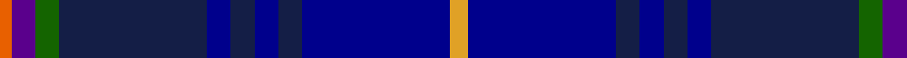

In pattern [RBGBBBBBBY](/patterns/rbgbbbbbby/).

This was sourced from register-of-tartans.  It is a [10 stripes tartan](/stripes/stripes10/).

Original link https://www.tartanregister.gov.uk/tartanDetails.aspx?ref=11095

## Thread count
O/4 P8 G8 DBa50 DB8 DBa8 DB8 DBa8 DB50 Y/6

## Palette
Each colour and its ΔE from the base-6 reference it is a variant of.

| Colour | Shade | Base | ΔE (OKLab) |
|---|---|---|---|
| DB | <code style="background-color:#00008C;">#00008C</code> `#00008C` | B <code style="background-color:#2C4084;">#2C4084</code> | 0.13 |
| DBa | <code style="background-color:#141E46;">#141E46</code> `#141E46` | B <code style="background-color:#2C4084;">#2C4084</code> | 0.15 |
| G | <code style="background-color:#146400;">#146400</code> `#146400` | G <code style="background-color:#006400;">#006400</code> | 0.01 |
| O | <code style="background-color:#E86000;">#E86000</code> `#E86000` | R <code style="background-color:#C80000;">#C80000</code> | 0.14 |
| P | <code style="background-color:#5A008C;">#5A008C</code> `#5A008C` | B <code style="background-color:#2C4084;">#2C4084</code> | 0.12 |
| Y | <code style="background-color:#E0A126;">#E0A126</code> `#E0A126` | Y <code style="background-color:#E8C000;">#E8C000</code> | 0.08 |

ID: /setts/s10/y6b50ba8b8ba8b8ba50g8bb8r4-b00008c-ba141e46-bb5a008c-g146400-re86000-ye0a126/
