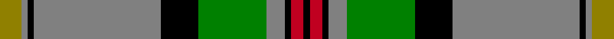

In pattern [GGKGKGGKRK](/stripes/ggkgkggkrk/).

This was sourced from weddslist.  It is a [10 stripe tartan](/stripes/stripes10/).

Original link http://www.weddslist.com/cgi-bin/tartans/pg.pl?source=sts

## Thread count
LG/14 N4 K4 N82 K24 G44 N12 K4 R8 K/4

## Palette
Each colour and the base-6 reference it is a variant of.

| Colour | Shade | Base |
|---|---|---|
| G | <code style="background-color:#008000;">#008000</code> `oklch(52.0% 0.177 142.5)` <small>#008000</small> | G <code style="background-color:#006100;">#006100</code> |
| K | <code style="background-color:#000000;">#000000</code> `oklch(0.0% 0.000 0.0)` <small>#000000</small> | K <code style="background-color:#000000;">#000000</code> |
| LG | <code style="background-color:#908000;">#908000</code> `oklch(59.6% 0.124 100.6)` <small>#908000</small> | G <code style="background-color:#006100;">#006100</code> |
| N | <code style="background-color:#808080;">#808080</code> `oklch(60.0% 0.000 89.9)` <small>#808080</small> | G <code style="background-color:#006100;">#006100</code> |
| R | <code style="background-color:#C00020;">#C00020</code> `oklch(50.9% 0.206 24.5)` <small>#C00020</small> | R <code style="background-color:#CC0000;">#CC0000</code> |

## Nearest tartans

The nearest existing variants by ΔTartan distance.

1. [Dinwiddie](/setts/s10/ly7o2k2o41k12g22o6k2r4k2~x2/) — ΔT 0.55
1. [Dinwiddie Clan Tartan Tartan Number: 3212. Earliest known date: 2001 The registered tartan of the Dinwiddie Clan. Dinwiddies are normally associated with the Maxwells, but Lord Lyon stated, in 1988, that Dinwiddies were a sept of no other clan. See products available Copyright © Blair Urquhart, Comrie, 2015](/setts/s10/ly4o2k2o42k13g25o6k2r4k2~x2/) — ΔT 0.80
1. [Smoke Showing (UFES)](/setts/s9/g3n5k4n33g12k4w2k18lo3~x2/) — ΔT 0.97
1. [MacNeil 3](/setts/s8/g45w2r3k15r3db15r3db15~x2/) — ΔT 0.99
1. [Murray-Hetherington (Personal)](/setts/s10/g1k1g14k2r3db3k6w1k1w1~x4/) — ΔT 0.99
1. [MacDonald of The Isles](/setts/s9/w4g30k1g1k1g3k12db10r3~x2/) — ΔT 1.10
1. [MacDowall](/setts/s12/w3g14n3k7n48k7w3k3w3k3w12ly3~x2/) — ΔT 1.10
1. [Otago](/setts/s10/y16k2y6k2r2k2db15g1db1w2~x2/) — ΔT 1.11
1. [Walker, Gauvin (Personal)](/setts/s12/lo1lg3k2g5dp4g1k14lg1k4g25lg2lo1~x2/) — ΔT 1.14
1. [Murray-Hetherington (Personal) Name Tartan Tartan Number: 10700. Earliest known date: 18 September 2012 After years of wearing the Murray of Atholl tartan, the registrant has chosen to register a tartan in his own name. He belongs to a family that has intermarried with the Murrays for many years and bears the additional surname of Murray. The underlying design of this personal tartan is based on details derived from the Blair Atholl tartan with due and proper differences to distinguish it. The colours used were specifically chosen to represent the colours found in the Murray of Atholl sett. The addition of three white stripes alludes to the three silver stars of the Murrays. The black and white also reflect the principal heraldic colours in the registrant's coat of arms granted to him by Garter King of Arms (England) and Norroy and Ulster King of Arms. The tartan, for the registrant, his immediate family, and their descendants to wear, maintains the strong link with the Murray Clan. See products available Copyright © Blair Urquhart, Comrie, 2015](/setts/s12/g1k1g14k2r3db3k6w1k1w1k1w1~x4/) — ΔT 1.14

## Neighbour map

Every grey dot is one of 14299 variants placed by the first two principal components of the ΔTartan feature space (44% of its variance). Red is this tartan; blue dots are its nearest — click one to open its page.

<svg viewBox="0 0 640 380" role="img" style="max-width:100%;height:auto;border:1px solid #e0e0e0;border-radius:4px;display:block" xmlns="http://www.w3.org/2000/svg"><image href="/nn/cloud.v1.png" width="640" height="380"/><a href="/setts/s10/ly7o2k2o41k12g22o6k2r4k2~x2/"><circle cx="255.8" cy="115.5" r="4" fill="#3465a4"><title>Dinwiddie</title></circle></a><a href="/setts/s10/ly4o2k2o42k13g25o6k2r4k2~x2/"><circle cx="267.2" cy="115.2" r="4" fill="#3465a4"><title>Dinwiddie Clan Tartan Tartan Number: 3212. Earliest known date: 2001 The registered tartan of the Dinwiddie Clan. Dinwiddies are normally associated with the Maxwells, but Lord Lyon stated, in 1988, that Dinwiddies were a sept of no other clan. See products available Copyright © Blair Urquhart, Comrie, 2015</title></circle></a><a href="/setts/s9/g3n5k4n33g12k4w2k18lo3~x2/"><circle cx="240.3" cy="148.3" r="4" fill="#3465a4"><title>Smoke Showing (UFES)</title></circle></a><a href="/setts/s8/g45w2r3k15r3db15r3db15~x2/"><circle cx="230.4" cy="135.1" r="4" fill="#3465a4"><title>MacNeil 3</title></circle></a><a href="/setts/s10/g1k1g14k2r3db3k6w1k1w1~x4/"><circle cx="204.8" cy="126.9" r="4" fill="#3465a4"><title>Murray-Hetherington (Personal)</title></circle></a><a href="/setts/s9/w4g30k1g1k1g3k12db10r3~x2/"><circle cx="293.1" cy="116.5" r="4" fill="#3465a4"><title>MacDonald of The Isles</title></circle></a><a href="/setts/s12/w3g14n3k7n48k7w3k3w3k3w12ly3~x2/"><circle cx="225.1" cy="103.8" r="4" fill="#3465a4"><title>MacDowall</title></circle></a><a href="/setts/s10/y16k2y6k2r2k2db15g1db1w2~x2/"><circle cx="206.3" cy="110.9" r="4" fill="#3465a4"><title>Otago</title></circle></a><a href="/setts/s12/lo1lg3k2g5dp4g1k14lg1k4g25lg2lo1~x2/"><circle cx="260.8" cy="97.3" r="4" fill="#3465a4"><title>Walker, Gauvin (Personal)</title></circle></a><a href="/setts/s12/g1k1g14k2r3db3k6w1k1w1k1w1~x4/"><circle cx="188.6" cy="112.3" r="4" fill="#3465a4"><title>Murray-Hetherington (Personal) Name Tartan Tartan Number: 10700. Earliest known date: 18 September 2012 After years of wearing the Murray of Atholl tartan, the registrant has chosen to register a tartan in his own name. He belongs to a family that has intermarried with the Murrays for many years and bears the additional surname of Murray. The underlying design of this personal tartan is based on details derived from the Blair Atholl tartan with due and proper differences to distinguish it. The colours used were specifically chosen to represent the colours found in the Murray of Atholl sett. The addition of three white stripes alludes to the three silver stars of the Murrays. The black and white also reflect the principal heraldic colours in the registrant's coat of arms granted to him by Garter King of Arms (England) and Norroy and Ulster King of Arms. The tartan, for the registrant, his immediate family, and their descendants to wear, maintains the strong link with the Murray Clan. See products available Copyright © Blair Urquhart, Comrie, 2015</title></circle></a><circle cx="248.5" cy="115.2" r="5" fill="#c00000"/></svg>

ID: /setts/s10/y7y2k2y41k12g22y6k2r4k2~x2/
