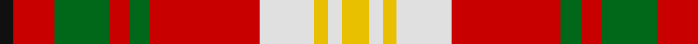

In pattern [KRGRGRWYWY](/patterns/krgrgrwywy/).

This was sourced from register-of-tartans.  It is a [10 stripes tartan](/stripes/stripes10/).

Original link https://www.tartanregister.gov.uk/tartanDetails.aspx?ref=2911

## Attestations

This cloth appears in 3 source records; the oldest owns this page.

- 01/01/1990 — Melieres, Carolyn (Personal) (register-of-tartans, [record](https://www.tartanregister.gov.uk/tartanDetails.aspx?ref=2911))
- pre 1990 — Melieres, Carolyn (Personal) (tartans-authority, [record](http://www.tartansauthority.com/tartan-ferret/display/1171/))
- undated — Carolyn Melieres Family Tartan Tartan Number: 1171. Earliest known date: 1966 A sample of this tartan was recorded by the Scottish Tartans Society during the period 1970 to 1990. See products available Copyright © Blair Urquhart, Comrie, 2015 (house-of-tartan, [record](http://www.house-of-tartan.scotland.net/house/TartanViewjs.asp?colr=Def&tnam=1171))

## Thread count
K/4 R12 G16 R6 G6 R32 LN16 Y4 LN4 Y/8

## Palette
Each colour and its ΔE from the base-6 reference it is a variant of.

| Colour | Shade | Base | ΔE (OKLab) |
|---|---|---|---|
| G | <code style="background-color:#006818;">#006818</code> `#006818` | G <code style="background-color:#006100;">#006100</code> | 0.02 |
| K | <code style="background-color:#101010;">#101010</code> `#101010` | K <code style="background-color:#000000;">#000000</code> | 0.17 |
| LN | <code style="background-color:#E0E0E0;">#E0E0E0</code> `#E0E0E0` | W <code style="background-color:#F7F7F7;">#F7F7F7</code> | 0.07 |
| R | <code style="background-color:#C80000;">#C80000</code> `#C80000` | R <code style="background-color:#CC0000;">#CC0000</code> | 0.01 |
| Y | <code style="background-color:#E8C000;">#E8C000</code> `#E8C000` | Y <code style="background-color:#F2BF00;">#F2BF00</code> | 0.02 |

## Nearest tartans

The nearest existing variants by ΔTartan distance.

1. [Carolyn, Melieres](/setts/s10/y8w4y4w16r32g6r6g16r12k4-g008000-k000000-rc00000-we0e0e0-yf0c000/) — ΔT 0.23
1. [Highland Spring (1985)](/setts/s12/r32k4r18g24y4g20b6k4b6k4b6r20-b64a0f0-g3c7828-k000000-rc82800-yc88c00/) — ΔT 1.05
1. [Keeling (Corporate)](/setts/s7/y34g14y12r86k10ra12k26-g289c18-k101010-rc80000-ra888888-ye8c000/) — ΔT 1.05
1. [Satchidananda (Personal)](/setts/s9/g36y8b20w4r40y10r4w4g12-b2888c4-g604000-rfc5000-we0e0e0-ye8c000/) — ΔT 1.22
1. [Thirkill (Dalgliesh)](/setts/s7/w24r72k8r24g28k32y24-g006818-k101010-rc80000-wfcfcfc-ye8c000/) — ΔT 1.25
1. [Unidentified from Winnipeg](/setts/s8/w48r16g4r16g4r16ga30gb4-g2a2303-ga503c14-gb005020-rfa4b00-wf5dca0/) — ΔT 1.28
1. [Sidney, (Nova Scotia)](/setts/s8/g32k8w4k8g12y22g4y32-g808080-k000000-we0e0e0-yff8500/) — ΔT 1.29
1. [Ogilvie (D.C. Stewart)](/setts/s14/g32r8g32y8k8r48w8r32w8r48k8y8g32w8-g789484-k101010-rc80000-we0e0e0-yd8b000/) — ΔT 1.29
1. [Carlow County Crest (Fashion)](/setts/s10/w15g8k12g14r64k12r16k10y8k14-g006818-k101010-rc80000-we0e0e0-ye8c000/) — ΔT 1.32
1. [Ballater Trade or 'Fancy' Tartan Tartan Number: 1708. Earliest known date: Modern Many new designs have been given district names to promote their Scottish connections. However, these names should not be confused with the District tartans which have earned their title through 'use and wont' and not a little history. See products available Copyright © Blair Urquhart, Comrie, 2015](/setts/s9/r24w4y6w4r6k10r4y36w4-k101010-rc80000-we0e0e0-ya08858/) — ΔT 1.36

## Neighbour map

Every grey dot is one of 15726 variants placed by the first two principal components of the ΔTartan feature space (44% of its variance). Red is this tartan; blue dots are its nearest — click one to open its page.

<svg viewBox="0 0 640 380" role="img" style="max-width:100%;height:auto;border:1px solid #e0e0e0;border-radius:4px;display:block" xmlns="http://www.w3.org/2000/svg"><image href="/nn/cloud.v1.png" width="640" height="380"/><a href="/setts/s10/y8w4y4w16r32g6r6g16r12k4-g008000-k000000-rc00000-we0e0e0-yf0c000/"><circle cx="168.1" cy="157.3" r="4" fill="#3465a4"><title>Carolyn, Melieres</title></circle></a><a href="/setts/s12/r32k4r18g24y4g20b6k4b6k4b6r20-b64a0f0-g3c7828-k000000-rc82800-yc88c00/"><circle cx="192.9" cy="164.0" r="4" fill="#3465a4"><title>Highland Spring (1985)</title></circle></a><a href="/setts/s7/y34g14y12r86k10ra12k26-g289c18-k101010-rc80000-ra888888-ye8c000/"><circle cx="185.0" cy="160.2" r="4" fill="#3465a4"><title>Keeling (Corporate)</title></circle></a><a href="/setts/s9/g36y8b20w4r40y10r4w4g12-b2888c4-g604000-rfc5000-we0e0e0-ye8c000/"><circle cx="150.6" cy="154.7" r="4" fill="#3465a4"><title>Satchidananda (Personal)</title></circle></a><a href="/setts/s7/w24r72k8r24g28k32y24-g006818-k101010-rc80000-wfcfcfc-ye8c000/"><circle cx="149.5" cy="183.4" r="4" fill="#3465a4"><title>Thirkill (Dalgliesh)</title></circle></a><a href="/setts/s8/w48r16g4r16g4r16ga30gb4-g2a2303-ga503c14-gb005020-rfa4b00-wf5dca0/"><circle cx="152.6" cy="144.6" r="4" fill="#3465a4"><title>Unidentified from Winnipeg</title></circle></a><a href="/setts/s8/g32k8w4k8g12y22g4y32-g808080-k000000-we0e0e0-yff8500/"><circle cx="199.5" cy="190.2" r="4" fill="#3465a4"><title>Sidney, (Nova Scotia)</title></circle></a><a href="/setts/s14/g32r8g32y8k8r48w8r32w8r48k8y8g32w8-g789484-k101010-rc80000-we0e0e0-yd8b000/"><circle cx="196.8" cy="168.4" r="4" fill="#3465a4"><title>Ogilvie (D.C. Stewart)</title></circle></a><a href="/setts/s10/w15g8k12g14r64k12r16k10y8k14-g006818-k101010-rc80000-we0e0e0-ye8c000/"><circle cx="188.6" cy="152.0" r="4" fill="#3465a4"><title>Carlow County Crest (Fashion)</title></circle></a><a href="/setts/s9/r24w4y6w4r6k10r4y36w4-k101010-rc80000-we0e0e0-ya08858/"><circle cx="229.2" cy="166.0" r="4" fill="#3465a4"><title>Ballater Trade or 'Fancy' Tartan Tartan Number: 1708. Earliest known date: Modern Many new designs have been given district names to promote their Scottish connections. However, these names should not be confused with the District tartans which have earned their title through 'use and wont' and not a little history. See products available Copyright © Blair Urquhart, Comrie, 2015</title></circle></a><circle cx="173.6" cy="158.8" r="5" fill="#c00000"/></svg>

ID: /setts/s10/y8w4y4w16r32g6r6g16r12k4-g006818-k101010-rc80000-we0e0e0-ye8c000/
