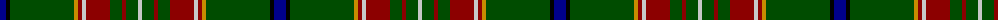

In pattern [BKGYRWRGRGW](/patterns/bkgyrwrgrgw/).

This was sourced from tartans-authority.  It is a [11 stripes tartan](/stripes/stripes11/).

Original link http://www.tartansauthority.com/tartan-ferret/display/335/

## Thread count
DB/12 K4 G64 DY4 DR4 N4 DR24 G12 DR4 G12 N/4

## Palette
Each colour and its ΔE from the base-6 reference it is a variant of.

| Colour | Shade | Base | ΔE (OKLab) |
|---|---|---|---|
| DB | <code style="background-color:#00008C;">#00008C</code> `#00008C` | B <code style="background-color:#2C4084;">#2C4084</code> | 0.13 |
| DR | <code style="background-color:#8C0000;">#8C0000</code> `#8C0000` | R <code style="background-color:#C80000;">#C80000</code> | 0.13 |
| DY | <code style="background-color:#C88C00;">#C88C00</code> `#C88C00` | Y <code style="background-color:#E8C000;">#E8C000</code> | 0.15 |
| G | <code style="background-color:#004C00;">#004C00</code> `#004C00` | G <code style="background-color:#006400;">#006400</code> | 0.08 |
| K | <code style="background-color:#000000;">#000000</code> `#000000` | K <code style="background-color:#000000;">#000000</code> | 0.00 |
| N | <code style="background-color:#C8C8C8;">#C8C8C8</code> `#C8C8C8` | W <code style="background-color:#F4F4F0;">#F4F4F0</code> | 0.13 |

ID: /setts/s11/b12k4g64y4r4w4r24g12r4g12w4-b00008c-g004c00-k000000-r8c0000-wc8c8c8-yc88c00/
