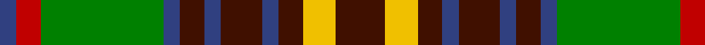

In pattern [BRGBBBBBBYB](/patterns/brgbbbbbbyb/).

This was sourced from weddslist.  It is a [11 stripes tartan](/stripes/stripes11/).

Original link http://www.weddslist.com/cgi-bin/tartans/pg.pl?source=sts

## Thread count
B/4 R6 G30 B4 DR6 B4 DR10 B4 DR6 Y8 DR/12

## Palette
Each colour and its ΔE from the base-6 reference it is a variant of.

| Colour | Shade | Base | ΔE (OKLab) |
|---|---|---|---|
| B | <code style="background-color:#304080;">#304080</code> `#304080` | B <code style="background-color:#2A418A;">#2A418A</code> | 0.02 |
| DR | <code style="background-color:#401000;">#401000</code> `#401000` | B <code style="background-color:#2A418A;">#2A418A</code> | 0.24 |
| G | <code style="background-color:#008000;">#008000</code> `#008000` | G <code style="background-color:#006100;">#006100</code> | 0.10 |
| R | <code style="background-color:#C00000;">#C00000</code> `#C00000` | R <code style="background-color:#CC0000;">#CC0000</code> | 0.03 |
| Y | <code style="background-color:#F0C000;">#F0C000</code> `#F0C000` | Y <code style="background-color:#F2BF00;">#F2BF00</code> | 0.00 |

## Nearest tartans

The nearest existing variants by ΔTartan distance.

1. [MacAart](/setts/s10/r18k4r4ra4g12k2y2k2g12ra6-g008000-k000000-r806050-rac00000-yf0c000/) — ΔT 0.62
1. [Dorcas Check](/setts/s12/g8w4g4w6g36k12ga6k4ga4k4ga28y6-g603800-ga006400-k101010-wffffff-yd87c00/) — ΔT 0.73
1. [Dorcas Check Trade Tartan Tartan Number: 1315. Earliest known date: 1980 tba See products available Copyright © Blair Urquhart, Comrie, 2015](/setts/s12/g8w4g4w6g36k12ga6k4ga4k4ga28y6-g604000-ga006818-k101010-we0e0e0-yd87c00/) — ΔT 0.88
1. [Leitrim County, Crest Range](/setts/s10/r10k24r5k13r24k5g52k5b18w8-b080848-g005020-k101010-rc87814-we0e0e0/) — ΔT 0.90
1. [Maguire](/setts/s13/g36r36k6r6b6r6b8r6k18r8g36w12k6-b2c2c80-g006818-k101010-rc80000-wfcfcfc/) — ΔT 0.93
1. [Clare](/setts/s11/r6b28g28b4r28b4r28b4ga28b4y6-b000050-g30a010-ga008000-r802040-yf0c000/) — ΔT 0.96
1. [Anderson 10](/setts/s14/k6r14k8ra14rb6ra14k8g6k6g38k4g4k4rb6-g008000-k000000-r800000-ra806050-rbc00000/) — ΔT 1.01
1. [Sikh](/setts/s8/r56k12r7k12r7g50b50y10-b2c2c80-g006818-k101010-rb84c00-ye8c000/) — ΔT 1.02
1. [California Firefighters (Corporate)](/setts/s12/r16k8ra8k4ra4k4ra8b12r4g16r36g4-b00008c-g004c00-k000000-ra0783c-ra8c0000/) — ΔT 1.03
1. [Dorcas, Check](/setts/s12/r8w4r4w6r36k12g6k4g4k4g28y6-g008000-k000000-r806050-we0e0e0-yff8500/) — ΔT 1.03

## Neighbour map

Every grey dot is one of 15726 variants placed by the first two principal components of the ΔTartan feature space (44% of its variance). Red is this tartan; blue dots are its nearest — click one to open its page.

<svg viewBox="0 0 640 380" role="img" style="max-width:100%;height:auto;border:1px solid #e0e0e0;border-radius:4px;display:block" xmlns="http://www.w3.org/2000/svg"><image href="/nn/cloud.v1.png" width="640" height="380"/><a href="/setts/s10/r18k4r4ra4g12k2y2k2g12ra6-g008000-k000000-r806050-rac00000-yf0c000/"><circle cx="143.8" cy="173.8" r="4" fill="#3465a4"><title>MacAart</title></circle></a><a href="/setts/s12/g8w4g4w6g36k12ga6k4ga4k4ga28y6-g603800-ga006400-k101010-wffffff-yd87c00/"><circle cx="167.7" cy="153.3" r="4" fill="#3465a4"><title>Dorcas Check</title></circle></a><a href="/setts/s12/g8w4g4w6g36k12ga6k4ga4k4ga28y6-g604000-ga006818-k101010-we0e0e0-yd87c00/"><circle cx="179.3" cy="159.3" r="4" fill="#3465a4"><title>Dorcas Check Trade Tartan Tartan Number: 1315. Earliest known date: 1980 tba See products available Copyright © Blair Urquhart, Comrie, 2015</title></circle></a><a href="/setts/s10/r10k24r5k13r24k5g52k5b18w8-b080848-g005020-k101010-rc87814-we0e0e0/"><circle cx="120.2" cy="164.9" r="4" fill="#3465a4"><title>Leitrim County, Crest Range</title></circle></a><a href="/setts/s13/g36r36k6r6b6r6b8r6k18r8g36w12k6-b2c2c80-g006818-k101010-rc80000-wfcfcfc/"><circle cx="127.5" cy="166.4" r="4" fill="#3465a4"><title>Maguire</title></circle></a><a href="/setts/s11/r6b28g28b4r28b4r28b4ga28b4y6-b000050-g30a010-ga008000-r802040-yf0c000/"><circle cx="118.3" cy="180.1" r="4" fill="#3465a4"><title>Clare</title></circle></a><a href="/setts/s14/k6r14k8ra14rb6ra14k8g6k6g38k4g4k4rb6-g008000-k000000-r800000-ra806050-rbc00000/"><circle cx="114.0" cy="148.2" r="4" fill="#3465a4"><title>Anderson 10</title></circle></a><a href="/setts/s8/r56k12r7k12r7g50b50y10-b2c2c80-g006818-k101010-rb84c00-ye8c000/"><circle cx="139.3" cy="186.9" r="4" fill="#3465a4"><title>Sikh</title></circle></a><a href="/setts/s12/r16k8ra8k4ra4k4ra8b12r4g16r36g4-b00008c-g004c00-k000000-ra0783c-ra8c0000/"><circle cx="171.1" cy="156.8" r="4" fill="#3465a4"><title>California Firefighters (Corporate)</title></circle></a><a href="/setts/s12/r8w4r4w6r36k12g6k4g4k4g28y6-g008000-k000000-r806050-we0e0e0-yff8500/"><circle cx="146.5" cy="143.0" r="4" fill="#3465a4"><title>Dorcas, Check</title></circle></a><circle cx="137.6" cy="173.3" r="5" fill="#c00000"/></svg>

ID: /setts/s11/b12y8b6ba4b10ba4b6ba4g30r6ba4-b401000-ba304080-g008000-rc00000-yf0c000/
