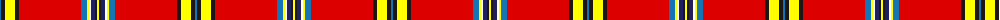

In pattern [BKYKRBYWBKY](/patterns/bkykrbywbky/).

This was sourced from register-of-tartans.  It is a [11 stripes tartan](/stripes/stripes11/).

Original link https://www.tartanregister.gov.uk/tartanDetails.aspx?ref=11526

## Thread count
B/2 K4 Y10 K4 R62 B6 Y2 W2 DB4 K2 Y/2

## Palette
Each colour and its ΔE from the base-6 reference it is a variant of.

| Colour | Shade | Base | ΔE (OKLab) |
|---|---|---|---|
| B | <code style="background-color:#1474B4;">#1474B4</code> `#1474B4` | B <code style="background-color:#2C4084;">#2C4084</code> | 0.15 |
| DB | <code style="background-color:#202060;">#202060</code> `#202060` | B <code style="background-color:#2C4084;">#2C4084</code> | 0.11 |
| K | <code style="background-color:#1C1714;">#1C1714</code> `#1C1714` | K <code style="background-color:#000000;">#000000</code> | 0.21 |
| R | <code style="background-color:#DC0000;">#DC0000</code> `#DC0000` | R <code style="background-color:#C80000;">#C80000</code> | 0.04 |
| W | <code style="background-color:#FFFFFF;">#FFFFFF</code> `#FFFFFF` | W <code style="background-color:#F4F4F0;">#F4F4F0</code> | 0.03 |
| Y | <code style="background-color:#FFFF00;">#FFFF00</code> `#FFFF00` | Y <code style="background-color:#E8C000;">#E8C000</code> | 0.16 |

ID: /setts/s11/b2k4y10k4r62b6y2w2ba4k2y2-b1474b4-ba202060-k1c1714-rdc0000-wffffff-yffff00/
