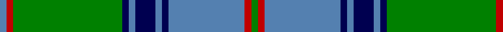

In pattern [BRGBBBBBBRG](/patterns/brgbbbbbbrg/).

This was sourced from weddslist.  It is a [11 stripes tartan](/stripes/stripes11/).

Original link http://www.weddslist.com/cgi-bin/tartans/pg.pl?source=sts

## Thread count
B/4 R4 G66 DB4 B4 DB12 B4 DB4 B46 R4 G/4

## Palette
Each colour and its ΔE from the base-6 reference it is a variant of.

| Colour | Shade | Base | ΔE (OKLab) |
|---|---|---|---|
| B | <code style="background-color:#5480B0;">#5480B0</code> `#5480B0` | B <code style="background-color:#2A418A;">#2A418A</code> | 0.19 |
| DB | <code style="background-color:#000050;">#000050</code> `#000050` | B <code style="background-color:#2A418A;">#2A418A</code> | 0.21 |
| G | <code style="background-color:#008000;">#008000</code> `#008000` | G <code style="background-color:#006100;">#006100</code> | 0.10 |
| R | <code style="background-color:#C00000;">#C00000</code> `#C00000` | R <code style="background-color:#CC0000;">#CC0000</code> | 0.03 |

## Nearest tartans

The nearest existing variants by ΔTartan distance.

1. [Maine State District Tartan Tartan Number: 502. Earliest known date: 1965 Maine tartan is the oldest of America's tartans. It was woven by the Maine Spinning Company which has now gone out of business. When the tartan was first introduced it was reported in the Glasgow Herald (30.12.65) that it had been 'duly accredited by the State of Maine'. The State archives, however, are unable to locate the authorization. It is now marketed by the Maine Tartan and Tweed company, who hold the copyright. See products available Copyright © Blair Urquhart, Comrie, 2015](/setts/s11/b2r2g33ba2b2ba6b2ba2b21r2g2~b5c8ca8-ba202060-g006818-rc80000~x2/) — ΔT 0.83
1. [Maine, Original State of (Fashion)](/setts/s11/b2r2g33ba2b2ba6b2ba2b23ba2g2~b5c8ca8-ba2c2c80-g285800-rc80000~x2/) — ΔT 1.06
1. [MacOrrell](/setts/s9/b5y2b17g14w1g1w1g4y2~b304080-g008000-we0e0e0-yf0c000~x2/) — ΔT 1.08
1. [Pina (Corporate)](/setts/s16/g2b1ba6b6g4r1g18b1g1r1g1b1g4b10ba6b1~b2c2c80-ba2888c4-g289c18-rc80000~x4/) — ΔT 1.13
1. [Tiger](/setts/s16/g2b1ba6b10g4b1g1r1g1b1g18r1g4b6ba6b1~b202173-ba1c7aba-g1d9011-rc30000~x4/) — ΔT 1.13
1. [Maine Dirigo](/setts/s13/b4w1g4r2g14b2g1b1w1b1w13r1g1~b2c2c80-g006818-rc80000-w98c8e8~x4/) — ΔT 1.23
1. [Banff Centennial](/setts/s8/k1b1k1b12g12k1g1y1~b1870a4-g004c00-k000000-yfcb000~x4/) — ΔT 1.27
1. [MacAuliffe Name Tartan Tartan Number: 2839. Earliest known date: 2005 The MacAuliffes are Irish in origin, being a branch of the powerful MacCarthys. The MacAuliffe's are descended from Auliffe Alainn (Humphrey the Dandy) MacCarthy, the son of Donough MacCarthy, the son of Murcharch MacCarthy, the son of Teige MacCarthy, who was King of Desmond (south Munster) from 1118 to 1124. The tartan is available from House of Tartan, Scotland. See products available Copyright © Blair Urquhart, Comrie, 2015](/setts/s14/g37w2g6b23y6b2y3b2y3b2y6b23g6w2~b2c2c80-g006818-wf8f8f8-yd4c410~x2/) — ΔT 1.28
1. [Chakraa (Fashion)](/setts/s11/k7b38g7k2g7k2g7y21k3g4k3~b2888c4-g006818-k101010-ya08858~x2/) — ΔT 1.28
1. [Dunedin Chapter (Corporate)](/setts/s10/b39g3b3g20k3g20k3g3k20r3~b5c8ca8-g006818-k101010-rc80000~x2/) — ΔT 1.30

## Neighbour map

Every grey dot is one of 15726 variants placed by the first two principal components of the ΔTartan feature space (44% of its variance). Red is this tartan; blue dots are its nearest — click one to open its page.

<svg viewBox="0 0 640 380" role="img" style="max-width:100%;height:auto;border:1px solid #e0e0e0;border-radius:4px;display:block" xmlns="http://www.w3.org/2000/svg"><image href="/nn/cloud.v1.png" width="640" height="380"/><a href="/setts/s11/b2r2g33ba2b2ba6b2ba2b21r2g2~b5c8ca8-ba202060-g006818-rc80000~x2/"><circle cx="314.1" cy="146.9" r="4" fill="#3465a4"><title>Maine State District Tartan Tartan Number: 502. Earliest known date: 1965 Maine tartan is the oldest of America's tartans. It was woven by the Maine Spinning Company which has now gone out of business. When the tartan was first introduced it was reported in the Glasgow Herald (30.12.65) that it had been 'duly accredited by the State of Maine'. The State archives, however, are unable to locate the authorization. It is now marketed by the Maine Tartan and Tweed company, who hold the copyright. See products available Copyright © Blair Urquhart, Comrie, 2015</title></circle></a><a href="/setts/s11/b2r2g33ba2b2ba6b2ba2b23ba2g2~b5c8ca8-ba2c2c80-g285800-rc80000~x2/"><circle cx="318.6" cy="148.8" r="4" fill="#3465a4"><title>Maine, Original State of (Fashion)</title></circle></a><a href="/setts/s9/b5y2b17g14w1g1w1g4y2~b304080-g008000-we0e0e0-yf0c000~x2/"><circle cx="279.3" cy="159.7" r="4" fill="#3465a4"><title>MacOrrell</title></circle></a><a href="/setts/s16/g2b1ba6b6g4r1g18b1g1r1g1b1g4b10ba6b1~b2c2c80-ba2888c4-g289c18-rc80000~x4/"><circle cx="259.1" cy="132.1" r="4" fill="#3465a4"><title>Pina (Corporate)</title></circle></a><a href="/setts/s16/g2b1ba6b10g4b1g1r1g1b1g18r1g4b6ba6b1~b202173-ba1c7aba-g1d9011-rc30000~x4/"><circle cx="261.9" cy="134.8" r="4" fill="#3465a4"><title>Tiger</title></circle></a><a href="/setts/s13/b4w1g4r2g14b2g1b1w1b1w13r1g1~b2c2c80-g006818-rc80000-w98c8e8~x4/"><circle cx="227.3" cy="130.6" r="4" fill="#3465a4"><title>Maine Dirigo</title></circle></a><a href="/setts/s8/k1b1k1b12g12k1g1y1~b1870a4-g004c00-k000000-yfcb000~x4/"><circle cx="272.3" cy="174.3" r="4" fill="#3465a4"><title>Banff Centennial</title></circle></a><a href="/setts/s14/g37w2g6b23y6b2y3b2y3b2y6b23g6w2~b2c2c80-g006818-wf8f8f8-yd4c410~x2/"><circle cx="243.1" cy="125.9" r="4" fill="#3465a4"><title>MacAuliffe Name Tartan Tartan Number: 2839. Earliest known date: 2005 The MacAuliffes are Irish in origin, being a branch of the powerful MacCarthys. The MacAuliffe's are descended from Auliffe Alainn (Humphrey the Dandy) MacCarthy, the son of Donough MacCarthy, the son of Murcharch MacCarthy, the son of Teige MacCarthy, who was King of Desmond (south Munster) from 1118 to 1124. The tartan is available from House of Tartan, Scotland. See products available Copyright © Blair Urquhart, Comrie, 2015</title></circle></a><a href="/setts/s11/k7b38g7k2g7k2g7y21k3g4k3~b2888c4-g006818-k101010-ya08858~x2/"><circle cx="218.2" cy="142.6" r="4" fill="#3465a4"><title>Chakraa (Fashion)</title></circle></a><a href="/setts/s10/b39g3b3g20k3g20k3g3k20r3~b5c8ca8-g006818-k101010-rc80000~x2/"><circle cx="228.2" cy="173.3" r="4" fill="#3465a4"><title>Dunedin Chapter (Corporate)</title></circle></a><circle cx="285.8" cy="138.1" r="5" fill="#c00000"/></svg>

ID: /setts/s11/b2r2g33ba2b2ba6b2ba2b23r2g2~b5480b0-ba000050-g008000-rc00000~x2/
