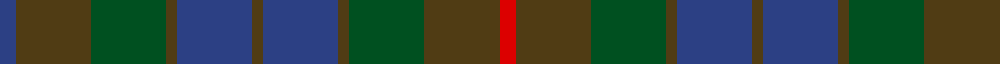

In pattern [BGGGBGBGGGR](/patterns/bgggbgbgggr/).

This was sourced from register-of-tartans.  It is a [11 stripes tartan](/stripes/stripes11/).

Original link https://www.tartanregister.gov.uk/tartanDetails.aspx?ref=425

## Register references

External register numbers recorded for this tartan.

- Scottish Register of Tartans: [425](https://www.tartanregister.gov.uk/tartanDetails.aspx?ref=425)
- Scottish Tartans World Register: 604

## Thread count
B/6 T28 G28 T4 B28 T4 B28 T4 G28 T28 R/6

## Palette
Each colour and its ΔE from the base-6 reference it is a variant of.

| Colour | Shade | Base | ΔE (OKLab) |
|---|---|---|---|
| B | <code style="background-color:#2C4084;">#2C4084</code> `#2C4084` | B <code style="background-color:#2A418A;">#2A418A</code> | 0.01 |
| G | <code style="background-color:#005020;">#005020</code> `#005020` | G <code style="background-color:#006100;">#006100</code> | 0.07 |
| R | <code style="background-color:#DC0000;">#DC0000</code> `#DC0000` | R <code style="background-color:#CC0000;">#CC0000</code> | 0.03 |
| T | <code style="background-color:#503C14;">#503C14</code> `#503C14` | G <code style="background-color:#006100;">#006100</code> | 0.14 |

## Nearest tartans

The nearest existing variants by ΔTartan distance.

1. [Unidentified Fragment #2](/setts/s15/g8ga20b15g6ga4g8b4g6ga20g8b6g4ba2g4b6~b2c4084-ba0596fa-g503c14-ga005020/) — ΔT 1.11
1. [House of Bruar](/setts/s10/b26ba28g26ba8ga3ba8g26ba28b26bb6~b4c3428-ba14283c-bb4c0000-g006818-ga8c7038~x2/) — ΔT 1.31
1. [Paul Henry (Personal)](/setts/s11/b4ba3bb7bc9bb13r2b13ba9bb7bc3bb4~b2f5980-ba0b1245-bb515151-bc1e1e1e-rb3020e~x2/) — ΔT 1.46
1. [Lochinvar Marine Harvest Corporate Tartan Tartan Number: 2102. Earliest known date: 1989 Colours represents the Scottish hills, the water, and the heather. See products available Copyright © Blair Urquhart, Comrie, 2015](/setts/s13/g10k2g2k2g2k7b8ba2b8k7g8k2g2~b202060-ba780078-g003820-k101010~x2/) — ΔT 1.48
1. [McWilliams (2014)](/setts/s12/b3k2b13k9ba3k2ba14k2ba3k9b15k3~b003c64-ba4c3428-k101010~x2/) — ΔT 1.51
1. [Rogers (Personal)](/setts/s15/b8k1b2k1b2k6g8k1ba2k1g8k6b8k1b2~b202060-ba5c8ca8-g003820-k101010~x4/) — ΔT 1.56
1. [Dewar Highlander Corporate Tartan Tartan Number: 694. Earliest known date: 1987. Based on MacNab. See products available Copyright © Blair Urquhart, Comrie, 2015](/setts/s13/g46k5g6k5g6k30b38y6b38k30g36k6g6~b202060-g003820-k101010-ye8c000/) — ΔT 1.56
1. [Cowal Highland Gathering](/setts/s9/g2ga8b1ga1b1ga1b8ba9bb1~b14283c-ba003c64-bb5c5c5c-g003820-ga5c6428~x4/) — ΔT 1.58
1. [MacAndreis](/setts/s10/k3g4b25k16g3k3g3k3g6r3~b383c60-g28442c-k101010-r883834~x2/) — ΔT 1.59
1. [Cowal Highland Games Corporate Tartan Tartan Number: 2536. Earliest known date: 1994 The Cowal Highland Gathering takes place on the last weekend of August each year in Dunoon, Argyllshire, on the Firth of Clyde and is the largest, most spectacular Highland Games in the world with thousands of dancers, pipers, drummers and athletes attending from all over the world. In 1994, the centenary year of the Gathering, this soft muted tartan in blues and greens was designed. Only available from Bells of Dunoon - michael.boyce@telco4u.net (Sept. 2004) See products available Copyright © Blair Urquhart, Comrie, 2015](/setts/s16/b9ba8g1ba1g1ba1g8ga2g8ba1g1ba1g1ba8b9bb1~b003c64-ba14283c-bb5c5c5c-g5c6428-ga003820~x4/) — ΔT 1.61

## Neighbour map

Every grey dot is one of 15726 variants placed by the first two principal components of the ΔTartan feature space (44% of its variance). Red is this tartan; blue dots are its nearest — click one to open its page.

<svg viewBox="0 0 640 380" role="img" style="max-width:100%;height:auto;border:1px solid #e0e0e0;border-radius:4px;display:block" xmlns="http://www.w3.org/2000/svg"><image href="/nn/cloud.v1.png" width="640" height="380"/><a href="/setts/s15/g8ga20b15g6ga4g8b4g6ga20g8b6g4ba2g4b6~b2c4084-ba0596fa-g503c14-ga005020/"><circle cx="297.3" cy="245.2" r="4" fill="#3465a4"><title>Unidentified Fragment #2</title></circle></a><a href="/setts/s10/b26ba28g26ba8ga3ba8g26ba28b26bb6~b4c3428-ba14283c-bb4c0000-g006818-ga8c7038~x2/"><circle cx="247.5" cy="252.5" r="4" fill="#3465a4"><title>House of Bruar</title></circle></a><a href="/setts/s11/b4ba3bb7bc9bb13r2b13ba9bb7bc3bb4~b2f5980-ba0b1245-bb515151-bc1e1e1e-rb3020e~x2/"><circle cx="229.7" cy="255.0" r="4" fill="#3465a4"><title>Paul Henry (Personal)</title></circle></a><a href="/setts/s13/g10k2g2k2g2k7b8ba2b8k7g8k2g2~b202060-ba780078-g003820-k101010~x2/"><circle cx="281.6" cy="285.6" r="4" fill="#3465a4"><title>Lochinvar Marine Harvest Corporate Tartan Tartan Number: 2102. Earliest known date: 1989 Colours represents the Scottish hills, the water, and the heather. See products available Copyright © Blair Urquhart, Comrie, 2015</title></circle></a><a href="/setts/s12/b3k2b13k9ba3k2ba14k2ba3k9b15k3~b003c64-ba4c3428-k101010~x2/"><circle cx="331.5" cy="274.7" r="4" fill="#3465a4"><title>McWilliams (2014)</title></circle></a><a href="/setts/s15/b8k1b2k1b2k6g8k1ba2k1g8k6b8k1b2~b202060-ba5c8ca8-g003820-k101010~x4/"><circle cx="283.7" cy="239.6" r="4" fill="#3465a4"><title>Rogers (Personal)</title></circle></a><a href="/setts/s13/g46k5g6k5g6k30b38y6b38k30g36k6g6~b202060-g003820-k101010-ye8c000/"><circle cx="276.6" cy="233.4" r="4" fill="#3465a4"><title>Dewar Highlander Corporate Tartan Tartan Number: 694. Earliest known date: 1987. Based on MacNab. See products available Copyright © Blair Urquhart, Comrie, 2015</title></circle></a><a href="/setts/s9/g2ga8b1ga1b1ga1b8ba9bb1~b14283c-ba003c64-bb5c5c5c-g003820-ga5c6428~x4/"><circle cx="253.7" cy="221.6" r="4" fill="#3465a4"><title>Cowal Highland Gathering</title></circle></a><a href="/setts/s10/k3g4b25k16g3k3g3k3g6r3~b383c60-g28442c-k101010-r883834~x2/"><circle cx="307.0" cy="232.0" r="4" fill="#3465a4"><title>MacAndreis</title></circle></a><a href="/setts/s16/b9ba8g1ba1g1ba1g8ga2g8ba1g1ba1g1ba8b9bb1~b003c64-ba14283c-bb5c5c5c-g5c6428-ga003820~x4/"><circle cx="250.7" cy="199.1" r="4" fill="#3465a4"><title>Cowal Highland Games Corporate Tartan Tartan Number: 2536. Earliest known date: 1994 The Cowal Highland Gathering takes place on the last weekend of August each year in Dunoon, Argyllshire, on the Firth of Clyde and is the largest, most spectacular Highland Games in the world with thousands of dancers, pipers, drummers and athletes attending from all over the world. In 1994, the centenary year of the Gathering, this soft muted tartan in blues and greens was designed. Only available from Bells of Dunoon - michael.boyce@telco4u.net (Sept. 2004) See products available Copyright © Blair Urquhart, Comrie, 2015</title></circle></a><circle cx="265.2" cy="263.6" r="5" fill="#c00000"/></svg>

ID: /setts/s11/b3g14ga14g2b14g2b14g2ga14g14r3~b2c4084-g503c14-ga005020-rdc0000~x2/
