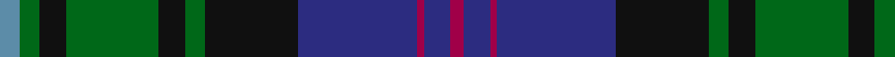

In pattern [BGKGKGKBRBR](/patterns/bgkgkgkbrbr/).

This was sourced from house-of-tartan.  It is a [11 stripes tartan](/stripes/stripes11/).

Original link http://www.house-of-tartan.scotland.net/house/TartanViewjs.asp?colr=Def&tnam=168

## Thread count
B/6 G6 K8 G28 K8 G6 K28 DB36 R2 DB8 R/4

## Palette
Each colour and its ΔE from the base-6 reference it is a variant of.

| Colour | Shade | Base | ΔE (OKLab) |
|---|---|---|---|
| B | <code style="background-color:#5C8CA8;">#5C8CA8</code> `#5C8CA8` | B <code style="background-color:#2A418A;">#2A418A</code> | 0.23 |
| DB | <code style="background-color:#2C2C80;">#2C2C80</code> `#2C2C80` | B <code style="background-color:#2A418A;">#2A418A</code> | 0.06 |
| G | <code style="background-color:#006818;">#006818</code> `#006818` | G <code style="background-color:#006100;">#006100</code> | 0.02 |
| K | <code style="background-color:#101010;">#101010</code> `#101010` | K <code style="background-color:#000000;">#000000</code> | 0.17 |
| R | <code style="background-color:#A00048;">#A00048</code> `#A00048` | R <code style="background-color:#CC0000;">#CC0000</code> | 0.12 |

## Nearest tartans

The nearest existing variants by ΔTartan distance.

1. [Campbell Red](/setts/s13/r3k1g21k19b19k3b3k3b19k19g21k1w3~b2c4084-g005020-k101010-rdc0000-we0e0e0~x2/) — ΔT 0.65
1. [Lochcarron District Tartan Tartan Number: 731. Earliest known date: pre 2003 Nothing See products available Copyright © Blair Urquhart, Comrie, 2015](/setts/s13/g5b25k19g23k2w2k5w2k2g23k19b30r5~b2c2c80-g006818-k101010-rc80000-we0e0e0~x2/) — ΔT 0.70
1. [Loch Carron](/setts/s13/g5b25k19g23k2w2k5w2k2g23k19b30r5~b2c2c80-g006818-k101010-rc80000-wfcfcfc~x2/) — ΔT 0.80
1. [Paterson (Dalgleish Version)](/setts/s12/y3k1g5ga2g5k12b15k2b15k12g12ga2~b2c2c80-g006818-ga808080-k101010-ye8c000~x2/) — ΔT 0.81
1. [Campbell of Loudoun](/setts/s13/w2k1g12k12b12k1b1k1b12k12g12k1y2~b2c4084-g005020-k101010-we0e0e0-ye8c000~x2/) — ΔT 0.82
1. [MacLaren (labelled)](/setts/s11/b22k4b4k4b4k22g22r6g6k2y3~b2c4084-g005020-k101010-rdc0000-ye8c000~x2/) — ΔT 0.83
1. [Cameron of Erracht (Clan)](/setts/s11/g8r1g1r3g16k16r1b16r3b8y2~b2c2c80-g006818-k101010-rc80000-ye8c000~x2/) — ΔT 0.85
1. [MacDonald of Clanranald #2](/setts/s13/b16r2b2r7b31r2k32w3g31r7g2r2g16~b2c4084-g005020-k101010-rdc0000-we0e0e0~x2/) — ΔT 0.86
1. [MacEwen Clan Tartan Tartan Number: 1587. Earliest known date: 1906 The tartan resembles the Campbell of Loudoun except for the red stripe. MacEwans have a historical link with the Campbells dating from 1432 when the lands of MacEwan of the Otter were annexed to Campbell territory. The association was not always a happy one and the 'broken' MacEwans settled in various parts of Lennox, Lochaber and Galloway. See products available Copyright © Blair Urquhart, Comrie, 2015](/setts/s13/r2k1g12k12b12k1b2k1b12k12g12k1y2~b2c2c80-g006818-k101010-rc80000-ye8c000~x2/) — ΔT 0.86
1. [Smith (Sir William)](/setts/s10/b18k20g20k1ka3k1g20k20b18ba3~b2c2c80-ba5c8ca8-g006818-k101010-ka000000~x2/) — ΔT 0.87

## Neighbour map

Every grey dot is one of 15726 variants placed by the first two principal components of the ΔTartan feature space (44% of its variance). Red is this tartan; blue dots are its nearest — click one to open its page.

<svg viewBox="0 0 640 380" role="img" style="max-width:100%;height:auto;border:1px solid #e0e0e0;border-radius:4px;display:block" xmlns="http://www.w3.org/2000/svg"><image href="/nn/cloud.v1.png" width="640" height="380"/><a href="/setts/s13/r3k1g21k19b19k3b3k3b19k19g21k1w3~b2c4084-g005020-k101010-rdc0000-we0e0e0~x2/"><circle cx="213.4" cy="156.4" r="4" fill="#3465a4"><title>Campbell Red</title></circle></a><a href="/setts/s13/g5b25k19g23k2w2k5w2k2g23k19b30r5~b2c2c80-g006818-k101010-rc80000-we0e0e0~x2/"><circle cx="177.3" cy="159.0" r="4" fill="#3465a4"><title>Lochcarron District Tartan Tartan Number: 731. Earliest known date: pre 2003 Nothing See products available Copyright © Blair Urquhart, Comrie, 2015</title></circle></a><a href="/setts/s13/g5b25k19g23k2w2k5w2k2g23k19b30r5~b2c2c80-g006818-k101010-rc80000-wfcfcfc~x2/"><circle cx="173.1" cy="157.2" r="4" fill="#3465a4"><title>Loch Carron</title></circle></a><a href="/setts/s12/y3k1g5ga2g5k12b15k2b15k12g12ga2~b2c2c80-g006818-ga808080-k101010-ye8c000~x2/"><circle cx="169.7" cy="169.4" r="4" fill="#3465a4"><title>Paterson (Dalgleish Version)</title></circle></a><a href="/setts/s13/w2k1g12k12b12k1b1k1b12k12g12k1y2~b2c4084-g005020-k101010-we0e0e0-ye8c000~x2/"><circle cx="183.2" cy="168.9" r="4" fill="#3465a4"><title>Campbell of Loudoun</title></circle></a><a href="/setts/s11/b22k4b4k4b4k22g22r6g6k2y3~b2c4084-g005020-k101010-rdc0000-ye8c000~x2/"><circle cx="172.3" cy="173.3" r="4" fill="#3465a4"><title>MacLaren (labelled)</title></circle></a><a href="/setts/s11/g8r1g1r3g16k16r1b16r3b8y2~b2c2c80-g006818-k101010-rc80000-ye8c000~x2/"><circle cx="171.9" cy="151.6" r="4" fill="#3465a4"><title>Cameron of Erracht (Clan)</title></circle></a><a href="/setts/s13/b16r2b2r7b31r2k32w3g31r7g2r2g16~b2c4084-g005020-k101010-rdc0000-we0e0e0~x2/"><circle cx="179.0" cy="139.3" r="4" fill="#3465a4"><title>MacDonald of Clanranald #2</title></circle></a><a href="/setts/s13/r2k1g12k12b12k1b2k1b12k12g12k1y2~b2c2c80-g006818-k101010-rc80000-ye8c000~x2/"><circle cx="176.1" cy="167.9" r="4" fill="#3465a4"><title>MacEwen Clan Tartan Tartan Number: 1587. Earliest known date: 1906 The tartan resembles the Campbell of Loudoun except for the red stripe. MacEwans have a historical link with the Campbells dating from 1432 when the lands of MacEwan of the Otter were annexed to Campbell territory. The association was not always a happy one and the 'broken' MacEwans settled in various parts of Lennox, Lochaber and Galloway. See products available Copyright © Blair Urquhart, Comrie, 2015</title></circle></a><a href="/setts/s10/b18k20g20k1ka3k1g20k20b18ba3~b2c2c80-ba5c8ca8-g006818-k101010-ka000000~x2/"><circle cx="194.5" cy="180.1" r="4" fill="#3465a4"><title>Smith (Sir William)</title></circle></a><circle cx="190.7" cy="159.1" r="5" fill="#c00000"/></svg>

ID: /setts/s11/b3g3k4g14k4g3k14ba18r1ba4r2~b5c8ca8-ba2c2c80-g006818-k101010-ra00048~x2/
