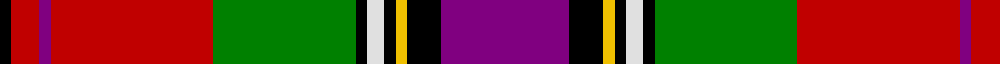

In pattern [BKYKWKGRBRK](/patterns/bkykwkgrbrk/).

This was sourced from weddslist.  It is a [11 stripes tartan](/stripes/stripes11/).

Original link http://www.weddslist.com/cgi-bin/tartans/pg.pl?source=sts

## Thread count
K/8 R20 P8 R114 G100 K8 LN12 K8 Y8 K24 P/90

## Palette
Each colour and its ΔE from the base-6 reference it is a variant of.

| Colour | Shade | Base | ΔE (OKLab) |
|---|---|---|---|
| G | <code style="background-color:#008000;">#008000</code> `#008000` | G <code style="background-color:#006100;">#006100</code> | 0.10 |
| K | <code style="background-color:#000000;">#000000</code> `#000000` | K <code style="background-color:#000000;">#000000</code> | 0.00 |
| LN | <code style="background-color:#E0E0E0;">#E0E0E0</code> `#E0E0E0` | W <code style="background-color:#F7F7F7;">#F7F7F7</code> | 0.07 |
| P | <code style="background-color:#800080;">#800080</code> `#800080` | B <code style="background-color:#2A418A;">#2A418A</code> | 0.17 |
| R | <code style="background-color:#C00000;">#C00000</code> `#C00000` | R <code style="background-color:#CC0000;">#CC0000</code> | 0.03 |
| Y | <code style="background-color:#F0C000;">#F0C000</code> `#F0C000` | Y <code style="background-color:#F2BF00;">#F2BF00</code> | 0.00 |

## Nearest tartans

The nearest existing variants by ΔTartan distance.

1. [MacLean Variation](/setts/s11/b45k12y4k4w6k4g50r57b4r10k4x2~b5a008c-g005020-k101010-rdc0000-we0e0e0-ye8c000/) — ΔT 0.61
1. [MacLean of Duart #4](/setts/s11/b13k6y2k3w4k3g22r31b3r4k2x2~b3c82af-g005020-k101010-rdc0000-we0e0e0-ye8c000/) — ΔT 0.70
1. [MacLean of Duart #3](/setts/s11/b16k12y4k4w6k4g32r50b6r8k3~b3c82af-g005020-k101010-rdc0000-we0e0e0-ye8c000/) — ΔT 0.77
1. [Gordon of Abergeldie](/setts/s10/r63w4k4b18y4g50y4b18k4w4x2~b780078-g005830-k101010-rc80000-wfcfcfc-yd8b000/) — ΔT 0.78
1. [Kilmorie](/setts/s11/k3r30g10k3y2k3w2k6r2b12w2x2~b2c2c80-g006818-k101010-rc80000-we0e0e0-ye8c000/) — ΔT 0.79
1. [MacLean](/setts/s12/b4w1k3y1g1w1k1g8r12w1r2k1x2~b000064-g004c00-k000000-rc80000-wd0d0d0-yffc800/) — ΔT 0.80
1. [Norwell](/setts/s11/r4k4r32g4w3g4k13g3b18r2y3x2~b2c2c80-g006818-k101010-rc80000-we0e0e0-ye8c000/) — ΔT 0.81
1. [Nazarian (Personal)](/setts/s13/y6w4k3b14w3r34k34w4b3y8w3g4k2x2~b2888c4-g289c18-k101010-rc80000-we0e0e0-ybc8c00/) — ΔT 0.86
1. [Boyd Clan Tartan Tartan Number: 1819. Earliest known date: 1956 This sett is taken from a sample in the Scottish Tartans Society collection. It is a more compact form of the sett designed for Lord Kilmarnock in 1956 and registered with the Lord Lyon. The Lordship of Boyd was created in 1454. The family has a long association with the town of Kilmarnock and the castle of Dean, in the South West of Scotland. Thomas Boyd was created Earl of Arran in 1467. The tartan is based on the Hay and the Stuart of Bute tartans. See products available Copyright © Blair Urquhart, Comrie, 2015](/setts/s12/w1k1r1g1r12k6b1k1b1k1g6y1x4~b2c2c80-g006818-k101010-rc80000-we0e0e0-ye8c000/) — ΔT 0.89
1. [Roman Family Tribute (Personal)](/setts/s14/r27g20k7y3ra3r2ra3y3ra6b6k2r3ra4b3x2~b5a008c-g004028-k000000-r8c0020-rab07430-yccc098/) — ΔT 0.90

## Neighbour map

Every grey dot is one of 15726 variants placed by the first two principal components of the ΔTartan feature space (44% of its variance). Red is this tartan; blue dots are its nearest — click one to open its page.

<svg viewBox="0 0 640 380" role="img" style="max-width:100%;height:auto;border:1px solid #e0e0e0;border-radius:4px;display:block" xmlns="http://www.w3.org/2000/svg"><image href="/nn/cloud.v1.png" width="640" height="380"/><a href="/setts/s11/b45k12y4k4w6k4g50r57b4r10k4x2~b5a008c-g005020-k101010-rdc0000-we0e0e0-ye8c000/"><circle cx="151.2" cy="103.5" r="4" fill="#3465a4"><title>MacLean Variation</title></circle></a><a href="/setts/s11/b13k6y2k3w4k3g22r31b3r4k2x2~b3c82af-g005020-k101010-rdc0000-we0e0e0-ye8c000/"><circle cx="159.1" cy="100.6" r="4" fill="#3465a4"><title>MacLean of Duart #4</title></circle></a><a href="/setts/s11/b16k12y4k4w6k4g32r50b6r8k3~b3c82af-g005020-k101010-rdc0000-we0e0e0-ye8c000/"><circle cx="171.5" cy="98.1" r="4" fill="#3465a4"><title>MacLean of Duart #3</title></circle></a><a href="/setts/s10/r63w4k4b18y4g50y4b18k4w4x2~b780078-g005830-k101010-rc80000-wfcfcfc-yd8b000/"><circle cx="181.9" cy="99.6" r="4" fill="#3465a4"><title>Gordon of Abergeldie</title></circle></a><a href="/setts/s11/k3r30g10k3y2k3w2k6r2b12w2x2~b2c2c80-g006818-k101010-rc80000-we0e0e0-ye8c000/"><circle cx="188.4" cy="96.6" r="4" fill="#3465a4"><title>Kilmorie</title></circle></a><a href="/setts/s12/b4w1k3y1g1w1k1g8r12w1r2k1x2~b000064-g004c00-k000000-rc80000-wd0d0d0-yffc800/"><circle cx="141.1" cy="101.2" r="4" fill="#3465a4"><title>MacLean</title></circle></a><a href="/setts/s11/r4k4r32g4w3g4k13g3b18r2y3x2~b2c2c80-g006818-k101010-rc80000-we0e0e0-ye8c000/"><circle cx="188.0" cy="101.6" r="4" fill="#3465a4"><title>Norwell</title></circle></a><a href="/setts/s13/y6w4k3b14w3r34k34w4b3y8w3g4k2x2~b2888c4-g289c18-k101010-rc80000-we0e0e0-ybc8c00/"><circle cx="119.6" cy="78.7" r="4" fill="#3465a4"><title>Nazarian (Personal)</title></circle></a><a href="/setts/s12/w1k1r1g1r12k6b1k1b1k1g6y1x4~b2c2c80-g006818-k101010-rc80000-we0e0e0-ye8c000/"><circle cx="174.8" cy="102.0" r="4" fill="#3465a4"><title>Boyd Clan Tartan Tartan Number: 1819. Earliest known date: 1956 This sett is taken from a sample in the Scottish Tartans Society collection. It is a more compact form of the sett designed for Lord Kilmarnock in 1956 and registered with the Lord Lyon. The Lordship of Boyd was created in 1454. The family has a long association with the town of Kilmarnock and the castle of Dean, in the South West of Scotland. Thomas Boyd was created Earl of Arran in 1467. The tartan is based on the Hay and the Stuart of Bute tartans. See products available Copyright © Blair Urquhart, Comrie, 2015</title></circle></a><a href="/setts/s14/r27g20k7y3ra3r2ra3y3ra6b6k2r3ra4b3x2~b5a008c-g004028-k000000-r8c0020-rab07430-yccc098/"><circle cx="140.2" cy="99.9" r="4" fill="#3465a4"><title>Roman Family Tribute (Personal)</title></circle></a><circle cx="140.2" cy="98.9" r="5" fill="#c00000"/></svg>

ID: /setts/s11/b45k12y4k4w6k4g50r57b4r10k4x2~b800080-g008000-k000000-rc00000-we0e0e0-yf0c000/
