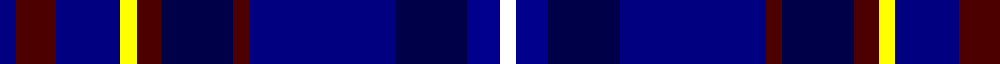

In pattern [BBBYBBBBBBW](/patterns/bbbybbbbbbw/).

This was sourced from register-of-tartans.  It is a [11 stripes tartan](/stripes/stripes11/).

Original link https://www.tartanregister.gov.uk/tartanDetails.aspx?ref=11087

## Thread count
DBa/4 DR10 DBa16 Y4 DR6 DB18 DR4 DBa36 DB18 DBb8 W/4

## Palette
Each colour and its ΔE from the base-6 reference it is a variant of.

| Colour | Shade | Base | ΔE (OKLab) |
|---|---|---|---|
| DB | <code style="background-color:#000048;">#000048</code> `#000048` | B <code style="background-color:#2A418A;">#2A418A</code> | 0.22 |
| DBa | <code style="background-color:#000080;">#000080</code> `#000080` | B <code style="background-color:#2A418A;">#2A418A</code> | 0.14 |
| DBb | <code style="background-color:#00008C;">#00008C</code> `#00008C` | B <code style="background-color:#2A418A;">#2A418A</code> | 0.13 |
| DR | <code style="background-color:#4C0000;">#4C0000</code> `#4C0000` | B <code style="background-color:#2A418A;">#2A418A</code> | 0.25 |
| W | <code style="background-color:#FFFFFF;">#FFFFFF</code> `#FFFFFF` | W <code style="background-color:#F7F7F7;">#F7F7F7</code> | 0.02 |
| Y | <code style="background-color:#FFFF00;">#FFFF00</code> `#FFFF00` | Y <code style="background-color:#F2BF00;">#F2BF00</code> | 0.16 |

## Nearest tartans

The nearest existing variants by ΔTartan distance.

1. [Royal Gourock Yacht Club, The](/setts/s11/b10r4b16y4r6k18r4b36k18ba8w4-b2c2c80-ba38409c-k00002c-r880000-wfcfcfc-ye8c000/) — ΔT 1.07
1. [Robert Burns Legacy](/setts/s9/b10g42ba8bb8ba8k24ba8b71r10-b1c0070-ba2c2c80-bb2888c4-g006818-k101010-rc80000/) — ΔT 1.49
1. [Highland Destiny (Fashion)](/setts/s13/b8k6b40k20ba38r4ba4r4ba50g6ba8k12w8-b780078-ba1c0070-g006818-k101010-rb468ac-we0e0e0/) — ΔT 1.52
1. [Thistle of Scotland](/setts/s9/r6b48k32ka6g4ka4g4ka56w6-b000064-g006818-k000000-ka000034-rb468ac-wc8c8c8/) — ΔT 1.59
1. [Impulse](/setts/s11/r4b20k18ba26k14bb6k4bb6k4bb6r4-b00008c-ba0000dc-bb000064-k000000-r880000/) — ΔT 1.59
1. [Kinloch Anderson Thistle](/setts/s12/b8ba8b4ba28k12bb7k12g4bb8g4bb28bc8-b007fff-ba00008b-bb551a8b-bc8a2be2-g006400-k101010/) — ΔT 1.61
1. [Dempster (Name)](/setts/s13/b24ba6b24ba32k6ba12k6ba32r6ba6y6k32ba8-b506494-ba00008c-k000000-r8c0000-yc88c00/) — ΔT 1.61
1. [World Corporate Golf Challenge (Corp](/setts/s16/b4w4b44k12b6k8b6k8b6k12ba24bb8ba4bb12ba14wa4-b202060-ba2c2c80-bb1474b4-k00002c-wc0c0c0-wae8ccb8/) — ΔT 1.61
1. [Scottish Tourist Guides Association](/setts/s13/g24b6ga6b6ga6b24ba6b6ba4b4ba28gb2w6-b551a8b-ba00009c-g006400-ga7a7a7a-gb8b7500-wffffff/) — ΔT 1.63
1. [Ertico](/setts/s10/k12y4b4ba24r8ba4r4ba4b40w4-b2c4084-ba141e46-k000000-ra00048-we0e0e0-yf8e38c/) — ΔT 1.64

## Neighbour map

Every grey dot is one of 15726 variants placed by the first two principal components of the ΔTartan feature space (44% of its variance). Red is this tartan; blue dots are its nearest — click one to open its page.

<svg viewBox="0 0 640 380" role="img" style="max-width:100%;height:auto;border:1px solid #e0e0e0;border-radius:4px;display:block" xmlns="http://www.w3.org/2000/svg"><image href="/nn/cloud.v1.png" width="640" height="380"/><a href="/setts/s11/b10r4b16y4r6k18r4b36k18ba8w4-b2c2c80-ba38409c-k00002c-r880000-wfcfcfc-ye8c000/"><circle cx="194.7" cy="166.3" r="4" fill="#3465a4"><title>Royal Gourock Yacht Club, The</title></circle></a><a href="/setts/s9/b10g42ba8bb8ba8k24ba8b71r10-b1c0070-ba2c2c80-bb2888c4-g006818-k101010-rc80000/"><circle cx="187.6" cy="170.5" r="4" fill="#3465a4"><title>Robert Burns Legacy</title></circle></a><a href="/setts/s13/b8k6b40k20ba38r4ba4r4ba50g6ba8k12w8-b780078-ba1c0070-g006818-k101010-rb468ac-we0e0e0/"><circle cx="226.1" cy="139.0" r="4" fill="#3465a4"><title>Highland Destiny (Fashion)</title></circle></a><a href="/setts/s9/r6b48k32ka6g4ka4g4ka56w6-b000064-g006818-k000000-ka000034-rb468ac-wc8c8c8/"><circle cx="197.8" cy="153.0" r="4" fill="#3465a4"><title>Thistle of Scotland</title></circle></a><a href="/setts/s11/r4b20k18ba26k14bb6k4bb6k4bb6r4-b00008c-ba0000dc-bb000064-k000000-r880000/"><circle cx="115.0" cy="203.6" r="4" fill="#3465a4"><title>Impulse</title></circle></a><a href="/setts/s12/b8ba8b4ba28k12bb7k12g4bb8g4bb28bc8-b007fff-ba00008b-bb551a8b-bc8a2be2-g006400-k101010/"><circle cx="112.1" cy="185.3" r="4" fill="#3465a4"><title>Kinloch Anderson Thistle</title></circle></a><a href="/setts/s13/b24ba6b24ba32k6ba12k6ba32r6ba6y6k32ba8-b506494-ba00008c-k000000-r8c0000-yc88c00/"><circle cx="170.6" cy="203.0" r="4" fill="#3465a4"><title>Dempster (Name)</title></circle></a><a href="/setts/s16/b4w4b44k12b6k8b6k8b6k12ba24bb8ba4bb12ba14wa4-b202060-ba2c2c80-bb1474b4-k00002c-wc0c0c0-wae8ccb8/"><circle cx="172.3" cy="154.4" r="4" fill="#3465a4"><title>World Corporate Golf Challenge (Corp</title></circle></a><a href="/setts/s13/g24b6ga6b6ga6b24ba6b6ba4b4ba28gb2w6-b551a8b-ba00009c-g006400-ga7a7a7a-gb8b7500-wffffff/"><circle cx="139.8" cy="132.5" r="4" fill="#3465a4"><title>Scottish Tourist Guides Association</title></circle></a><a href="/setts/s10/k12y4b4ba24r8ba4r4ba4b40w4-b2c4084-ba141e46-k000000-ra00048-we0e0e0-yf8e38c/"><circle cx="166.4" cy="140.5" r="4" fill="#3465a4"><title>Ertico</title></circle></a><circle cx="167.6" cy="173.4" r="5" fill="#c00000"/></svg>

ID: /setts/s11/b4ba10b16y4ba6bb18ba4b36bb18bc8w4-b000080-ba4c0000-bb000048-bc00008c-wffffff-yffff00/
