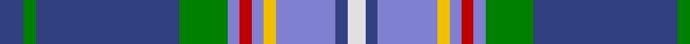

In pattern [BGBGBRBYBBW](/patterns/bgbgbrbybbw/).

This was sourced from weddslist.  It is a [11 stripes tartan](/stripes/stripes11/).

Original link http://www.weddslist.com/cgi-bin/tartans/pg.pl?source=sts

## Thread count
Ba/8 G4 Ba48 G16 B4 R4 B4 Y4 B20 Ba4 LN/6

## Palette
Each colour and its ΔE from the base-6 reference it is a variant of.

| Colour | Shade | Base | ΔE (OKLab) |
|---|---|---|---|
| B | <code style="background-color:#8080D0;">#8080D0</code> `#8080D0` | B <code style="background-color:#2A418A;">#2A418A</code> | 0.24 |
| Ba | <code style="background-color:#304080;">#304080</code> `#304080` | B <code style="background-color:#2A418A;">#2A418A</code> | 0.02 |
| G | <code style="background-color:#008000;">#008000</code> `#008000` | G <code style="background-color:#006100;">#006100</code> | 0.10 |
| LN | <code style="background-color:#E0E0E0;">#E0E0E0</code> `#E0E0E0` | W <code style="background-color:#F7F7F7;">#F7F7F7</code> | 0.07 |
| R | <code style="background-color:#C00000;">#C00000</code> `#C00000` | R <code style="background-color:#CC0000;">#CC0000</code> | 0.03 |
| Y | <code style="background-color:#F0C000;">#F0C000</code> `#F0C000` | Y <code style="background-color:#F2BF00;">#F2BF00</code> | 0.00 |

## Nearest tartans

The nearest existing variants by ΔTartan distance.

1. [McCartney (Evening/Night)](/setts/s11/b4g2b24g8ba2r2ba2y2ba10b2w3~b2c2c80-ba2888c4-g006818-rc80000-we0e0e0-ye8c000~x2/) — ΔT 0.54
1. [Texas Blue Bonnet](/setts/s11/g5r1b10w1r1w1ba10w1ba10w1y1~b2c2c80-ba5c8ca8-g006818-rc80000-we0e0e0-ye8c000~x4/) — ΔT 0.71
1. [Leith](/setts/s13/b5k2b17ba3b3bb22b3g22b3ba3b27k2r4~b5480b0-ba304080-bb000050-g008000-k000000-rc00000~x2/) — ΔT 0.95
1. [Los Angeles](/setts/s8/y4b24ba5g2b3k5ba33r2~b2c2c80-ba6098b8-g289c18-k101010-rc80000-ye8c000~x2/) — ΔT 0.99
1. [Spirit of Fife](/setts/s14/g10w2b3ga2r14ba26g2ba6g2ba26r14ga2b3w2~b14283c-ba003c64-g005448-ga408060-rb468ac-wf8f8f8~x2/) — ΔT 1.00
1. [O'Donohue Personal)](/setts/s10/b24w2b6g9r6b3r6g35k2y2~b3850c8-g009468-k101010-rc80000-we0e0e0-yfccc00~x2/) — ΔT 1.01
1. [GYL family (Personal)](/setts/s10/b28r3w3r3w3r3b28k12ba38wa8~b2c4084-ba0064ac-k101010-rdc0000-we0e0e0-wafafa96/) — ΔT 1.03
1. [Stuart/Stewart Blue](/setts/s12/b29ba3k10y2k2b2k2g10r5k3r2b2~b2888c4-ba2c2c80-g006818-k101010-r880000-yd09800~x2/) — ΔT 1.05
1. [Heirloom Blue Alba (Fashion)](/setts/s9/b4y2b34ba10ya4ba4bb4ba23w3~b5c8ca8-ba202060-bb780078-we0e0e0-ybc8c00-yaa0a0a0~x2/) — ΔT 1.05
1. [Texas Bluebonnet District Tartan Tartan Number: 852. Earliest known date: 1983 The colours of the Texas Bluebonnet district tartan owe their selection to the bluebonnet flower, a member of the lupin family, which is widespread in many parts of Texas. The flower changes colour with the passing of time, the 'brim' becoming flecked with wine red. The tartan was adopted as the Sequicentennial Tartan and Accredited by the Scottish Tartans Society. See products available Copyright © Blair Urquhart, Comrie, 2015](/setts/s11/g4r1b8w1r1w1ba8w1ba8w1y1~b2c2c80-ba2888c4-g006818-rc80000-we0e0e0-ye8c000~x4/) — ΔT 1.11

## Neighbour map

Every grey dot is one of 15726 variants placed by the first two principal components of the ΔTartan feature space (44% of its variance). Red is this tartan; blue dots are its nearest — click one to open its page.

<svg viewBox="0 0 640 380" role="img" style="max-width:100%;height:auto;border:1px solid #e0e0e0;border-radius:4px;display:block" xmlns="http://www.w3.org/2000/svg"><image href="/nn/cloud.v1.png" width="640" height="380"/><a href="/setts/s11/b4g2b24g8ba2r2ba2y2ba10b2w3~b2c2c80-ba2888c4-g006818-rc80000-we0e0e0-ye8c000~x2/"><circle cx="223.1" cy="126.6" r="4" fill="#3465a4"><title>McCartney (Evening/Night)</title></circle></a><a href="/setts/s11/g5r1b10w1r1w1ba10w1ba10w1y1~b2c2c80-ba5c8ca8-g006818-rc80000-we0e0e0-ye8c000~x4/"><circle cx="197.5" cy="134.8" r="4" fill="#3465a4"><title>Texas Blue Bonnet</title></circle></a><a href="/setts/s13/b5k2b17ba3b3bb22b3g22b3ba3b27k2r4~b5480b0-ba304080-bb000050-g008000-k000000-rc00000~x2/"><circle cx="210.1" cy="124.4" r="4" fill="#3465a4"><title>Leith</title></circle></a><a href="/setts/s8/y4b24ba5g2b3k5ba33r2~b2c2c80-ba6098b8-g289c18-k101010-rc80000-ye8c000~x2/"><circle cx="248.1" cy="126.3" r="4" fill="#3465a4"><title>Los Angeles</title></circle></a><a href="/setts/s14/g10w2b3ga2r14ba26g2ba6g2ba26r14ga2b3w2~b14283c-ba003c64-g005448-ga408060-rb468ac-wf8f8f8~x2/"><circle cx="244.8" cy="128.8" r="4" fill="#3465a4"><title>Spirit of Fife</title></circle></a><a href="/setts/s10/b24w2b6g9r6b3r6g35k2y2~b3850c8-g009468-k101010-rc80000-we0e0e0-yfccc00~x2/"><circle cx="238.6" cy="119.2" r="4" fill="#3465a4"><title>O'Donohue Personal)</title></circle></a><a href="/setts/s10/b28r3w3r3w3r3b28k12ba38wa8~b2c4084-ba0064ac-k101010-rdc0000-we0e0e0-wafafa96/"><circle cx="180.3" cy="134.8" r="4" fill="#3465a4"><title>GYL family (Personal)</title></circle></a><a href="/setts/s12/b29ba3k10y2k2b2k2g10r5k3r2b2~b2888c4-ba2c2c80-g006818-k101010-r880000-yd09800~x2/"><circle cx="204.6" cy="107.0" r="4" fill="#3465a4"><title>Stuart/Stewart Blue</title></circle></a><a href="/setts/s9/b4y2b34ba10ya4ba4bb4ba23w3~b5c8ca8-ba202060-bb780078-we0e0e0-ybc8c00-yaa0a0a0~x2/"><circle cx="234.8" cy="127.3" r="4" fill="#3465a4"><title>Heirloom Blue Alba (Fashion)</title></circle></a><a href="/setts/s11/g4r1b8w1r1w1ba8w1ba8w1y1~b2c2c80-ba2888c4-g006818-rc80000-we0e0e0-ye8c000~x4/"><circle cx="163.0" cy="145.2" r="4" fill="#3465a4"><title>Texas Bluebonnet District Tartan Tartan Number: 852. Earliest known date: 1983 The colours of the Texas Bluebonnet district tartan owe their selection to the bluebonnet flower, a member of the lupin family, which is widespread in many parts of Texas. The flower changes colour with the passing of time, the 'brim' becoming flecked with wine red. The tartan was adopted as the Sequicentennial Tartan and Accredited by the Scottish Tartans Society. See products available Copyright © Blair Urquhart, Comrie, 2015</title></circle></a><circle cx="228.4" cy="125.0" r="5" fill="#c00000"/></svg>

ID: /setts/s11/b4g2b24g8ba2r2ba2y2ba10b2w3~b304080-ba8080d0-g008000-rc00000-we0e0e0-yf0c000~x2/
