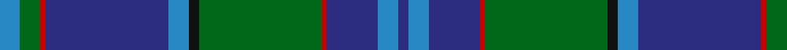

In pattern [BBBRGKBBRGB](/patterns/bbbrgkbbrgb/).

This was sourced from register-of-tartans.  It is a [11 stripes tartan](/stripes/stripes11/).

Original link https://www.tartanregister.gov.uk/tartanDetails.aspx?ref=756

## Attestations

This cloth appears in 2 source records; the oldest owns this page.

- 01/01/1996 — Coopers & Lybrand (register-of-tartans, [record](https://www.tartanregister.gov.uk/tartanDetails.aspx?ref=756))
- 1996 — Coopers & Lybrand (Corporate) (tartans-authority, [record](http://www.tartansauthority.com/tartan-ferret/display/2303/))

## Thread count
B/8 G8 R2 DB48 B8 K4 G48 R2 DB20 B8 DB/4

## Palette
Each colour and its ΔE from the base-6 reference it is a variant of.

| Colour | Shade | Base | ΔE (OKLab) |
|---|---|---|---|
| B | <code style="background-color:#2888C4;">#2888C4</code> `#2888C4` | B <code style="background-color:#2A418A;">#2A418A</code> | 0.21 |
| DB | <code style="background-color:#2C2C80;">#2C2C80</code> `#2C2C80` | B <code style="background-color:#2A418A;">#2A418A</code> | 0.06 |
| G | <code style="background-color:#006818;">#006818</code> `#006818` | G <code style="background-color:#006100;">#006100</code> | 0.02 |
| K | <code style="background-color:#101010;">#101010</code> `#101010` | K <code style="background-color:#000000;">#000000</code> | 0.17 |
| R | <code style="background-color:#C80000;">#C80000</code> `#C80000` | R <code style="background-color:#CC0000;">#CC0000</code> | 0.01 |

## Nearest tartans

The nearest existing variants by ΔTartan distance.

1. [Weisfeld](/setts/s12/k6b3g28w1ba28b2w3b2ba28w1g28b3x2~b2c2c80-ba202060-g00643c-k101010-we0e0e0/) — ΔT 0.66
1. [Spirit of Morningside (Fashion)](/setts/s10/b4ba5b3ba50k15g3k5g32w2g3~b780078-ba2c2c80-g006818-k101010-we0e0e0/) — ΔT 0.79
1. [Polkemmet (Corporate)](/setts/s11/k7y3b62r16g5r5g5r5g16b16k4~b2c2c80-g006818-k101010-r888888-ybc8c00/) — ΔT 1.04
1. [Ellis (Welsh Name)](/setts/s12/k4b26k2b4k2b26k3ba36k3g30k3w2~b5c8ca8-ba3c3c60-g00643c-k101010-wfcfcfc/) — ΔT 1.10
1. [Dollar Academy (1999) (Corporate)](/setts/s8/w2b19k4b4k4g9ba2k1x4~b005088-ba1c0070-g006818-k101010-we0e0e0/) — ΔT 1.12
1. [Huaumé, Patrick Antoine (Personal)](/setts/s11/g10b9r4ra2r4g6k10w4g24b60k4~b113c8b-g006818-k101010-r9c68a4-ra901c38-we0e0e0/) — ΔT 1.13
1. [Heriot Watt University (Corporate)](/setts/s10/g5y1b4ba18g2r2g16bb1b32ba3x2~b1474b4-ba14283c-bb202060-g285800-ra00000-yd09800/) — ΔT 1.14
1. [Kilkenny Irish County Tartan Tartan Number: 2280. Earliest known date: 1995 One of a series of Irish District tartans designed by Polly Wittering of the House of Edgar, with colours reminiscent of the Country with soft warm colours dominating. See products available Copyright © Blair Urquhart, Comrie, 2015](/setts/s13/g25r2b25y5g3ba3g3y5b25r2g27ba5g2x2~b2c1084-ba300438-g005438-ra46458-yc0a010/) — ΔT 1.14
1. [Lowry](/setts/s7/b6y2b1g25ba16k2ba4x2~b440044-ba282878-g006438-k101010-yd8b000/) — ΔT 1.14
1. [Lawrie](/setts/s7/b6g2b1ga25ba16k2ba4x2~b700070-ba2c2c84-g784400-ga007040-k101010/) — ΔT 1.16

## Neighbour map

Every grey dot is one of 15726 variants placed by the first two principal components of the ΔTartan feature space (44% of its variance). Red is this tartan; blue dots are its nearest — click one to open its page.

<svg viewBox="0 0 640 380" role="img" style="max-width:100%;height:auto;border:1px solid #e0e0e0;border-radius:4px;display:block" xmlns="http://www.w3.org/2000/svg"><image href="/nn/cloud.v1.png" width="640" height="380"/><a href="/setts/s12/k6b3g28w1ba28b2w3b2ba28w1g28b3x2~b2c2c80-ba202060-g00643c-k101010-we0e0e0/"><circle cx="289.1" cy="133.7" r="4" fill="#3465a4"><title>Weisfeld</title></circle></a><a href="/setts/s10/b4ba5b3ba50k15g3k5g32w2g3~b780078-ba2c2c80-g006818-k101010-we0e0e0/"><circle cx="290.2" cy="129.3" r="4" fill="#3465a4"><title>Spirit of Morningside (Fashion)</title></circle></a><a href="/setts/s11/k7y3b62r16g5r5g5r5g16b16k4~b2c2c80-g006818-k101010-r888888-ybc8c00/"><circle cx="320.2" cy="131.1" r="4" fill="#3465a4"><title>Polkemmet (Corporate)</title></circle></a><a href="/setts/s12/k4b26k2b4k2b26k3ba36k3g30k3w2~b5c8ca8-ba3c3c60-g00643c-k101010-wfcfcfc/"><circle cx="224.5" cy="136.2" r="4" fill="#3465a4"><title>Ellis (Welsh Name)</title></circle></a><a href="/setts/s8/w2b19k4b4k4g9ba2k1x4~b005088-ba1c0070-g006818-k101010-we0e0e0/"><circle cx="280.9" cy="164.8" r="4" fill="#3465a4"><title>Dollar Academy (1999) (Corporate)</title></circle></a><a href="/setts/s11/g10b9r4ra2r4g6k10w4g24b60k4~b113c8b-g006818-k101010-r9c68a4-ra901c38-we0e0e0/"><circle cx="297.9" cy="100.5" r="4" fill="#3465a4"><title>Huaumé, Patrick Antoine (Personal)</title></circle></a><a href="/setts/s10/g5y1b4ba18g2r2g16bb1b32ba3x2~b1474b4-ba14283c-bb202060-g285800-ra00000-yd09800/"><circle cx="277.0" cy="115.0" r="4" fill="#3465a4"><title>Heriot Watt University (Corporate)</title></circle></a><a href="/setts/s13/g25r2b25y5g3ba3g3y5b25r2g27ba5g2x2~b2c1084-ba300438-g005438-ra46458-yc0a010/"><circle cx="260.6" cy="155.4" r="4" fill="#3465a4"><title>Kilkenny Irish County Tartan Tartan Number: 2280. Earliest known date: 1995 One of a series of Irish District tartans designed by Polly Wittering of the House of Edgar, with colours reminiscent of the Country with soft warm colours dominating. See products available Copyright © Blair Urquhart, Comrie, 2015</title></circle></a><a href="/setts/s7/b6y2b1g25ba16k2ba4x2~b440044-ba282878-g006438-k101010-yd8b000/"><circle cx="301.2" cy="162.7" r="4" fill="#3465a4"><title>Lowry</title></circle></a><a href="/setts/s7/b6g2b1ga25ba16k2ba4x2~b700070-ba2c2c84-g784400-ga007040-k101010/"><circle cx="308.3" cy="163.9" r="4" fill="#3465a4"><title>Lawrie</title></circle></a><circle cx="288.1" cy="136.1" r="5" fill="#c00000"/></svg>

ID: /setts/s11/b4g4r1ba24b4k2g24r1ba10b4ba2x2~b2888c4-ba2c2c80-g006818-k101010-rc80000/
