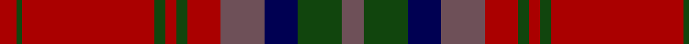

In pattern [BGBBRGRGRGR](/patterns/bgbbrgrgrgr/).

This was sourced from weddslist.  It is a [11 stripes tartan](/stripes/stripes11/).

Original link http://www.weddslist.com/cgi-bin/tartans/pg.pl?source=tinsel

## Attestations

This cloth appears in 2 source records; the oldest owns this page.

- undated — MacDougall VS (weddslist, [record](http://www.weddslist.com/cgi-bin/tartans/pg.pl?source=tinsel))
- undated — MacDougall VS (weddslist, [record](http://www.weddslist.com/cgi-bin/tartans/pg.pl?source=x))

## Thread count
DR/6 DG2 DR48 DG4 DR4 DG4 DR12 N16 DB12 DG16 N/8

## Palette
Each colour and its ΔE from the base-6 reference it is a variant of.

| Colour | Shade | Base | ΔE (OKLab) |
|---|---|---|---|
| DB | <code style="background-color:#000052;">#000052</code> `#000052` | B <code style="background-color:#2A418A;">#2A418A</code> | 0.20 |
| DG | <code style="background-color:#11450D;">#11450D</code> `#11450D` | G <code style="background-color:#006100;">#006100</code> | 0.09 |
| DR | <code style="background-color:#AA0000;">#AA0000</code> `#AA0000` | R <code style="background-color:#CC0000;">#CC0000</code> | 0.07 |
| N | <code style="background-color:#6E5058;">#6E5058</code> `#6E5058` | B <code style="background-color:#2A418A;">#2A418A</code> | 0.15 |

## Nearest tartans

The nearest existing variants by ΔTartan distance.

1. [Rice Welsh Name Tartan Tartan Number: 5754. Earliest known date: 2002 The tartan for this Welsh surname and its variations, Brice, Bryce, Price, Pryce, Rice, Rhys, Ryce, is actually woven in Wales at the Cambrian Woollen Mill, weaving on the same site since 1830. This tartan differs from many traditional patterns in that the warp and weft differ, giving the finished worsted wool cloth more of a predominant stripe, noticeable in the finished Kilt, or Cilt in Wales. See products available Copyright © Blair Urquhart, Comrie, 2015](/setts/s10/y4r21y1r21g8b4g5b4g4y4~b202060-g5c6428-r901c38-ybc8c00/) — ΔT 0.72
1. [MacDougall #5](/setts/s12/r7ra2b2r2g32r6b12r41g2r5ra2g5~b2c4084-g005020-r960028-rac82828~x2/) — ΔT 0.97
1. [Chisholm D](/setts/s10/r6y1r24b6g2b1g2b1g12r1~b6e5058-g11450d-raa0000-yaaaaaa~x2/) — ΔT 1.03
1. [MacDougal 4](/setts/s11/b4g8ba6b8r6g2r2g2r24g1r3~b800080-ba304080-g008000-rc00000~x2/) — ΔT 1.05
1. [Chisholm Hunting](/setts/s10/r7w2r32b7g3b2g3b2g16r3~b2c4084-g005020-r960028-we0e0e0~x2/) — ΔT 1.08
1. [Marshall](/setts/s10/r4b4ba2b24w1ba14b2r18b4ba3~b5c5c5c-ba1c1c1c-rc80000-wc0c0c0~x4/) — ΔT 1.08
1. [Nethybridge](/setts/s9/b2r49b51r9w2r9g51r49b2~b2c2c80-g003820-r880000-wfcfcfc~x2/) — ΔT 1.10
1. [Livingstone Australia (NSW) (Clan)](/setts/s12/g12r4k1y1r2k1y1r4g16r20g2r8~g005430-k101010-ra00048-ybc8c00~x2/) — ΔT 1.23
1. [Walker Family Tartan Tartan Number: 2068. Earliest known date: 1991 R.W.Hawks submitted this tartan via Phil Smith in January 1991. Hawks advised Oct. 1993 that he is agreeable for any Walkers to use this tartan. Marroon Red. See products available Copyright © Blair Urquhart, Comrie, 2015](/setts/s12/y4b2r7b15r4b3r4b7r28g7r6g2~b003c64-g003820-r880022-ye8c000/) — ΔT 1.31
1. [MacDonald of Glenaladale](/setts/s12/r7ra2b2r2g32r6b12r41g2r5ra2g5~b304080-g008000-r900030-rad03030~x2/) — ΔT 1.35

## Neighbour map

Every grey dot is one of 15726 variants placed by the first two principal components of the ΔTartan feature space (44% of its variance). Red is this tartan; blue dots are its nearest — click one to open its page.

<svg viewBox="0 0 640 380" role="img" style="max-width:100%;height:auto;border:1px solid #e0e0e0;border-radius:4px;display:block" xmlns="http://www.w3.org/2000/svg"><image href="/nn/cloud.v1.png" width="640" height="380"/><a href="/setts/s10/y4r21y1r21g8b4g5b4g4y4~b202060-g5c6428-r901c38-ybc8c00/"><circle cx="372.5" cy="171.7" r="4" fill="#3465a4"><title>Rice Welsh Name Tartan Tartan Number: 5754. Earliest known date: 2002 The tartan for this Welsh surname and its variations, Brice, Bryce, Price, Pryce, Rice, Rhys, Ryce, is actually woven in Wales at the Cambrian Woollen Mill, weaving on the same site since 1830. This tartan differs from many traditional patterns in that the warp and weft differ, giving the finished worsted wool cloth more of a predominant stripe, noticeable in the finished Kilt, or Cilt in Wales. See products available Copyright © Blair Urquhart, Comrie, 2015</title></circle></a><a href="/setts/s12/r7ra2b2r2g32r6b12r41g2r5ra2g5~b2c4084-g005020-r960028-rac82828~x2/"><circle cx="385.6" cy="147.4" r="4" fill="#3465a4"><title>MacDougall #5</title></circle></a><a href="/setts/s10/r6y1r24b6g2b1g2b1g12r1~b6e5058-g11450d-raa0000-yaaaaaa~x2/"><circle cx="419.3" cy="149.1" r="4" fill="#3465a4"><title>Chisholm D</title></circle></a><a href="/setts/s11/b4g8ba6b8r6g2r2g2r24g1r3~b800080-ba304080-g008000-rc00000~x2/"><circle cx="343.0" cy="136.8" r="4" fill="#3465a4"><title>MacDougal 4</title></circle></a><a href="/setts/s10/r7w2r32b7g3b2g3b2g16r3~b2c4084-g005020-r960028-we0e0e0~x2/"><circle cx="367.6" cy="160.3" r="4" fill="#3465a4"><title>Chisholm Hunting</title></circle></a><a href="/setts/s10/r4b4ba2b24w1ba14b2r18b4ba3~b5c5c5c-ba1c1c1c-rc80000-wc0c0c0~x4/"><circle cx="313.3" cy="152.4" r="4" fill="#3465a4"><title>Marshall</title></circle></a><a href="/setts/s9/b2r49b51r9w2r9g51r49b2~b2c2c80-g003820-r880000-wfcfcfc~x2/"><circle cx="366.9" cy="174.7" r="4" fill="#3465a4"><title>Nethybridge</title></circle></a><a href="/setts/s12/g12r4k1y1r2k1y1r4g16r20g2r8~g005430-k101010-ra00048-ybc8c00~x2/"><circle cx="379.7" cy="154.9" r="4" fill="#3465a4"><title>Livingstone Australia (NSW) (Clan)</title></circle></a><a href="/setts/s12/y4b2r7b15r4b3r4b7r28g7r6g2~b003c64-g003820-r880022-ye8c000/"><circle cx="350.3" cy="174.9" r="4" fill="#3465a4"><title>Walker Family Tartan Tartan Number: 2068. Earliest known date: 1991 R.W.Hawks submitted this tartan via Phil Smith in January 1991. Hawks advised Oct. 1993 that he is agreeable for any Walkers to use this tartan. Marroon Red. See products available Copyright © Blair Urquhart, Comrie, 2015</title></circle></a><a href="/setts/s12/r7ra2b2r2g32r6b12r41g2r5ra2g5~b304080-g008000-r900030-rad03030~x2/"><circle cx="350.3" cy="133.2" r="4" fill="#3465a4"><title>MacDonald of Glenaladale</title></circle></a><circle cx="363.1" cy="151.5" r="5" fill="#c00000"/></svg>

ID: /setts/s11/b4g8ba6b8r6g2r2g2r24g1r3~b6e5058-ba000052-g11450d-raa0000~x2/
