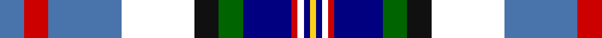

In pattern [BRBWKGBRWBY](/patterns/brbwkgbrwby/).

This was sourced from register-of-tartans.  It is a [11 stripes tartan](/stripes/stripes11/).

Original link https://www.tartanregister.gov.uk/tartanDetails.aspx?ref=10170

## Thread count
B/8 R8 B24 W24 K8 G8 DB16 R2 W2 DB2 Y/2

## Palette
Each colour and its ΔE from the base-6 reference it is a variant of.

| Colour | Shade | Base | ΔE (OKLab) |
|---|---|---|---|
| B | <code style="background-color:#4973AB;">#4973AB</code> `#4973AB` | B <code style="background-color:#2A418A;">#2A418A</code> | 0.15 |
| DB | <code style="background-color:#000080;">#000080</code> `#000080` | B <code style="background-color:#2A418A;">#2A418A</code> | 0.14 |
| G | <code style="background-color:#006400;">#006400</code> `#006400` | G <code style="background-color:#006100;">#006100</code> | 0.01 |
| K | <code style="background-color:#101010;">#101010</code> `#101010` | K <code style="background-color:#000000;">#000000</code> | 0.17 |
| R | <code style="background-color:#CD0000;">#CD0000</code> `#CD0000` | R <code style="background-color:#CC0000;">#CC0000</code> | 0.00 |
| W | <code style="background-color:#FFFFFF;">#FFFFFF</code> `#FFFFFF` | W <code style="background-color:#F7F7F7;">#F7F7F7</code> | 0.02 |
| Y | <code style="background-color:#FCD116;">#FCD116</code> `#FCD116` | Y <code style="background-color:#F2BF00;">#F2BF00</code> | 0.05 |

## Nearest tartans

The nearest existing variants by ΔTartan distance.

1. [Arisaig (District)](/setts/s11/b4r4b12w12k4g4ba8r1w1ba1y1~b5c8ca8-ba003c64-g006818-k101010-rc8002c-we0e0e0-ye8c000~x2/) — ΔT 0.81
1. [Lashbrooke of Barrowfield](/setts/s12/b3w3r3w24y4g6b3r2b16ba12y2b3~b202060-ba3850c8-g643424-rc80000-wfcfcfc-ye8c000~x2/) — ΔT 1.17
1. [Gillies, dress Blue](/setts/s10/y6k2b15r5b9k13w25ba2w3ba2~b5480b0-ba304080-k000000-rc00000-we0e0e0-yf0c000~x2/) — ΔT 1.18
1. [Haymarket Dress Blue Trade Tartan Tartan Number: 713. Earliest known date: pre 1992 One of a number of dress tartans produced by Hugh Macpherson, a kiltmaker in Edinburgh, whose shop is a short walk from Haymarket railway station. See products available Copyright © Blair Urquhart, Comrie, 2015](/setts/s9/g5b22g6k10w24y2b2w2r2~b2c2c80-g006818-k101010-rc80000-we0e0e0-ye8c000~x2/) — ΔT 1.28
1. [Lashbrooke of Barrowfield (Personal)](/setts/s12/b3r2ba12b14ra2b4g6r4w24ra2w2b3~b141e46-ba1870a4-g604000-rb07430-ra880000-wf8f4d0~x2/) — ΔT 1.31
1. [Californian MacLeod](/setts/s10/y4b22g3k3g3k3g12w22k2r3~b1c0070-g006818-k101010-rc80000-we0e0e0-ye8c000~x2/) — ΔT 1.31
1. [Edinburgh Zoo Panda (Comm)](/setts/s12/g4w28wa3w3k16wa4r10b4k14ra2k2ra3~b5c5c5c-g289c18-k101010-r888888-rac80000-we0e0e0-wac0c0c0/) — ΔT 1.32
1. [Gillies, Blue dress](/setts/s10/r7k2b16y5b10k13w28g2w4g2~b5480b0-g008000-k000000-rc00000-we0e0e0-yf0c000~x2/) — ΔT 1.38
1. [Armagh County Crest (Fashion)](/setts/s9/w3b4g8k5ba20ga3y13ga4w2~b1c1c50-ba2c2c80-g003820-ga006818-k101010-we0e0e0-ye8c000~x2/) — ΔT 1.38
1. [Culloden Blue, Stirling](/setts/s8/r4g2b15y2k14w14k2w4~b0596fa-g503c14-k101010-rc82828-we0e0e0-ye8c000~x2/) — ΔT 1.38

## Neighbour map

Every grey dot is one of 15726 variants placed by the first two principal components of the ΔTartan feature space (44% of its variance). Red is this tartan; blue dots are its nearest — click one to open its page.

<svg viewBox="0 0 640 380" role="img" style="max-width:100%;height:auto;border:1px solid #e0e0e0;border-radius:4px;display:block" xmlns="http://www.w3.org/2000/svg"><image href="/nn/cloud.v1.png" width="640" height="380"/><a href="/setts/s11/b4r4b12w12k4g4ba8r1w1ba1y1~b5c8ca8-ba003c64-g006818-k101010-rc8002c-we0e0e0-ye8c000~x2/"><circle cx="56.0" cy="107.7" r="4" fill="#3465a4"><title>Arisaig (District)</title></circle></a><a href="/setts/s12/b3w3r3w24y4g6b3r2b16ba12y2b3~b202060-ba3850c8-g643424-rc80000-wfcfcfc-ye8c000~x2/"><circle cx="86.3" cy="99.1" r="4" fill="#3465a4"><title>Lashbrooke of Barrowfield</title></circle></a><a href="/setts/s10/y6k2b15r5b9k13w25ba2w3ba2~b5480b0-ba304080-k000000-rc00000-we0e0e0-yf0c000~x2/"><circle cx="84.4" cy="116.1" r="4" fill="#3465a4"><title>Gillies, dress Blue</title></circle></a><a href="/setts/s9/g5b22g6k10w24y2b2w2r2~b2c2c80-g006818-k101010-rc80000-we0e0e0-ye8c000~x2/"><circle cx="106.9" cy="119.7" r="4" fill="#3465a4"><title>Haymarket Dress Blue Trade Tartan Tartan Number: 713. Earliest known date: pre 1992 One of a number of dress tartans produced by Hugh Macpherson, a kiltmaker in Edinburgh, whose shop is a short walk from Haymarket railway station. See products available Copyright © Blair Urquhart, Comrie, 2015</title></circle></a><a href="/setts/s12/b3r2ba12b14ra2b4g6r4w24ra2w2b3~b141e46-ba1870a4-g604000-rb07430-ra880000-wf8f4d0~x2/"><circle cx="90.2" cy="102.3" r="4" fill="#3465a4"><title>Lashbrooke of Barrowfield (Personal)</title></circle></a><a href="/setts/s10/y4b22g3k3g3k3g12w22k2r3~b1c0070-g006818-k101010-rc80000-we0e0e0-ye8c000~x2/"><circle cx="69.7" cy="118.0" r="4" fill="#3465a4"><title>Californian MacLeod</title></circle></a><a href="/setts/s12/g4w28wa3w3k16wa4r10b4k14ra2k2ra3~b5c5c5c-g289c18-k101010-r888888-rac80000-we0e0e0-wac0c0c0/"><circle cx="84.1" cy="82.1" r="4" fill="#3465a4"><title>Edinburgh Zoo Panda (Comm)</title></circle></a><a href="/setts/s10/r7k2b16y5b10k13w28g2w4g2~b5480b0-g008000-k000000-rc00000-we0e0e0-yf0c000~x2/"><circle cx="98.5" cy="111.1" r="4" fill="#3465a4"><title>Gillies, Blue dress</title></circle></a><a href="/setts/s9/w3b4g8k5ba20ga3y13ga4w2~b1c1c50-ba2c2c80-g003820-ga006818-k101010-we0e0e0-ye8c000~x2/"><circle cx="46.7" cy="128.7" r="4" fill="#3465a4"><title>Armagh County Crest (Fashion)</title></circle></a><a href="/setts/s8/r4g2b15y2k14w14k2w4~b0596fa-g503c14-k101010-rc82828-we0e0e0-ye8c000~x2/"><circle cx="60.2" cy="153.1" r="4" fill="#3465a4"><title>Culloden Blue, Stirling</title></circle></a><circle cx="40.4" cy="101.9" r="5" fill="#c00000"/></svg>

ID: /setts/s11/b4r4b12w12k4g4ba8r1w1ba1y1~b4973ab-ba000080-g006400-k101010-rcd0000-wffffff-yfcd116~x2/
