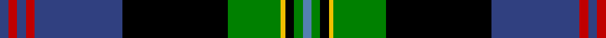

In pattern [BGKYGKBRBRB](/patterns/bgkygkbrbrb/).

This was sourced from weddslist.  It is a [11 stripes tartan](/stripes/stripes11/).

Original link http://www.weddslist.com/cgi-bin/tartans/pg.pl?source=sts

## Thread count
B/4 R4 B4 R4 B40 K48 G24 Y2 K4 G4 Ba/4

## Palette
Each colour and its ΔE from the base-6 reference it is a variant of.

| Colour | Shade | Base | ΔE (OKLab) |
|---|---|---|---|
| B | <code style="background-color:#304080;">#304080</code> `#304080` | B <code style="background-color:#2A418A;">#2A418A</code> | 0.02 |
| Ba | <code style="background-color:#5480B0;">#5480B0</code> `#5480B0` | B <code style="background-color:#2A418A;">#2A418A</code> | 0.19 |
| G | <code style="background-color:#008000;">#008000</code> `#008000` | G <code style="background-color:#006100;">#006100</code> | 0.10 |
| K | <code style="background-color:#000000;">#000000</code> `#000000` | K <code style="background-color:#000000;">#000000</code> | 0.00 |
| R | <code style="background-color:#C00000;">#C00000</code> `#C00000` | R <code style="background-color:#CC0000;">#CC0000</code> | 0.03 |
| Y | <code style="background-color:#F0C000;">#F0C000</code> `#F0C000` | Y <code style="background-color:#F2BF00;">#F2BF00</code> | 0.00 |

## Nearest tartans

The nearest existing variants by ΔTartan distance.

1. [Hunnisett, /Edinchip](/setts/s11/b76w4b4k20g4y4g44k6r6k6r6-b000050-g008000-k000000-rc00000-we0e0e0-yf0c000/) — ΔT 0.85
1. [Lochaber, Cameron](/setts/s11/b16ba6b80r6k88ba6r6g80r4k8r14-b304080-ba5480b0-g008000-k000000-rc00000/) — ΔT 1.08
1. [Joseph Linn Family (Monohon 2012) (Personal)](/setts/s15/w6b6r2b6r2b30r2b4g30ra2g4k40ra2k4ra4-b010082-g008001-k101010-rff0000-ra9a7036-wffffff/) — ΔT 1.11
1. [Joseph Linn Family (Monohon) Name Tartan Tartan Number: 10722. Earliest known date: 22 October 2012 Designed by Euan Dalgliesh and Joseph Linn. Joseph Linn and his wife, CathyJo, retired to the Monohon community on the shores of Lake Sammamish before the first of the next generation came into the world in October 2012. This tartan celebrates their recommitment to their family values and Celtic heritage. It also symbolises their hopes for a strong family connection for generations to come. See products available Copyright © Blair Urquhart, Comrie, 2015](/setts/s15/w6b6k2b6k2b30k2b4g30r2g4ka40r2ka4r4-b010082-g008001-k000000-ka101010-r9a7036-wffffff/) — ΔT 1.12
1. [Linn (Personal)](/setts/s15/w6b6r2b6r2b30r2b4g30y2g4k40y2k4y4-b1c0070-g006818-k101010-rc80000-we0e0e0-ybc8c00/) — ΔT 1.12
1. [Canadian Estate](/setts/s13/g72r4g8r8g64r4k64b4k8r8ba80r4w8-b646464-ba00008c-g007c00-k000000-r8c0000-wc8c8c8/) — ΔT 1.13
1. [Ogilvy Hunting](/setts/s9/b48y4k16g32k2g6k2g6r8-b00004c-g004c00-k000000-rc80000-yffc800/) — ΔT 1.21
1. [Gillies](/setts/s14/b176k30g18r24g40k6y16k6g40r24g18k30b48k72-b304080-g008000-k000000-rc00000-yf0c000/) — ΔT 1.22
1. [Scottish Spirit](/setts/s12/b18r6b64ba24k10ba4k8ba4k34bb8k4w4-b505050-ba646464-bb9058d8-k000000-r781c38-wc8c8c8/) — ΔT 1.22
1. [Sutherland](/setts/s12/g6w2g24k12b3k2b2k2b12r1b1r3-b000064-g004c00-k000000-rc80000-wd0d0d0/) — ΔT 1.23

## Neighbour map

Every grey dot is one of 15726 variants placed by the first two principal components of the ΔTartan feature space (44% of its variance). Red is this tartan; blue dots are its nearest — click one to open its page.

<svg viewBox="0 0 640 380" role="img" style="max-width:100%;height:auto;border:1px solid #e0e0e0;border-radius:4px;display:block" xmlns="http://www.w3.org/2000/svg"><image href="/nn/cloud.v1.png" width="640" height="380"/><a href="/setts/s11/b76w4b4k20g4y4g44k6r6k6r6-b000050-g008000-k000000-rc00000-we0e0e0-yf0c000/"><circle cx="201.0" cy="95.5" r="4" fill="#3465a4"><title>Hunnisett, /Edinchip</title></circle></a><a href="/setts/s11/b16ba6b80r6k88ba6r6g80r4k8r14-b304080-ba5480b0-g008000-k000000-rc00000/"><circle cx="157.6" cy="112.1" r="4" fill="#3465a4"><title>Lochaber, Cameron</title></circle></a><a href="/setts/s15/w6b6r2b6r2b30r2b4g30ra2g4k40ra2k4ra4-b010082-g008001-k101010-rff0000-ra9a7036-wffffff/"><circle cx="136.6" cy="81.9" r="4" fill="#3465a4"><title>Joseph Linn Family (Monohon 2012) (Personal)</title></circle></a><a href="/setts/s15/w6b6k2b6k2b30k2b4g30r2g4ka40r2ka4r4-b010082-g008001-k000000-ka101010-r9a7036-wffffff/"><circle cx="137.6" cy="85.4" r="4" fill="#3465a4"><title>Joseph Linn Family (Monohon) Name Tartan Tartan Number: 10722. Earliest known date: 22 October 2012 Designed by Euan Dalgliesh and Joseph Linn. Joseph Linn and his wife, CathyJo, retired to the Monohon community on the shores of Lake Sammamish before the first of the next generation came into the world in October 2012. This tartan celebrates their recommitment to their family values and Celtic heritage. It also symbolises their hopes for a strong family connection for generations to come. See products available Copyright © Blair Urquhart, Comrie, 2015</title></circle></a><a href="/setts/s15/w6b6r2b6r2b30r2b4g30y2g4k40y2k4y4-b1c0070-g006818-k101010-rc80000-we0e0e0-ybc8c00/"><circle cx="151.8" cy="86.8" r="4" fill="#3465a4"><title>Linn (Personal)</title></circle></a><a href="/setts/s13/g72r4g8r8g64r4k64b4k8r8ba80r4w8-b646464-ba00008c-g007c00-k000000-r8c0000-wc8c8c8/"><circle cx="176.8" cy="96.9" r="4" fill="#3465a4"><title>Canadian Estate</title></circle></a><a href="/setts/s9/b48y4k16g32k2g6k2g6r8-b00004c-g004c00-k000000-rc80000-yffc800/"><circle cx="219.7" cy="135.6" r="4" fill="#3465a4"><title>Ogilvy Hunting</title></circle></a><a href="/setts/s14/b176k30g18r24g40k6y16k6g40r24g18k30b48k72-b304080-g008000-k000000-rc00000-yf0c000/"><circle cx="200.2" cy="98.6" r="4" fill="#3465a4"><title>Gillies</title></circle></a><a href="/setts/s12/b18r6b64ba24k10ba4k8ba4k34bb8k4w4-b505050-ba646464-bb9058d8-k000000-r781c38-wc8c8c8/"><circle cx="198.7" cy="113.5" r="4" fill="#3465a4"><title>Scottish Spirit</title></circle></a><a href="/setts/s12/g6w2g24k12b3k2b2k2b12r1b1r3-b000064-g004c00-k000000-rc80000-wd0d0d0/"><circle cx="226.5" cy="120.0" r="4" fill="#3465a4"><title>Sutherland</title></circle></a><circle cx="176.6" cy="92.6" r="5" fill="#c00000"/></svg>

ID: /setts/s11/b4r4b4r4b40k48g24y2k4g4ba4-b304080-ba5480b0-g008000-k000000-rc00000-yf0c000/
