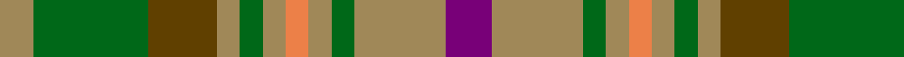

In pattern [BYGYYYGYGGY](/patterns/bygyyygyggy/).

This was sourced from register-of-tartans.  It is a [11 stripes tartan](/stripes/stripes11/).

Original link https://www.tartanregister.gov.uk/tartanDetails.aspx?ref=92

## Attestations

This cloth appears in 2 source records; the oldest owns this page.

- 01/01/1997 — Annand Family (Personal) (register-of-tartans, [record](https://www.tartanregister.gov.uk/tartanDetails.aspx?ref=92))
- 1997 — Annand (Personal) (tartans-authority, [record](http://www.tartansauthority.com/tartan-ferret/display/6059/))

## Thread count
LT/6 G20 T12 LT4 G4 LT4 O4 LT4 G4 LT16 P/8

## Palette
Each colour and its ΔE from the base-6 reference it is a variant of.

| Colour | Shade | Base | ΔE (OKLab) |
|---|---|---|---|
| G | <code style="background-color:#006818;">#006818</code> `#006818` | G <code style="background-color:#006100;">#006100</code> | 0.02 |
| LT | <code style="background-color:#A08858;">#A08858</code> `#A08858` | Y <code style="background-color:#F2BF00;">#F2BF00</code> | 0.21 |
| O | <code style="background-color:#EC8048;">#EC8048</code> `#EC8048` | Y <code style="background-color:#F2BF00;">#F2BF00</code> | 0.17 |
| P | <code style="background-color:#780078;">#780078</code> `#780078` | B <code style="background-color:#2A418A;">#2A418A</code> | 0.17 |
| T | <code style="background-color:#604000;">#604000</code> `#604000` | G <code style="background-color:#006100;">#006100</code> | 0.14 |

## Nearest tartans

The nearest existing variants by ΔTartan distance.

1. [Vassseur Mignon ({Personal)](/setts/s11/r2y2r2y2g5ra5g11b11g5ra11y2x2~b5c5c5c-g006818-rc80000-ra888888-yfccc00/) — ΔT 0.74
1. [Harmony 14](/setts/s11/g3ga16gb11ga2y11ga2y11ga2gb11ga16w3x2~g005020-ga808080-gb503c14-we0e0e0-yc89600/) — ΔT 0.99
1. [MacVicker (Name)](/setts/s13/b12g2y2g2b2g10ga10g3ga12g10b11r2y2x2~b003c64-g604000-ga407c38-rc80000-ye8c000/) — ΔT 1.16
1. [Quinn (Name?)](/setts/s12/g20r20ga5r5ga30k10g10y8ga30r5ga5r20x2~g408060-ga006818-k101010-rc80000-ye8c000/) — ΔT 1.18
1. [Lawrence's Seven Pillars of Khaki](/setts/s9/g3b12g10b6g8ga6g8r23ra3x2~b5c8ca8-g006818-ga289c18-r98481c-rab03000/) — ΔT 1.25
1. [Maple Leaf](/setts/s12/g6r1g1r4ga4r4g1r1g6ra2ga2gb4x8~g003000-ga008000-gb607030-r900030-ra806050/) — ΔT 1.29
1. [MacDonald of Denovan Htg (Clan)](/setts/s12/g10b2g3r4g13k13r2ga13r4ga3r2ga10x2~b6c0070-g285800-ga408060-k101010-r880000/) — ΔT 1.30
1. [Niagara Falls](/setts/s12/b22g4b4g17r17g17b4g4b22y8r8ra8x2~b304080-g008000-r806050-rac00000-yf0c000/) — ΔT 1.40
1. [MacAart Family Tartan Tartan Number: 1477. Earliest known date: pre 2003 Restricted See products available Copyright © Blair Urquhart, Comrie, 2015](/setts/s10/g9k2g2r2ga6k1y1k1ga6r3x2~g604000-ga006818-k101010-rc80000-ye8c000/) — ΔT 1.42
1. [Corcoran of Sherbrooke (Personal)](/setts/s9/k1y1g5b1g2ga5y1gb3y1x4~b780078-g006818-ga603800-gb8c7038-k101010-yb8b8b8/) — ΔT 1.44

## Neighbour map

Every grey dot is one of 15726 variants placed by the first two principal components of the ΔTartan feature space (44% of its variance). Red is this tartan; blue dots are its nearest — click one to open its page.

<svg viewBox="0 0 640 380" role="img" style="max-width:100%;height:auto;border:1px solid #e0e0e0;border-radius:4px;display:block" xmlns="http://www.w3.org/2000/svg"><image href="/nn/cloud.v1.png" width="640" height="380"/><a href="/setts/s11/r2y2r2y2g5ra5g11b11g5ra11y2x2~b5c5c5c-g006818-rc80000-ra888888-yfccc00/"><circle cx="141.0" cy="206.7" r="4" fill="#3465a4"><title>Vassseur Mignon ({Personal)</title></circle></a><a href="/setts/s11/g3ga16gb11ga2y11ga2y11ga2gb11ga16w3x2~g005020-ga808080-gb503c14-we0e0e0-yc89600/"><circle cx="204.6" cy="196.8" r="4" fill="#3465a4"><title>Harmony 14</title></circle></a><a href="/setts/s13/b12g2y2g2b2g10ga10g3ga12g10b11r2y2x2~b003c64-g604000-ga407c38-rc80000-ye8c000/"><circle cx="162.4" cy="209.1" r="4" fill="#3465a4"><title>MacVicker (Name)</title></circle></a><a href="/setts/s12/g20r20ga5r5ga30k10g10y8ga30r5ga5r20x2~g408060-ga006818-k101010-rc80000-ye8c000/"><circle cx="161.3" cy="200.7" r="4" fill="#3465a4"><title>Quinn (Name?)</title></circle></a><a href="/setts/s9/g3b12g10b6g8ga6g8r23ra3x2~b5c8ca8-g006818-ga289c18-r98481c-rab03000/"><circle cx="196.8" cy="226.0" r="4" fill="#3465a4"><title>Lawrence's Seven Pillars of Khaki</title></circle></a><a href="/setts/s12/g6r1g1r4ga4r4g1r1g6ra2ga2gb4x8~g003000-ga008000-gb607030-r900030-ra806050/"><circle cx="156.8" cy="217.8" r="4" fill="#3465a4"><title>Maple Leaf</title></circle></a><a href="/setts/s12/g10b2g3r4g13k13r2ga13r4ga3r2ga10x2~b6c0070-g285800-ga408060-k101010-r880000/"><circle cx="146.5" cy="208.6" r="4" fill="#3465a4"><title>MacDonald of Denovan Htg (Clan)</title></circle></a><a href="/setts/s12/b22g4b4g17r17g17b4g4b22y8r8ra8x2~b304080-g008000-r806050-rac00000-yf0c000/"><circle cx="139.5" cy="213.7" r="4" fill="#3465a4"><title>Niagara Falls</title></circle></a><a href="/setts/s10/g9k2g2r2ga6k1y1k1ga6r3x2~g604000-ga006818-k101010-rc80000-ye8c000/"><circle cx="188.7" cy="192.1" r="4" fill="#3465a4"><title>MacAart Family Tartan Tartan Number: 1477. Earliest known date: pre 2003 Restricted See products available Copyright © Blair Urquhart, Comrie, 2015</title></circle></a><a href="/setts/s9/k1y1g5b1g2ga5y1gb3y1x4~b780078-g006818-ga603800-gb8c7038-k101010-yb8b8b8/"><circle cx="106.8" cy="198.4" r="4" fill="#3465a4"><title>Corcoran of Sherbrooke (Personal)</title></circle></a><circle cx="175.7" cy="217.1" r="5" fill="#c00000"/></svg>

ID: /setts/s11/b4y8g2y2ya2y2g2y2ga6g10y3x2~b780078-g006818-ga604000-ya08858-yaec8048/
