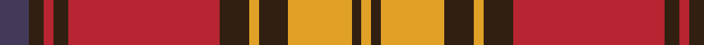

In pattern [BBRBRBYBYBY](/patterns/bbrbrbybyby/).

This was sourced from register-of-tartans.  It is a [11 stripes tartan](/stripes/stripes11/).

Original link https://www.tartanregister.gov.uk/tartanDetails.aspx?ref=10819

## Thread count
N/12 K6 R4 K6 R62 K12 Y4 K12 Y26 K4 Y/4

## Palette
Each colour and its ΔE from the base-6 reference it is a variant of.

| Colour | Shade | Base | ΔE (OKLab) |
|---|---|---|---|
| K | <code style="background-color:#311F11;">#311F11</code> `#311F11` | B <code style="background-color:#2A418A;">#2A418A</code> | 0.21 |
| N | <code style="background-color:#433A5A;">#433A5A</code> `#433A5A` | B <code style="background-color:#2A418A;">#2A418A</code> | 0.09 |
| R | <code style="background-color:#B62531;">#B62531</code> `#B62531` | R <code style="background-color:#CC0000;">#CC0000</code> | 0.05 |
| Y | <code style="background-color:#E0A126;">#E0A126</code> `#E0A126` | Y <code style="background-color:#F2BF00;">#F2BF00</code> | 0.08 |

## Nearest tartans

The nearest existing variants by ΔTartan distance.

1. [Rourke-Frew (Name)](/setts/s11/b6k3r2k3r31k6y2k6y13k2y2~b003c64-k101010-rc8002c-ybc8c00~x2/) — ΔT 0.58
1. [Orr, Gerald William (Personal)](/setts/s12/b4y2b2k5b4k4b8k6b2r32b2w4~b5c5c5c-k101010-rc80000-we0e0e0-ybc8c00~x2/) — ΔT 1.00
1. [Robertson 1820 - White line](/setts/s13/w1g2r18b2r2b18r2g18r2b2r18g2w1~b202060-g006818-rc80000-wfcfcfc~x2/) — ΔT 1.01
1. [Lindsay #3](/setts/s9/g12k1g1k1g1r5ra10k1ra2~g005020-k101010-r960028-radc0000~x2/) — ΔT 1.07
1. [Robertson 7](/setts/s13/w1g2r18b2r2b18r2g18r2b2r18g2w1~b304080-g008000-rc00000-we0e0e0~x2/) — ΔT 1.10
1. [Glenfinnan](/setts/s10/b28r26w2b5w2r26g28r5w2r5~b780078-g289c18-rc80000-wfcfcfc~x2/) — ΔT 1.15
1. [MacKillop (Scottish Tartan Society)](/setts/s10/g4r2k2r20b1k7r2g10r3k2~b3c82af-g005020-k101010-rdc0000~x2/) — ΔT 1.16
1. [Cruikshank (Name)](/setts/s9/r4g15b8g4r48g4b8g4y3~b2c2c80-g006818-rc80000-yfccc00~x2/) — ΔT 1.17
1. [Scrymgeour](/setts/s12/r15k1y2g3r2k1y15k1r2g3y2k1~g408060-k101010-rc80000-yd09800~x6/) — ΔT 1.19
1. [Glenaladale Plaid](/setts/s10/b28r26w2b5w2r26g28r5w2r5~b2c4084-g005020-rdc0000-we0e0e0~x2/) — ΔT 1.19

## Neighbour map

Every grey dot is one of 15726 variants placed by the first two principal components of the ΔTartan feature space (44% of its variance). Red is this tartan; blue dots are its nearest — click one to open its page.

<svg viewBox="0 0 640 380" role="img" style="max-width:100%;height:auto;border:1px solid #e0e0e0;border-radius:4px;display:block" xmlns="http://www.w3.org/2000/svg"><image href="/nn/cloud.v1.png" width="640" height="380"/><a href="/setts/s11/b6k3r2k3r31k6y2k6y13k2y2~b003c64-k101010-rc8002c-ybc8c00~x2/"><circle cx="253.0" cy="127.9" r="4" fill="#3465a4"><title>Rourke-Frew (Name)</title></circle></a><a href="/setts/s12/b4y2b2k5b4k4b8k6b2r32b2w4~b5c5c5c-k101010-rc80000-we0e0e0-ybc8c00~x2/"><circle cx="244.0" cy="106.4" r="4" fill="#3465a4"><title>Orr, Gerald William (Personal)</title></circle></a><a href="/setts/s13/w1g2r18b2r2b18r2g18r2b2r18g2w1~b202060-g006818-rc80000-wfcfcfc~x2/"><circle cx="283.8" cy="128.5" r="4" fill="#3465a4"><title>Robertson 1820 - White line</title></circle></a><a href="/setts/s9/g12k1g1k1g1r5ra10k1ra2~g005020-k101010-r960028-radc0000~x2/"><circle cx="258.2" cy="166.2" r="4" fill="#3465a4"><title>Lindsay #3</title></circle></a><a href="/setts/s13/w1g2r18b2r2b18r2g18r2b2r18g2w1~b304080-g008000-rc00000-we0e0e0~x2/"><circle cx="292.1" cy="132.0" r="4" fill="#3465a4"><title>Robertson 7</title></circle></a><a href="/setts/s10/b28r26w2b5w2r26g28r5w2r5~b780078-g289c18-rc80000-wfcfcfc~x2/"><circle cx="263.8" cy="154.0" r="4" fill="#3465a4"><title>Glenfinnan</title></circle></a><a href="/setts/s10/g4r2k2r20b1k7r2g10r3k2~b3c82af-g005020-k101010-rdc0000~x2/"><circle cx="306.3" cy="138.2" r="4" fill="#3465a4"><title>MacKillop (Scottish Tartan Society)</title></circle></a><a href="/setts/s9/r4g15b8g4r48g4b8g4y3~b2c2c80-g006818-rc80000-yfccc00~x2/"><circle cx="333.8" cy="142.5" r="4" fill="#3465a4"><title>Cruikshank (Name)</title></circle></a><a href="/setts/s12/r15k1y2g3r2k1y15k1r2g3y2k1~g408060-k101010-rc80000-yd09800~x6/"><circle cx="264.1" cy="124.6" r="4" fill="#3465a4"><title>Scrymgeour</title></circle></a><a href="/setts/s10/b28r26w2b5w2r26g28r5w2r5~b2c4084-g005020-rdc0000-we0e0e0~x2/"><circle cx="263.9" cy="159.7" r="4" fill="#3465a4"><title>Glenaladale Plaid</title></circle></a><circle cx="265.4" cy="131.1" r="5" fill="#c00000"/></svg>

ID: /setts/s11/b6ba3r2ba3r31ba6y2ba6y13ba2y2~b433a5a-ba311f11-rb62531-ye0a126~x2/
