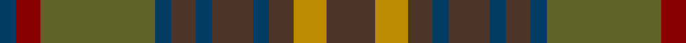

In pattern [BRGBBBBBBYB](/patterns/brgbbbbbbyb/).

This was sourced from register-of-tartans.  It is a [11 stripes tartan](/stripes/stripes11/).

Original link https://www.tartanregister.gov.uk/tartanDetails.aspx?ref=2113

## Attestations

This cloth appears in 2 source records; the oldest owns this page.

- 01/01/1996 — Limerick, County (register-of-tartans, [record](https://www.tartanregister.gov.uk/tartanDetails.aspx?ref=2113))
- 1996 — Limerick, County (District) (tartans-authority, [record](http://www.tartansauthority.com/tartan-ferret/display/2272/))

## Thread count
DB/4 DR6 G28 DB4 T6 DB4 T10 DB4 T6 DY8 T/12

## Palette
Each colour and its ΔE from the base-6 reference it is a variant of.

| Colour | Shade | Base | ΔE (OKLab) |
|---|---|---|---|
| DB | <code style="background-color:#003C64;">#003C64</code> `#003C64` | B <code style="background-color:#2A418A;">#2A418A</code> | 0.08 |
| DR | <code style="background-color:#880000;">#880000</code> `#880000` | R <code style="background-color:#CC0000;">#CC0000</code> | 0.15 |
| DY | <code style="background-color:#BC8C00;">#BC8C00</code> `#BC8C00` | Y <code style="background-color:#F2BF00;">#F2BF00</code> | 0.16 |
| G | <code style="background-color:#5C6428;">#5C6428</code> `#5C6428` | G <code style="background-color:#006100;">#006100</code> | 0.10 |
| T | <code style="background-color:#4C3428;">#4C3428</code> `#4C3428` | B <code style="background-color:#2A418A;">#2A418A</code> | 0.17 |

## Nearest tartans

The nearest existing variants by ΔTartan distance.

1. [MacVicar, McVicar, McVicker](/setts/s13/b12g2y2g2b2g10ga12g3ga12g10b11r2y2x2~b574b6f-g594312-ga667123-rd45647-yfcc254/) — ΔT 0.79
1. [Maple Leaf (District)](/setts/s12/r15g3r3g19ga6gb6ra6g19r3g3r15gb13x2~g006438-ga581c00-gb806c44-r880000-ra906828/) — ΔT 0.90
1. [Hash House Harriers Hunting (Corp)](/setts/s13/g7ga1w1ga1y1ga7b7ga1b7ga7g7ga1r1x4~b48587c-g006818-ga604000-rc80000-wd4d0b4-ybc8c00/) — ΔT 1.17
1. [MacAart (Personal)](/setts/s10/g9k2g2r2ga6k1y1k1ga6r3x4~g604000-ga006818-k101010-r880000-yd09800/) — ΔT 1.22
1. [Lochaber (Ingles Buchan)](/setts/s10/b6r4ba22ra4k22b22k2ra5k2b6x2~b4c3428-ba5c5c5c-k101010-r888888-ra880000/) — ΔT 1.24
1. [United Distillers Corporate Tartan Tartan Number: 2098. Earliest known date: 1989 An expression of evocative Scottish colours to reflect the corporate image of quality and style. (weft) lb4 b24 lb2 dg24 g24 r4 See products available Copyright © Blair Urquhart, Comrie, 2015](/setts/s10/b12g1ga12g12y2g12ga12g1b12ba2x2~b680028-ba2888c4-g604000-ga003820-ye8c000/) — ΔT 1.28
1. [Kerry, County](/setts/s15/y2b3g3b4ga16b3g3b4ga3b3g16b4ga3b3y2x2~b003c64-g5c6428-ga604000-yd09800/) — ΔT 1.29
1. [Jardine, of Castlemilk](/setts/s8/b9r9ba9ra1bb1r9bb1ra1x4~b401000-ba505050-bb304080-r806050-rac00000/) — ΔT 1.32
1. [Roscommon Irish County Tartan Tartan Number: 2246. Earliest known date: 1996 One of a series of Irish District tartans designed by Polly Wittering of the House of Edgar, with colours reminiscent of the Country with soft warm colours dominating. See products available Copyright © Blair Urquhart, Comrie, 2015](/setts/s10/r5y3r19b6y5b6g12ba5g12ba3x2~b4c3428-ba3c588c-g385c5c-rc05838-yc48800/) — ΔT 1.33
1. [Lander (2013)](/setts/s15/y18b3y3b3y3b16g16r2ya2r2g16b16y17b3y3x2~b4c3428-g5c6428-r960000-ya08858-yad8b000/) — ΔT 1.36

## Neighbour map

Every grey dot is one of 15726 variants placed by the first two principal components of the ΔTartan feature space (44% of its variance). Red is this tartan; blue dots are its nearest — click one to open its page.

<svg viewBox="0 0 640 380" role="img" style="max-width:100%;height:auto;border:1px solid #e0e0e0;border-radius:4px;display:block" xmlns="http://www.w3.org/2000/svg"><image href="/nn/cloud.v1.png" width="640" height="380"/><a href="/setts/s13/b12g2y2g2b2g10ga12g3ga12g10b11r2y2x2~b574b6f-g594312-ga667123-rd45647-yfcc254/"><circle cx="199.5" cy="218.9" r="4" fill="#3465a4"><title>MacVicar, McVicar, McVicker</title></circle></a><a href="/setts/s12/r15g3r3g19ga6gb6ra6g19r3g3r15gb13x2~g006438-ga581c00-gb806c44-r880000-ra906828/"><circle cx="227.6" cy="226.4" r="4" fill="#3465a4"><title>Maple Leaf (District)</title></circle></a><a href="/setts/s13/g7ga1w1ga1y1ga7b7ga1b7ga7g7ga1r1x4~b48587c-g006818-ga604000-rc80000-wd4d0b4-ybc8c00/"><circle cx="216.2" cy="199.1" r="4" fill="#3465a4"><title>Hash House Harriers Hunting (Corp)</title></circle></a><a href="/setts/s10/g9k2g2r2ga6k1y1k1ga6r3x4~g604000-ga006818-k101010-r880000-yd09800/"><circle cx="215.7" cy="205.7" r="4" fill="#3465a4"><title>MacAart (Personal)</title></circle></a><a href="/setts/s10/b6r4ba22ra4k22b22k2ra5k2b6x2~b4c3428-ba5c5c5c-k101010-r888888-ra880000/"><circle cx="234.5" cy="194.8" r="4" fill="#3465a4"><title>Lochaber (Ingles Buchan)</title></circle></a><a href="/setts/s10/b12g1ga12g12y2g12ga12g1b12ba2x2~b680028-ba2888c4-g604000-ga003820-ye8c000/"><circle cx="232.9" cy="214.4" r="4" fill="#3465a4"><title>United Distillers Corporate Tartan Tartan Number: 2098. Earliest known date: 1989 An expression of evocative Scottish colours to reflect the corporate image of quality and style. (weft) lb4 b24 lb2 dg24 g24 r4 See products available Copyright © Blair Urquhart, Comrie, 2015</title></circle></a><a href="/setts/s15/y2b3g3b4ga16b3g3b4ga3b3g16b4ga3b3y2x2~b003c64-g5c6428-ga604000-yd09800/"><circle cx="247.7" cy="207.8" r="4" fill="#3465a4"><title>Kerry, County</title></circle></a><a href="/setts/s8/b9r9ba9ra1bb1r9bb1ra1x4~b401000-ba505050-bb304080-r806050-rac00000/"><circle cx="291.3" cy="222.0" r="4" fill="#3465a4"><title>Jardine, of Castlemilk</title></circle></a><a href="/setts/s10/r5y3r19b6y5b6g12ba5g12ba3x2~b4c3428-ba3c588c-g385c5c-rc05838-yc48800/"><circle cx="165.7" cy="223.4" r="4" fill="#3465a4"><title>Roscommon Irish County Tartan Tartan Number: 2246. Earliest known date: 1996 One of a series of Irish District tartans designed by Polly Wittering of the House of Edgar, with colours reminiscent of the Country with soft warm colours dominating. See products available Copyright © Blair Urquhart, Comrie, 2015</title></circle></a><a href="/setts/s15/y18b3y3b3y3b16g16r2ya2r2g16b16y17b3y3x2~b4c3428-g5c6428-r960000-ya08858-yad8b000/"><circle cx="221.0" cy="179.7" r="4" fill="#3465a4"><title>Lander (2013)</title></circle></a><circle cx="223.2" cy="215.4" r="5" fill="#c00000"/></svg>

ID: /setts/s11/b6y4b3ba2b5ba2b3ba2g14r3ba2x2~b4c3428-ba003c64-g5c6428-r880000-ybc8c00/
