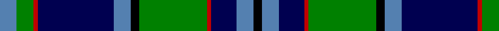

In pattern [BGRBBKGRBBK](/patterns/bgrbbkgrbbk/).

This was sourced from weddslist.  It is a [11 stripes tartan](/stripes/stripes11/).

Original link http://www.weddslist.com/cgi-bin/tartans/pg.pl?source=sts

## Thread count
B/8 G8 R2 DB36 B8 K4 G32 R2 DB12 B8 K/4

## Palette
Each colour and its ΔE from the base-6 reference it is a variant of.

| Colour | Shade | Base | ΔE (OKLab) |
|---|---|---|---|
| B | <code style="background-color:#5480B0;">#5480B0</code> `#5480B0` | B <code style="background-color:#2C4084;">#2C4084</code> | 0.20 |
| DB | <code style="background-color:#000050;">#000050</code> `#000050` | B <code style="background-color:#2C4084;">#2C4084</code> | 0.20 |
| G | <code style="background-color:#008000;">#008000</code> `#008000` | G <code style="background-color:#006400;">#006400</code> | 0.09 |
| K | <code style="background-color:#000000;">#000000</code> `#000000` | K <code style="background-color:#000000;">#000000</code> | 0.00 |
| R | <code style="background-color:#C00000;">#C00000</code> `#C00000` | R <code style="background-color:#C80000;">#C80000</code> | 0.02 |

## Nearest tartans

The nearest existing variants by ΔTartan distance.

1. [Ebdon Muir (Personal)](/setts/s9/b8ba80k30g20b4g20b4g20w8-b780078-ba000058-g00801c-k101010-wf0f0c4/) — ΔT 0.64
1. [West of Wells](/setts/s9/g56k4b6k22b6k4b34ba8w4-b000080-ba0000cd-g006400-k000000-we6e6fa/) — ΔT 0.87
1. [Robertson, hunting](/setts/s11/b56k24g32k2r4k2g32k24b24k2w6-b304080-g008000-k000000-rc00000-we0e0e0/) — ΔT 0.98
1. [O'Doherty (Glasgow) (Personal)](/setts/s13/w4b20g6b4g6k36g20y2g6y4g4k4y4-b000080-g006400-k101010-wffffff-yffe600/) — ΔT 1.02
1. [Forth](/setts/s11/b8k6b46k18g4ba4g4ba4g16k4y6-b304080-ba5480b0-g008000-k000000-yf0c000/) — ΔT 1.03
1. [Ebdon-Muir (Personal)](/setts/s9/b8ba80k30g20b4g20b4g20w8-b551a8b-ba00009c-g006400-k101010-wffffaa/) — ΔT 1.03
1. [Clerke of Ulva](/setts/s11/b6g6k8g28k8g6k28ba36r2ba8r4-b5480b0-ba304080-g008000-k000000-r900030/) — ΔT 1.04
1. [Hope Vere Family Tartan Tartan Number: 759. Earliest known date: c.1815 Hopetoun House, South Queensferry, home of the Marquesses of Linlithgow, was built by Robert Adam. The Highland Society of London collected specimens of tartan sealed with the signature of the Clan Chief or Head of the family, from 1815 onwards. See products available Copyright © Blair Urquhart, Comrie, 2015](/setts/s16/g38k2ga6k2g6k18b40k2y2k14y2k2b42k24g4ga2-b2c2c80-g289c18-ga006818-k101010-ye8c000/) — ΔT 1.05
1. [Scottish Rugby Union Corporate Tartan Tartan Number: 2101. Earliest known date: 1990 S.R.U. requested that the Navy of their jersey should be prominent, including the green and lilac of the thistle, and the white of the shorts. This version is approved by the Scottish Rugby Union. See products available Copyright © Blair Urquhart, Comrie, 2015](/setts/s11/b6k4b44k18g4w4g4w4g16k4wa6-b003c64-g289c18-k101010-wc49cd8-wae0e0e0/) — ΔT 1.06
1. [MacDonell of Glengarry](/setts/s11/b32r10b60r4k66g60r10g4r4g14w4-b304080-g008000-k000000-rc00000-we0e0e0/) — ΔT 1.07

## Neighbour map

Every grey dot is one of 15726 variants placed by the first two principal components of the ΔTartan feature space (44% of its variance). Red is this tartan; blue dots are its nearest — click one to open its page.

<svg viewBox="0 0 640 380" role="img" style="max-width:100%;height:auto;border:1px solid #e0e0e0;border-radius:4px;display:block" xmlns="http://www.w3.org/2000/svg"><image href="/nn/cloud.v1.png" width="640" height="380"/><a href="/setts/s9/b8ba80k30g20b4g20b4g20w8-b780078-ba000058-g00801c-k101010-wf0f0c4/"><circle cx="201.9" cy="139.1" r="4" fill="#3465a4"><title>Ebdon Muir (Personal)</title></circle></a><a href="/setts/s9/g56k4b6k22b6k4b34ba8w4-b000080-ba0000cd-g006400-k000000-we6e6fa/"><circle cx="180.7" cy="152.1" r="4" fill="#3465a4"><title>West of Wells</title></circle></a><a href="/setts/s11/b56k24g32k2r4k2g32k24b24k2w6-b304080-g008000-k000000-rc00000-we0e0e0/"><circle cx="187.1" cy="126.6" r="4" fill="#3465a4"><title>Robertson, hunting</title></circle></a><a href="/setts/s13/w4b20g6b4g6k36g20y2g6y4g4k4y4-b000080-g006400-k101010-wffffff-yffe600/"><circle cx="152.5" cy="120.5" r="4" fill="#3465a4"><title>O'Doherty (Glasgow) (Personal)</title></circle></a><a href="/setts/s11/b8k6b46k18g4ba4g4ba4g16k4y6-b304080-ba5480b0-g008000-k000000-yf0c000/"><circle cx="190.2" cy="140.7" r="4" fill="#3465a4"><title>Forth</title></circle></a><a href="/setts/s9/b8ba80k30g20b4g20b4g20w8-b551a8b-ba00009c-g006400-k101010-wffffaa/"><circle cx="207.6" cy="143.1" r="4" fill="#3465a4"><title>Ebdon-Muir (Personal)</title></circle></a><a href="/setts/s11/b6g6k8g28k8g6k28ba36r2ba8r4-b5480b0-ba304080-g008000-k000000-r900030/"><circle cx="142.3" cy="142.6" r="4" fill="#3465a4"><title>Clerke of Ulva</title></circle></a><a href="/setts/s16/g38k2ga6k2g6k18b40k2y2k14y2k2b42k24g4ga2-b2c2c80-g289c18-ga006818-k101010-ye8c000/"><circle cx="206.7" cy="109.6" r="4" fill="#3465a4"><title>Hope Vere Family Tartan Tartan Number: 759. Earliest known date: c.1815 Hopetoun House, South Queensferry, home of the Marquesses of Linlithgow, was built by Robert Adam. The Highland Society of London collected specimens of tartan sealed with the signature of the Clan Chief or Head of the family, from 1815 onwards. See products available Copyright © Blair Urquhart, Comrie, 2015</title></circle></a><a href="/setts/s11/b6k4b44k18g4w4g4w4g16k4wa6-b003c64-g289c18-k101010-wc49cd8-wae0e0e0/"><circle cx="187.1" cy="141.9" r="4" fill="#3465a4"><title>Scottish Rugby Union Corporate Tartan Tartan Number: 2101. Earliest known date: 1990 S.R.U. requested that the Navy of their jersey should be prominent, including the green and lilac of the thistle, and the white of the shorts. This version is approved by the Scottish Rugby Union. See products available Copyright © Blair Urquhart, Comrie, 2015</title></circle></a><a href="/setts/s11/b32r10b60r4k66g60r10g4r4g14w4-b304080-g008000-k000000-rc00000-we0e0e0/"><circle cx="152.6" cy="132.6" r="4" fill="#3465a4"><title>MacDonell of Glengarry</title></circle></a><circle cx="177.8" cy="136.8" r="5" fill="#c00000"/></svg>

ID: /setts/s11/b8g8r2ba36b8k4g32r2ba12b8k4-b5480b0-ba000050-g008000-k000000-rc00000/
