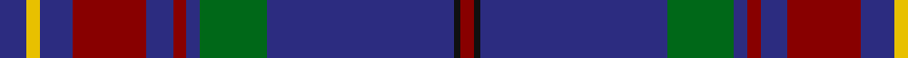

In pattern [BYBRBRBGBKR](/patterns/bybrbrbgbkr/).

This was sourced from register-of-tartans.  It is a [11 stripes tartan](/stripes/stripes11/).

Original link https://www.tartanregister.gov.uk/tartanDetails.aspx?ref=3434

## Attestations

This cloth appears in 2 source records; the oldest owns this page.

- 01/07/2004 — Rabbie Burns (register-of-tartans, [record](https://www.tartanregister.gov.uk/tartanDetails.aspx?ref=3434))
- July 2004 — Rabbie Burns (Corporate) (tartans-authority, [record](http://www.tartansauthority.com/tartan-ferret/display/6318/))

## Thread count
DB/8 Y4 DB10 DR22 DB8 DR4 DB4 G20 DB56 K2 DR/4

## Palette
Each colour and its ΔE from the base-6 reference it is a variant of.

| Colour | Shade | Base | ΔE (OKLab) |
|---|---|---|---|
| DB | <code style="background-color:#2C2C80;">#2C2C80</code> `#2C2C80` | B <code style="background-color:#2A418A;">#2A418A</code> | 0.06 |
| DR | <code style="background-color:#880000;">#880000</code> `#880000` | R <code style="background-color:#CC0000;">#CC0000</code> | 0.15 |
| G | <code style="background-color:#006818;">#006818</code> `#006818` | G <code style="background-color:#006100;">#006100</code> | 0.02 |
| K | <code style="background-color:#101010;">#101010</code> `#101010` | K <code style="background-color:#000000;">#000000</code> | 0.17 |
| Y | <code style="background-color:#E8C000;">#E8C000</code> `#E8C000` | Y <code style="background-color:#F2BF00;">#F2BF00</code> | 0.02 |

## Nearest tartans

The nearest existing variants by ΔTartan distance.

1. [Connaught Ancestry (Fashion)](/setts/s11/b8ba42b16k8b8y8b18ba18b76k2w6-b2c2c80-ba5c5c5c-k101010-we8ccb8-ye8c000/) — ΔT 0.84
1. [St. Leonards](/setts/s14/b80ba4k8r6ra12b4r32b4ra12r6k8ba4b80ba12-b2c2c80-ba2888c4-k101010-rc80000-ra888888/) — ΔT 1.07
1. [Connaught Ancestry](/setts/s11/b8ba42b16k8b8y8b18ba18b76k2w6-b0d4f8b-ba332c2c-k101010-wffffff-ycc7f32/) — ΔT 1.16
1. [Brough from Orkney (Name)](/setts/s13/b4k4b2r2k4ra14k4r4b24y6b54r8k4-b003c64-k101010-r888888-rac80000-yfccc00/) — ΔT 1.16
1. [Riyadh Caledonian (Corporate)](/setts/s13/b92g16b4w4b12g20b4ba16b12y4g12w4g16-b2c2c80-ba780078-g006818-we0e0e0-ye8c000/) — ΔT 1.18
1. [Al-Fadhli (Personal)](/setts/s10/k34b48g6b6w6b6r6b48k34w2-b2c2c80-g006818-k101010-rc80000-we0e0e0/) — ΔT 1.21
1. [Polkemmet (Corporate)](/setts/s11/k7y3b62r16g5r5g5r5g16b16k4-b2c2c80-g006818-k101010-r888888-ybc8c00/) — ΔT 1.25
1. [MacLaurin of Brioch](/setts/s7/b72k20g6r6g12k2y4-b2c4084-g005020-k101010-rdc0000-ye8c000/) — ΔT 1.26
1. [MacLaurin of Brioch Clan Tartan Tartan Number: 344. Earliest known date: 1856 This sett was approved by the Chief and accepted by the A.G.M. of the Clan MacLaren Society as Dress MacLaren in 1981. The sett has been designed by changing the blue ground of the usual MacLaren sett to white and then centering a blue stripe on the white ground. This illustration is based on a kilt belonging to the designer, Mr I.G.Campbell MacLaren. See products available Copyright © Blair Urquhart, Comrie, 2015](/setts/s7/b72k20g6r6g12k2y4-b2c2c80-g006818-k101010-rc80000-ye8c000/) — ΔT 1.28
1. [Al-Fadhli (Personal)](/setts/s10/b6g6b48k68w2k68b48r6b6w6-b2c4084-g003c14-k101010-rdc0000-we0e0e0/) — ΔT 1.30

## Neighbour map

Every grey dot is one of 15726 variants placed by the first two principal components of the ΔTartan feature space (44% of its variance). Red is this tartan; blue dots are its nearest — click one to open its page.

<svg viewBox="0 0 640 380" role="img" style="max-width:100%;height:auto;border:1px solid #e0e0e0;border-radius:4px;display:block" xmlns="http://www.w3.org/2000/svg"><image href="/nn/cloud.v1.png" width="640" height="380"/><a href="/setts/s11/b8ba42b16k8b8y8b18ba18b76k2w6-b2c2c80-ba5c5c5c-k101010-we8ccb8-ye8c000/"><circle cx="392.0" cy="124.4" r="4" fill="#3465a4"><title>Connaught Ancestry (Fashion)</title></circle></a><a href="/setts/s14/b80ba4k8r6ra12b4r32b4ra12r6k8ba4b80ba12-b2c2c80-ba2888c4-k101010-rc80000-ra888888/"><circle cx="366.2" cy="113.3" r="4" fill="#3465a4"><title>St. Leonards</title></circle></a><a href="/setts/s11/b8ba42b16k8b8y8b18ba18b76k2w6-b0d4f8b-ba332c2c-k101010-wffffff-ycc7f32/"><circle cx="395.9" cy="130.9" r="4" fill="#3465a4"><title>Connaught Ancestry</title></circle></a><a href="/setts/s13/b4k4b2r2k4ra14k4r4b24y6b54r8k4-b003c64-k101010-r888888-rac80000-yfccc00/"><circle cx="368.4" cy="102.9" r="4" fill="#3465a4"><title>Brough from Orkney (Name)</title></circle></a><a href="/setts/s13/b92g16b4w4b12g20b4ba16b12y4g12w4g16-b2c2c80-ba780078-g006818-we0e0e0-ye8c000/"><circle cx="347.7" cy="112.5" r="4" fill="#3465a4"><title>Riyadh Caledonian (Corporate)</title></circle></a><a href="/setts/s10/k34b48g6b6w6b6r6b48k34w2-b2c2c80-g006818-k101010-rc80000-we0e0e0/"><circle cx="330.7" cy="152.8" r="4" fill="#3465a4"><title>Al-Fadhli (Personal)</title></circle></a><a href="/setts/s11/k7y3b62r16g5r5g5r5g16b16k4-b2c2c80-g006818-k101010-r888888-ybc8c00/"><circle cx="317.7" cy="130.7" r="4" fill="#3465a4"><title>Polkemmet (Corporate)</title></circle></a><a href="/setts/s7/b72k20g6r6g12k2y4-b2c4084-g005020-k101010-rdc0000-ye8c000/"><circle cx="389.0" cy="130.7" r="4" fill="#3465a4"><title>MacLaurin of Brioch</title></circle></a><a href="/setts/s7/b72k20g6r6g12k2y4-b2c2c80-g006818-k101010-rc80000-ye8c000/"><circle cx="381.0" cy="126.7" r="4" fill="#3465a4"><title>MacLaurin of Brioch Clan Tartan Tartan Number: 344. Earliest known date: 1856 This sett was approved by the Chief and accepted by the A.G.M. of the Clan MacLaren Society as Dress MacLaren in 1981. The sett has been designed by changing the blue ground of the usual MacLaren sett to white and then centering a blue stripe on the white ground. This illustration is based on a kilt belonging to the designer, Mr I.G.Campbell MacLaren. See products available Copyright © Blair Urquhart, Comrie, 2015</title></circle></a><a href="/setts/s10/b6g6b48k68w2k68b48r6b6w6-b2c4084-g003c14-k101010-rdc0000-we0e0e0/"><circle cx="344.1" cy="137.4" r="4" fill="#3465a4"><title>Al-Fadhli (Personal)</title></circle></a><circle cx="383.0" cy="127.1" r="5" fill="#c00000"/></svg>

ID: /setts/s11/b8y4b10r22b8r4b4g20b56k2r4-b2c2c80-g006818-k101010-r880000-ye8c000/
