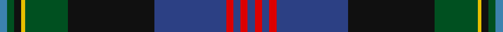

In pattern [BGKYGKBRBRB](/stripes/bgkygkbrbrb/).

This was sourced from register-of-tartans.  It is a [11 stripe tartan](/stripes/stripes11/).

Original link https://www.tartanregister.gov.uk/tartanDetails.aspx?ref=4208

## Register references

External register numbers recorded for this tartan.

- Scottish Register of Tartans: [4208](https://www.tartanregister.gov.uk/tartanDetails.aspx?ref=4208)
- Scottish Tartans World Register: 157

## Thread count
B/4 G4 K4 Y2 G24 K48 Ba40 R4 Ba4 R4 Ba/4

## Palette
Each colour and its ΔE from the base-6 reference it is a variant of.

| Colour | Shade | Base | ΔE (OKLab) |
|---|---|---|---|
| B | <code style="background-color:#3C82AF;">#3C82AF</code> `#3C82AF` | B <code style="background-color:#2A418A;">#2A418A</code> | 0.19 |
| Ba | <code style="background-color:#2C4084;">#2C4084</code> `#2C4084` | B <code style="background-color:#2A418A;">#2A418A</code> | 0.01 |
| G | <code style="background-color:#005020;">#005020</code> `#005020` | G <code style="background-color:#006100;">#006100</code> | 0.07 |
| K | <code style="background-color:#101010;">#101010</code> `#101010` | K <code style="background-color:#000000;">#000000</code> | 0.17 |
| R | <code style="background-color:#DC0000;">#DC0000</code> `#DC0000` | R <code style="background-color:#CC0000;">#CC0000</code> | 0.03 |
| Y | <code style="background-color:#E8C000;">#E8C000</code> `#E8C000` | Y <code style="background-color:#F2BF00;">#F2BF00</code> | 0.02 |

## Nearest tartans

The nearest existing variants by ΔTartan distance.

1. [Smithsonian (Corporate)](/setts/s11/db2w2y24k24ly1r2y2r2ly1db24y2~x2/) — ΔT 0.54
1. [McGuirk (2013)](/setts/s12/dg4r1dg1r3dg16k12r1db27lb2db3lb1ly2~x2/) — ΔT 0.68
1. [McGuirk (2013)](/setts/s12/dg4r1dg1r3dg16k12r1db27t2db3t1ly2~x2/) — ΔT 0.74
1. [Sidey Family Tartan (Name)](/setts/s10/db4w1k2db25k12b1k2g16k2r1~x2/) — ΔT 0.78
1. [Scragg Moran (Personal)](/setts/s10/g1dt28k11r5w1r5k11lr1k2g1~x2/) — ΔT 0.93
1. [San Diego, The](/setts/s11/r2ly2db3dg30t8db3t2db3t2db16lb2~x2/) — ΔT 1.01
1. [Wcwm 1290](/setts/s11/dg28lb2dg3lo4dg3lb2dg3k14lg2db28lb3~x2/) — ΔT 1.03
1. [Hunnisett/Edinchip (Name)](/setts/s11/db38w2db2k10g2ly2g22k3r3k3r3~x2/) — ΔT 1.04
1. [Beauly Firth and Glens](/setts/s8/dp3n3dp3n27w1t15k22r3~x2/) — ΔT 1.07
1. [Rikaco Heirloom (Fashion)](/setts/s10/db3db3db1g26db10n1db3dp5db4lo2~x2/) — ΔT 1.07

## Neighbour map

Every grey dot is one of 14299 variants placed by the first two principal components of the ΔTartan feature space (44% of its variance). Red is this tartan; blue dots are its nearest — click one to open its page.

<svg viewBox="0 0 640 380" role="img" style="max-width:100%;height:auto;border:1px solid #e0e0e0;border-radius:4px;display:block" xmlns="http://www.w3.org/2000/svg"><image href="/nn/cloud.v1.png" width="640" height="380"/><a href="/setts/s11/db2w2y24k24ly1r2y2r2ly1db24y2~x2/"><circle cx="207.6" cy="108.7" r="4" fill="#3465a4"><title>Smithsonian (Corporate)</title></circle></a><a href="/setts/s12/dg4r1dg1r3dg16k12r1db27lb2db3lb1ly2~x2/"><circle cx="257.3" cy="112.0" r="4" fill="#3465a4"><title>McGuirk (2013)</title></circle></a><a href="/setts/s12/dg4r1dg1r3dg16k12r1db27t2db3t1ly2~x2/"><circle cx="241.0" cy="100.6" r="4" fill="#3465a4"><title>McGuirk (2013)</title></circle></a><a href="/setts/s10/db4w1k2db25k12b1k2g16k2r1~x2/"><circle cx="275.2" cy="129.7" r="4" fill="#3465a4"><title>Sidey Family Tartan (Name)</title></circle></a><a href="/setts/s10/g1dt28k11r5w1r5k11lr1k2g1~x2/"><circle cx="276.5" cy="116.2" r="4" fill="#3465a4"><title>Scragg Moran (Personal)</title></circle></a><a href="/setts/s11/r2ly2db3dg30t8db3t2db3t2db16lb2~x2/"><circle cx="233.0" cy="131.1" r="4" fill="#3465a4"><title>San Diego, The</title></circle></a><a href="/setts/s11/dg28lb2dg3lo4dg3lb2dg3k14lg2db28lb3~x2/"><circle cx="204.4" cy="135.4" r="4" fill="#3465a4"><title>Wcwm 1290</title></circle></a><a href="/setts/s11/db38w2db2k10g2ly2g22k3r3k3r3~x2/"><circle cx="240.9" cy="109.2" r="4" fill="#3465a4"><title>Hunnisett/Edinchip (Name)</title></circle></a><a href="/setts/s8/dp3n3dp3n27w1t15k22r3~x2/"><circle cx="233.9" cy="138.6" r="4" fill="#3465a4"><title>Beauly Firth and Glens</title></circle></a><a href="/setts/s10/db3db3db1g26db10n1db3dp5db4lo2~x2/"><circle cx="276.2" cy="124.0" r="4" fill="#3465a4"><title>Rikaco Heirloom (Fashion)</title></circle></a><circle cx="232.6" cy="118.4" r="5" fill="#c00000"/></svg>

ID: /setts/s11/db2r2db2r2db20k24dg12ly1k2dg2t2~x2/
