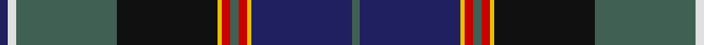

**Bands:** [BWGKYRGRYBG](/stripes/bwgkyrgrybg/) · **Stripes:** [DB W Y K LY R Y R LY DB Y](/stripes/stripes11/) DB W Y K LY R Y R LY DB Y

This was sourced from tartans-authority.  It is a [11 band tartan](/bands/bands11/).

Original link http://www.tartansauthority.com/tartan-ferret/display/5813/

## Attestations

This cloth appears in 2 source records; the oldest owns this page.

- April 2003 — Smithsonian (Corporate) (tartans-authority, [record](http://www.tartansauthority.com/tartan-ferret/display/5813/))
- undated — Smithsonian (Corporate) American Corporate Tartan Tartan Number: 5813. Earliest known date: April 2003 Designed by Alistair Buchan of Lochcarron to support Scotland's and Lochcarron's participation in the Smithsonian Institute's For Life Festival in Washington DC, USA June 25th - July 6th 2003. See products available Copyright © Blair Urquhart, Comrie, 2015 (house-of-tartan, [record](http://www.house-of-tartan.scotland.net/house/TartanViewjs.asp?colr=Def&tnam=5813))

## Thread count
DB/4 LN4 N48 K48 Y2 R4 N4 R4 Y2 DB48 N/4

## Palette
Each colour and its ΔE from the base-6 reference it is a variant of.

| Colour | Shade | Base | ΔE (OKLab) |
|---|---|---|---|
| DB | <code style="background-color:#202060;">#202060</code> `#202060` | B <code style="background-color:#2A418A;">#2A418A</code> | 0.11 |
| K | <code style="background-color:#101010;">#101010</code> `#101010` | K <code style="background-color:#000000;">#000000</code> | 0.17 |
| LN | <code style="background-color:#E0E0E0;">#E0E0E0</code> `#E0E0E0` | W <code style="background-color:#F7F7F7;">#F7F7F7</code> | 0.07 |
| N | <code style="background-color:#406054;">#406054</code> `#406054` | G <code style="background-color:#006100;">#006100</code> | 0.11 |
| R | <code style="background-color:#C80000;">#C80000</code> `#C80000` | R <code style="background-color:#CC0000;">#CC0000</code> | 0.01 |
| Y | <code style="background-color:#E8C000;">#E8C000</code> `#E8C000` | Y <code style="background-color:#F2BF00;">#F2BF00</code> | 0.02 |

## Nearest tartans

The nearest existing variants by ΔTartan distance.

1. [Unidentified #7](/setts/s11/db2r2db2r2db20k24dg12ly1k2dg2t2~x2/) — ΔT 0.54
1. [McGuirk (2013)](/setts/s12/dg4r1dg1r3dg16k12r1db27t2db3t1ly2~x2/) — ΔT 0.87
1. [Lang of Sherbrooke (Personal)](/setts/s11/g10ly2k2g2k13g2k2g1dp13db24w2~x2/) — ΔT 0.95
1. [Womack (2014)](/setts/s12/dg19w2dg5k4db21k4w2dg5w1ly1w1dr14~x2/) — ΔT 0.96
1. [Lochaber Cameron](/setts/s11/db8t3db40r3k44t3r3g40r2k4r7~x2/) — ΔT 0.96
1. [McGuirk (2013)](/setts/s12/dg4r1dg1r3dg16k12r1db27lb2db3lb1ly2~x2/) — ΔT 1.02
1. [Pride of Scotland](/setts/s11/g9m2m2g3m18g2k2g1k19db33w2~x2/) — ΔT 1.02
1. [Spirit of Bannockburn (Fashion)](/setts/s13/k2dp4m4dp3g20dp5k4dp3k7dp3k3db35w2~x2/) — ΔT 1.09
1. [Lang of Sherbrooke (Personal)](/setts/s11/g10ly2dp2g2dp13g2dp2g1k13db24w2~x2/) — ΔT 1.09
1. [Scottish Association for Neurological Sciences](/setts/s9/db46ly4db4ly4db6k16n66lb11r6/) — ΔT 1.12

## Neighbour map

Every grey dot is one of 14313 variants placed by the first two principal components of the ΔTartan feature space (44% of its variance). Red is this tartan; blue dots are its nearest — click one to open its page.

<svg viewBox="0 0 640 380" role="img" style="max-width:100%;height:auto;border:1px solid #e0e0e0;border-radius:4px;display:block" xmlns="http://www.w3.org/2000/svg"><image href="/nn/cloud.v1.png" width="640" height="380"/><a href="/setts/s11/db2r2db2r2db20k24dg12ly1k2dg2t2~x2/"><circle cx="232.5" cy="118.2" r="4" fill="#3465a4"><title>Unidentified #7</title></circle></a><a href="/setts/s12/dg4r1dg1r3dg16k12r1db27t2db3t1ly2~x2/"><circle cx="241.0" cy="100.5" r="4" fill="#3465a4"><title>McGuirk (2013)</title></circle></a><a href="/setts/s11/g10ly2k2g2k13g2k2g1dp13db24w2~x2/"><circle cx="173.6" cy="112.8" r="4" fill="#3465a4"><title>Lang of Sherbrooke (Personal)</title></circle></a><a href="/setts/s12/dg19w2dg5k4db21k4w2dg5w1ly1w1dr14~x2/"><circle cx="178.7" cy="117.8" r="4" fill="#3465a4"><title>Womack (2014)</title></circle></a><a href="/setts/s11/db8t3db40r3k44t3r3g40r2k4r7~x2/"><circle cx="201.8" cy="131.3" r="4" fill="#3465a4"><title>Lochaber Cameron</title></circle></a><a href="/setts/s12/dg4r1dg1r3dg16k12r1db27lb2db3lb1ly2~x2/"><circle cx="257.3" cy="111.8" r="4" fill="#3465a4"><title>McGuirk (2013)</title></circle></a><a href="/setts/s11/g9m2m2g3m18g2k2g1k19db33w2~x2/"><circle cx="212.7" cy="95.7" r="4" fill="#3465a4"><title>Pride of Scotland</title></circle></a><a href="/setts/s13/k2dp4m4dp3g20dp5k4dp3k7dp3k3db35w2~x2/"><circle cx="193.0" cy="108.9" r="4" fill="#3465a4"><title>Spirit of Bannockburn (Fashion)</title></circle></a><a href="/setts/s11/g10ly2dp2g2dp13g2dp2g1k13db24w2~x2/"><circle cx="176.2" cy="112.3" r="4" fill="#3465a4"><title>Lang of Sherbrooke (Personal)</title></circle></a><a href="/setts/s9/db46ly4db4ly4db6k16n66lb11r6/"><circle cx="216.1" cy="127.8" r="4" fill="#3465a4"><title>Scottish Association for Neurological Sciences</title></circle></a><circle cx="207.6" cy="108.5" r="5" fill="#c00000"/></svg>

ID: /setts/s11/db2w2y24k24ly1r2y2r2ly1db24y2~x2/
