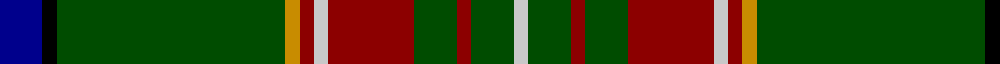

**Bands:** [BKGYRWRGRGW](/stripes/bkgyrwrgrgw/) · **Stripes:** [DB K DG LO R LB R DG R DG LB](/stripes/stripes11/) DB K DG LO R LB R DG R DG LB

This was sourced from register-of-tartans.  It is a [11 band tartan](/bands/bands11/).

Original link https://www.tartanregister.gov.uk/tartanDetails.aspx?ref=542

## Attestations

This cloth appears in 2 source records; the oldest owns this page.

- 01/01/1939 — Canadian Caledonian Hunting (register-of-tartans, [record](https://www.tartanregister.gov.uk/tartanDetails.aspx?ref=542))
- 1939 — Canadian Caledonian Htg (Universal) (tartans-authority, [record](http://www.tartansauthority.com/tartan-ferret/display/335/))

## Register references

External register numbers recorded for this tartan.

- Scottish Register of Tartans: [542](https://www.tartanregister.gov.uk/tartanDetails.aspx?ref=542)
- Scottish Tartans Authority (ITI): 335
- Scottish Tartans World Register: 335

## Thread count
DB/12 K4 G64 DY4 DR4 N4 DR24 G12 DR4 G12 N/4

## Palette
Each colour and its ΔE from the base-6 reference it is a variant of.

| Colour | Shade | Base | ΔE (OKLab) |
|---|---|---|---|
| DB | <code style="background-color:#00008C;">#00008C</code> `#00008C` | B <code style="background-color:#2A418A;">#2A418A</code> | 0.13 |
| DR | <code style="background-color:#8C0000;">#8C0000</code> `#8C0000` | R <code style="background-color:#CC0000;">#CC0000</code> | 0.14 |
| DY | <code style="background-color:#C88C00;">#C88C00</code> `#C88C00` | Y <code style="background-color:#F2BF00;">#F2BF00</code> | 0.15 |
| G | <code style="background-color:#004C00;">#004C00</code> `#004C00` | G <code style="background-color:#006100;">#006100</code> | 0.07 |
| K | <code style="background-color:#000000;">#000000</code> `#000000` | K <code style="background-color:#000000;">#000000</code> | 0.00 |
| N | <code style="background-color:#C8C8C8;">#C8C8C8</code> `#C8C8C8` | W <code style="background-color:#F7F7F7;">#F7F7F7</code> | 0.14 |

## Nearest tartans

The nearest existing variants by ΔTartan distance.

1. [State Seal of Maine (Fashion)](/setts/s10/dg49k8lo20lo3dg23r6k5t3dg10lo10~x2/) — ΔT 0.85
1. [Pienaar (Personal)](/setts/s9/ly3g6dg32r4ly2r2dp7dg2w2~x2/) — ΔT 0.98
1. [New York Caledonian Club Day](/setts/s11/g9o1g2r3g28k16lb1g8lb1db8r1~x2/) — ΔT 1.06
1. [Princess Mary](/setts/s12/dg44db3k8ly2k2w2k2dg9r5k2r2w2~x2/) — ΔT 1.08
1. [Cochrane of Dundonald](/setts/s13/g44r4g2r2g2r4g12k12r2db10r4db4ly3~x2/) — ΔT 1.15
1. [Hynde (Sir John)](/setts/s11/g28r2g28r7lb2r7lb2r7k5dp4lb2~x2/) — ΔT 1.18
1. [Bottle Green (Fashion)](/setts/s12/g30lo4k6lo2k2g4k2db5y4k2y3g2~x2/) — ΔT 1.20
1. [Carroll O'Reed](/setts/s12/dg28b1dg4r1k1lr1k1g4r4k2r4lr2~x2/) — ΔT 1.22
1. [Anthony Plaid Stewart](/setts/s10/dg18k1ly3k1lr1dg1r2k2r2lr2~x4/) — ΔT 1.24
1. [New York Caledonian Club Day](/setts/s11/g9lo1g2r3g28k16t1g8t1db8r1~x2/) — ΔT 1.24

## Neighbour map

Every grey dot is one of 14313 variants placed by the first two principal components of the ΔTartan feature space (44% of its variance). Red is this tartan; blue dots are its nearest — click one to open its page.

<svg viewBox="0 0 640 380" role="img" style="max-width:100%;height:auto;border:1px solid #e0e0e0;border-radius:4px;display:block" xmlns="http://www.w3.org/2000/svg"><image href="/nn/cloud.v1.png" width="640" height="380"/><a href="/setts/s10/dg49k8lo20lo3dg23r6k5t3dg10lo10~x2/"><circle cx="313.7" cy="147.1" r="4" fill="#3465a4"><title>State Seal of Maine (Fashion)</title></circle></a><a href="/setts/s9/ly3g6dg32r4ly2r2dp7dg2w2~x2/"><circle cx="286.8" cy="112.0" r="4" fill="#3465a4"><title>Pienaar (Personal)</title></circle></a><a href="/setts/s11/g9o1g2r3g28k16lb1g8lb1db8r1~x2/"><circle cx="345.8" cy="114.6" r="4" fill="#3465a4"><title>New York Caledonian Club Day</title></circle></a><a href="/setts/s12/dg44db3k8ly2k2w2k2dg9r5k2r2w2~x2/"><circle cx="366.8" cy="88.4" r="4" fill="#3465a4"><title>Princess Mary</title></circle></a><a href="/setts/s13/g44r4g2r2g2r4g12k12r2db10r4db4ly3~x2/"><circle cx="332.3" cy="113.6" r="4" fill="#3465a4"><title>Cochrane of Dundonald</title></circle></a><a href="/setts/s11/g28r2g28r7lb2r7lb2r7k5dp4lb2~x2/"><circle cx="336.3" cy="153.7" r="4" fill="#3465a4"><title>Hynde (Sir John)</title></circle></a><a href="/setts/s12/g30lo4k6lo2k2g4k2db5y4k2y3g2~x2/"><circle cx="288.9" cy="121.7" r="4" fill="#3465a4"><title>Bottle Green (Fashion)</title></circle></a><a href="/setts/s12/dg28b1dg4r1k1lr1k1g4r4k2r4lr2~x2/"><circle cx="359.2" cy="85.1" r="4" fill="#3465a4"><title>Carroll O'Reed</title></circle></a><a href="/setts/s10/dg18k1ly3k1lr1dg1r2k2r2lr2~x4/"><circle cx="317.6" cy="114.6" r="4" fill="#3465a4"><title>Anthony Plaid Stewart</title></circle></a><a href="/setts/s11/g9lo1g2r3g28k16t1g8t1db8r1~x2/"><circle cx="348.0" cy="121.1" r="4" fill="#3465a4"><title>New York Caledonian Club Day</title></circle></a><circle cx="319.2" cy="121.0" r="5" fill="#c00000"/></svg>

ID: /setts/s11/db3k1dg16lo1r1lb1r6dg3r1dg3lb1~x4/
