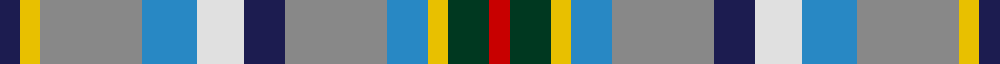

In pattern [BYRBWBRBYGR](/stripes/byrbwbrbygr/).

This was sourced from tartans-authority.  It is a [11 stripe tartan](/stripes/stripes11/).

Original link http://www.tartansauthority.com/tartan-ferret/display/7822/

## Thread count
DB/6 Y6 N30 B16 LN14 DB12 N30 B12 Y6 DG12 R/6

## Palette
Each colour and the base-6 reference it is a variant of.

| Colour | Shade | Base |
|---|---|---|
| B | <code style="background-color:#2888C4;">#2888C4</code> `oklch(60.1% 0.125 241.5)` <small>#2888C4</small> | B <code style="background-color:#2A418A;">#2A418A</code> |
| DB | <code style="background-color:#1C1C50;">#1C1C50</code> `oklch(26.2% 0.093 277.9)` <small>#1C1C50</small> | B <code style="background-color:#2A418A;">#2A418A</code> |
| DG | <code style="background-color:#003820;">#003820</code> `oklch(30.0% 0.070 158.3)` <small>#003820</small> | G <code style="background-color:#006100;">#006100</code> |
| LN | <code style="background-color:#E0E0E0;">#E0E0E0</code> `oklch(90.7% 0.000 89.9)` <small>#E0E0E0</small> | W <code style="background-color:#F7F7F7;">#F7F7F7</code> |
| N | <code style="background-color:#888888;">#888888</code> `oklch(62.7% 0.000 89.9)` <small>#888888</small> | R <code style="background-color:#CC0000;">#CC0000</code> |
| R | <code style="background-color:#C80000;">#C80000</code> `oklch(52.3% 0.215 29.2)` <small>#C80000</small> | R <code style="background-color:#CC0000;">#CC0000</code> |
| Y | <code style="background-color:#E8C000;">#E8C000</code> `oklch(81.9% 0.168 93.7)` <small>#E8C000</small> | Y <code style="background-color:#F2BF00;">#F2BF00</code> |

## Nearest tartans

The nearest existing variants by ΔTartan distance.

1. [Saltcoats (Saskatchewan)](/setts/s11/db3ly3y15b8w8db6y15b6ly3dg6r3~x2/) — ΔT 0.31
1. [RAF Leuchars](/setts/s10/lr2y11r2y11k2db6b13k2b3ly2~x4/) — ΔT 1.11
1. [Union Club of British Columbia](/setts/s12/o2k1n4lb4w1lb4t4k1t4lb2t4ly1~x4/) — ΔT 1.21
1. [Northern College (Ontario)](/setts/s10/g5db3t3g5w4ly2t1ly2db1r1~x6/) — ΔT 1.24
1. [Kentucky, State of](/setts/s12/g13db11w2lb4r3ly3r3lb4w2db11g13k2~x2/) — ΔT 1.30
1. [Manx National](/setts/s7/b5dg9o2ly2db6t14w3~x4/) — ΔT 1.37
1. [Mounth The.. Corporate Tartan Tartan Number: 120. Earliest known date: 1988 Designed for Kincardine & Deeside branch of the National Trust for Scotland. Blue is a muted sky blue. Green is a dark pine green. See products available Copyright © Blair Urquhart, Comrie, 2015](/setts/s9/dg2o13dg12w3lb10w3lb12g13r2~x2/) — ΔT 1.38
1. [Chattahoochee River](/setts/s12/w3r3k3r10b7db8g4db3g3db3g13lo3~x2/) — ΔT 1.45
1. [McCulloch (Personal)](/setts/s15/y6k1y1k1y3lr1w1r1w1lr1t3db1t1db1t6~x4/) — ΔT 1.50
1. [Anderson (Blackwood) (Personal)](/setts/s12/k5g15dy8g15k5r4db8lt5w3lt5db8r4~x2/) — ΔT 1.52

## Neighbour map

Every grey dot is one of 14299 variants placed by the first two principal components of the ΔTartan feature space (44% of its variance). Red is this tartan; blue dots are its nearest — click one to open its page.

<svg viewBox="0 0 640 380" role="img" style="max-width:100%;height:auto;border:1px solid #e0e0e0;border-radius:4px;display:block" xmlns="http://www.w3.org/2000/svg"><image href="/nn/cloud.v1.png" width="640" height="380"/><a href="/setts/s11/db3ly3y15b8w8db6y15b6ly3dg6r3~x2/"><circle cx="54.1" cy="170.7" r="4" fill="#3465a4"><title>Saltcoats (Saskatchewan)</title></circle></a><a href="/setts/s10/lr2y11r2y11k2db6b13k2b3ly2~x4/"><circle cx="119.9" cy="160.6" r="4" fill="#3465a4"><title>RAF Leuchars</title></circle></a><a href="/setts/s12/o2k1n4lb4w1lb4t4k1t4lb2t4ly1~x4/"><circle cx="53.5" cy="198.6" r="4" fill="#3465a4"><title>Union Club of British Columbia</title></circle></a><a href="/setts/s10/g5db3t3g5w4ly2t1ly2db1r1~x6/"><circle cx="52.0" cy="194.1" r="4" fill="#3465a4"><title>Northern College (Ontario)</title></circle></a><a href="/setts/s12/g13db11w2lb4r3ly3r3lb4w2db11g13k2~x2/"><circle cx="68.2" cy="147.1" r="4" fill="#3465a4"><title>Kentucky, State of</title></circle></a><a href="/setts/s7/b5dg9o2ly2db6t14w3~x4/"><circle cx="80.3" cy="183.9" r="4" fill="#3465a4"><title>Manx National</title></circle></a><a href="/setts/s9/dg2o13dg12w3lb10w3lb12g13r2~x2/"><circle cx="54.6" cy="186.1" r="4" fill="#3465a4"><title>Mounth The.. Corporate Tartan Tartan Number: 120. Earliest known date: 1988 Designed for Kincardine &amp; Deeside branch of the National Trust for Scotland. Blue is a muted sky blue. Green is a dark pine green. See products available Copyright © Blair Urquhart, Comrie, 2015</title></circle></a><a href="/setts/s12/w3r3k3r10b7db8g4db3g3db3g13lo3~x2/"><circle cx="31.7" cy="181.9" r="4" fill="#3465a4"><title>Chattahoochee River</title></circle></a><a href="/setts/s15/y6k1y1k1y3lr1w1r1w1lr1t3db1t1db1t6~x4/"><circle cx="93.1" cy="141.1" r="4" fill="#3465a4"><title>McCulloch (Personal)</title></circle></a><a href="/setts/s12/k5g15dy8g15k5r4db8lt5w3lt5db8r4~x2/"><circle cx="14.0" cy="169.9" r="4" fill="#3465a4"><title>Anderson (Blackwood) (Personal)</title></circle></a><circle cx="65.3" cy="173.8" r="5" fill="#c00000"/></svg>

ID: /setts/s11/db3ly3o15t8w7db6o15t6ly3dg6r3~x2/
