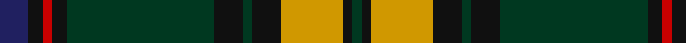

In pattern [BKRKGKGKYKG](/stripes/bkrkgkgkykg/).

This was sourced from tartans-authority.  It is a [11 stripe tartan](/stripes/stripes11/).

Original link http://www.tartansauthority.com/tartan-ferret/display/10982/

## Thread count
DB/12 K6 R4 K6 DG62 K12 DG4 K12 DY26 K4 DG/4

## Palette
Each colour and the base-6 reference it is a variant of.

| Colour | Shade | Base |
|---|---|---|
| DB | <code style="background-color:#202060;">#202060</code> `oklch(28.9% 0.111 276.9)` <small>#202060</small> | B <code style="background-color:#2A418A;">#2A418A</code> |
| DG | <code style="background-color:#003820;">#003820</code> `oklch(30.0% 0.070 158.3)` <small>#003820</small> | G <code style="background-color:#006100;">#006100</code> |
| DY | <code style="background-color:#D09800;">#D09800</code> `oklch(71.4% 0.147 82.1)` <small>#D09800</small> | Y <code style="background-color:#F2BF00;">#F2BF00</code> |
| K | <code style="background-color:#101010;">#101010</code> `oklch(17.3% 0.000 89.9)` <small>#101010</small> | K <code style="background-color:#000000;">#000000</code> |
| R | <code style="background-color:#C80000;">#C80000</code> `oklch(52.3% 0.215 29.2)` <small>#C80000</small> | R <code style="background-color:#CC0000;">#CC0000</code> |

## Nearest tartans

The nearest existing variants by ΔTartan distance, with this tartan at the top so the swatches line up against it.

ΔTartan

Tartan

Sett

—

<a href="/ttd/edit/#slug=db6k3r2k3dg31k6dg2k6lo13k2dg2~x2">Rourke-Frew Hunting</a> <a class="nn-out" href="/setts/s11/db6k3r2k3dg31k6dg2k6lo13k2dg2~x2/" title="open its dictionary page">↗</a>

0.89

<a href="/ttd/edit/#slug=g3n5k4n33g12k4w2k18lo3~x2">Smoke Showing (UFES)</a> <a class="nn-out" href="/setts/s9/g3n5k4n33g12k4w2k18lo3~x2/" title="open its dictionary page">↗</a>

0.94

<a href="/ttd/edit/#slug=g6k2g24k10dt2p2dt2p2dt10k2lb3~x2">Scottish Rugby Union (City of Nagasaki)</a> <a class="nn-out" href="/setts/s11/g6k2g24k10dt2p2dt2p2dt10k2lb3~x2/" title="open its dictionary page">↗</a>

0.97

<a href="/ttd/edit/#slug=r6g1lb2g24k3g3k3g3k8db8lb2db4~x2">Kerby/Kirby</a> <a class="nn-out" href="/setts/s12/r6g1lb2g24k3g3k3g3k8db8lb2db4~x2/" title="open its dictionary page">↗</a>

0.98

<a href="/ttd/edit/#slug=k6r2k2r2k6db7g20ly2g3r2~x2">Connolly Hunting (Name)</a> <a class="nn-out" href="/setts/s10/k6r2k2r2k6db7g20ly2g3r2~x2/" title="open its dictionary page">↗</a>

1.01

<a href="/ttd/edit/#slug=dg6r4dg4r3dg4ly2db14k4dg4k28dg18k2dg2k2~x2">Cypress Presbyterian Church</a> <a class="nn-out" href="/setts/s14/dg6r4dg4r3dg4ly2db14k4dg4k28dg18k2dg2k2~x2/" title="open its dictionary page">↗</a>

1.02

<a href="/ttd/edit/#slug=g34r4g3r2g4r2g3r4g17k17r2db17r4db4ly3~x2">Cochrane</a> <a class="nn-out" href="/setts/s15/g34r4g3r2g4r2g3r4g17k17r2db17r4db4ly3~x2/" title="open its dictionary page">↗</a>

1.03

<a href="/ttd/edit/#slug=g6w2g24k12db3k2db2k2db12r1db1r3~x2">Sutherland (Clan)</a> <a class="nn-out" href="/setts/s12/g6w2g24k12db3k2db2k2db12r1db1r3~x2/" title="open its dictionary page">↗</a>

1.05

<a href="/ttd/edit/#slug=lb1dr1g1dr11db6dr1g14dr1g1lb1~x4">Glen Tilt #1</a> <a class="nn-out" href="/setts/s10/lb1dr1g1dr11db6dr1g14dr1g1lb1~x4/" title="open its dictionary page">↗</a>

1.06

<a href="/ttd/edit/#slug=g19r1g2r2g15r1dt13w1db2r2db21r1w3~x2">Ontario (Official)</a> <a class="nn-out" href="/setts/s13/g19r1g2r2g15r1dt13w1db2r2db21r1w3~x2/" title="open its dictionary page">↗</a>

1.06

<a href="/ttd/edit/#slug=dp4w2dp10k10g3k3g3k2g24ly2g2r4~x2">Kerby (Personal)</a> <a class="nn-out" href="/setts/s12/dp4w2dp10k10g3k3g3k2g24ly2g2r4~x2/" title="open its dictionary page">↗</a>

## Neighbour map

Every grey dot is one of 14299 variants placed by the first two principal components of the ΔTartan feature space (44% of its variance). Red is this tartan; blue dots are its nearest — click one to open its page.

<svg viewBox="0 0 640 380" role="img" style="max-width:100%;height:auto;border:1px solid #e0e0e0;border-radius:4px;display:block" xmlns="http://www.w3.org/2000/svg"><image href="/nn/cloud.v1.png" width="640" height="380"/><a href="/setts/s9/g3n5k4n33g12k4w2k18lo3~x2/"><circle cx="240.3" cy="148.3" r="4" fill="#3465a4"><title>Smoke Showing (UFES)</title></circle></a><a href="/setts/s11/g6k2g24k10dt2p2dt2p2dt10k2lb3~x2/"><circle cx="235.3" cy="160.4" r="4" fill="#3465a4"><title>Scottish Rugby Union (City of Nagasaki)</title></circle></a><a href="/setts/s12/r6g1lb2g24k3g3k3g3k8db8lb2db4~x2/"><circle cx="245.2" cy="126.7" r="4" fill="#3465a4"><title>Kerby/Kirby</title></circle></a><a href="/setts/s10/k6r2k2r2k6db7g20ly2g3r2~x2/"><circle cx="207.7" cy="165.5" r="4" fill="#3465a4"><title>Connolly Hunting (Name)</title></circle></a><a href="/setts/s14/dg6r4dg4r3dg4ly2db14k4dg4k28dg18k2dg2k2~x2/"><circle cx="230.7" cy="150.7" r="4" fill="#3465a4"><title>Cypress Presbyterian Church</title></circle></a><a href="/setts/s15/g34r4g3r2g4r2g3r4g17k17r2db17r4db4ly3~x2/"><circle cx="265.9" cy="128.3" r="4" fill="#3465a4"><title>Cochrane</title></circle></a><a href="/setts/s12/g6w2g24k12db3k2db2k2db12r1db1r3~x2/"><circle cx="241.6" cy="123.1" r="4" fill="#3465a4"><title>Sutherland (Clan)</title></circle></a><a href="/setts/s10/lb1dr1g1dr11db6dr1g14dr1g1lb1~x4/"><circle cx="267.7" cy="160.3" r="4" fill="#3465a4"><title>Glen Tilt #1</title></circle></a><a href="/setts/s13/g19r1g2r2g15r1dt13w1db2r2db21r1w3~x2/"><circle cx="237.1" cy="122.7" r="4" fill="#3465a4"><title>Ontario (Official)</title></circle></a><a href="/setts/s12/dp4w2dp10k10g3k3g3k2g24ly2g2r4~x2/"><circle cx="207.0" cy="133.2" r="4" fill="#3465a4"><title>Kerby (Personal)</title></circle></a><circle cx="250.4" cy="140.1" r="5" fill="#c00000"/></svg>

ID: /setts/s11/db6k3r2k3dg31k6dg2k6lo13k2dg2~x2/
