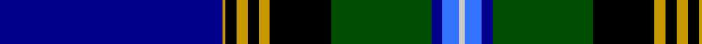

**Bands:** [BYKYKYKGBBW](/stripes/bykykykgbbw/) · **Stripes:** [DB LY K LY K LY K DG DB B LB](/stripes/stripes11/) DB LY K LY K LY K DG DB B LB

This was sourced from register-of-tartans.  It is a [11 band tartan](/bands/bands11/).

Original link https://www.tartanregister.gov.uk/tartanDetails.aspx?ref=4056

## Attestations

This cloth appears in 3 source records; the oldest owns this page.

- 01/01/2002 — Swedish #2 (register-of-tartans, [record](https://www.tartanregister.gov.uk/tartanDetails.aspx?ref=4056))
- pre 2002 — Swedish Dance (District) (tartans-authority, [record](http://www.tartansauthority.com/tartan-ferret/display/5161/))
- undated — Swedish District Tartan Tartan Number: 5161. Earliest known date: pre 2002 Designed and woven by Peter McDonald for a member of Perth Royal Scottish Country Dance Society (RSCDS) who wished it for a Swedish friend. Not intended as "the" Swedish tartan, but to represent a Scottish-Swedish connection and available for any who may wish to use it. See products available Copyright © Blair Urquhart, Comrie, 2015 (house-of-tartan, [record](http://www.house-of-tartan.scotland.net/house/TartanViewjs.asp?colr=Def&tnam=5161))

## Register references

External register numbers recorded for this tartan.

- Scottish Register of Tartans: [4056](https://www.tartanregister.gov.uk/tartanDetails.aspx?ref=4056)
- Scottish Tartans Authority (ITI): 5161

## Thread count
DB/80 DY1 K4 DY4 K4 DY4 K22 G36 DB4 B6 N/2

## Palette
Each colour and its ΔE from the base-6 reference it is a variant of.

| Colour | Shade | Base | ΔE (OKLab) |
|---|---|---|---|
| B | <code style="background-color:#3474FC;">#3474FC</code> `#3474FC` | B <code style="background-color:#2A418A;">#2A418A</code> | 0.22 |
| DB | <code style="background-color:#00008C;">#00008C</code> `#00008C` | B <code style="background-color:#2A418A;">#2A418A</code> | 0.13 |
| DY | <code style="background-color:#C89800;">#C89800</code> `#C89800` | Y <code style="background-color:#F2BF00;">#F2BF00</code> | 0.12 |
| G | <code style="background-color:#004C00;">#004C00</code> `#004C00` | G <code style="background-color:#006100;">#006100</code> | 0.07 |
| K | <code style="background-color:#000000;">#000000</code> `#000000` | K <code style="background-color:#000000;">#000000</code> | 0.00 |
| N | <code style="background-color:#C8C8C8;">#C8C8C8</code> `#C8C8C8` | W <code style="background-color:#F7F7F7;">#F7F7F7</code> | 0.14 |

## Nearest tartans

The nearest existing variants by ΔTartan distance.

1. [MacBeth](/setts/s12/db36ly4k6lr1k1lr1k1dg8r6k1r3lr1~x2/) — ΔT 1.27
1. [MacBeth](/setts/s12/db36ly4k6lr1k1lr1k1dg8r6k1r3lr1/) — ΔT 1.27
1. [Northfield Academy Corporate Tartan Tartan Number: 11490. Earliest known date: 2016, March Northfield is built on Freedom Lands gifted by Robert the Bruce to the Burgh of Aberdeen around 1313 and this Academy design is based on the complex 1782 Aberdeen tartan. The dark blue squares number 56 threads for the year 1956 when the Academy was opened; the maroon is from the original 1956 school badge; the predominantly dark blue and light blue colours represent the colours of the school tie in 2016; the four light blue lines around the white represent the four capacities of Scottish education's Curriculum for Excellence in the 21st century. Finally, the grey remembers the 19th century Cairncry Granite Quarry on part of which, Northfield Academy was built. See products available Copyright © Blair Urquhart, Comrie, 2015](/setts/s15/lr2db1t2db2k1t12db2k1k10db28t1db3t2db3w1~x2/) — ΔT 1.34
1. [Wcwm 1571](/setts/s13/db64r3k3lb2db3r28dg26db3r3k3ly2db3dg16~x2/) — ΔT 1.41
1. [Heart of Scotland Fancy Tartan Tartan Number: 4230. Earliest known date: 1999 October 1999. Designed by Lochcarron of Scotland for 'Gavin' Kiltmaker. They use it for their hire kilts. Colour checked against sample. See products available Copyright © Blair Urquhart, Comrie, 2015](/setts/s10/db5lb1db44m1g12k12m5k2lp2k3~x2/) — ΔT 1.44
1. [Royal Navy](/setts/s12/db4dp8db3dp2db64t24r4db3t4db3w8r4/) — ΔT 1.49
1. [Sidey Family (Dundee) (Personal)](/setts/s10/db4w1k2db25k12db1k2g16k2r1~x2/) — ΔT 1.51
1. [Wcwm 9275-1510-1](/setts/s10/db60lo2db10k9lb2k2r2k2g28lo3~x2/) — ΔT 1.52
1. [MacBeth](/setts/s12/db36ly4k6lb1k1lb1k1dg8r6k1r3lb1/) — ΔT 1.55
1. [Wcwm 1105](/setts/s12/db84r3k16ly4k4lb4k4dg20db8k4db8lb4/) — ΔT 1.59

## Neighbour map

Every grey dot is one of 14313 variants placed by the first two principal components of the ΔTartan feature space (44% of its variance). Red is this tartan; blue dots are its nearest — click one to open its page.

<svg viewBox="0 0 640 380" role="img" style="max-width:100%;height:auto;border:1px solid #e0e0e0;border-radius:4px;display:block" xmlns="http://www.w3.org/2000/svg"><image href="/nn/cloud.v1.png" width="640" height="380"/><a href="/setts/s12/db36ly4k6lr1k1lr1k1dg8r6k1r3lr1~x2/"><circle cx="290.1" cy="63.4" r="4" fill="#3465a4"><title>MacBeth</title></circle></a><a href="/setts/s12/db36ly4k6lr1k1lr1k1dg8r6k1r3lr1/"><circle cx="290.1" cy="63.4" r="4" fill="#3465a4"><title>MacBeth</title></circle></a><a href="/setts/s15/lr2db1t2db2k1t12db2k1k10db28t1db3t2db3w1~x2/"><circle cx="309.0" cy="80.7" r="4" fill="#3465a4"><title>Northfield Academy Corporate Tartan Tartan Number: 11490. Earliest known date: 2016, March Northfield is built on Freedom Lands gifted by Robert the Bruce to the Burgh of Aberdeen around 1313 and this Academy design is based on the complex 1782 Aberdeen tartan. The dark blue squares number 56 threads for the year 1956 when the Academy was opened; the maroon is from the original 1956 school badge; the predominantly dark blue and light blue colours represent the colours of the school tie in 2016; the four light blue lines around the white represent the four capacities of Scottish education's Curriculum for Excellence in the 21st century. Finally, the grey remembers the 19th century Cairncry Granite Quarry on part of which, Northfield Academy was built. See products available Copyright © Blair Urquhart, Comrie, 2015</title></circle></a><a href="/setts/s13/db64r3k3lb2db3r28dg26db3r3k3ly2db3dg16~x2/"><circle cx="272.9" cy="81.5" r="4" fill="#3465a4"><title>Wcwm 1571</title></circle></a><a href="/setts/s10/db5lb1db44m1g12k12m5k2lp2k3~x2/"><circle cx="352.4" cy="88.2" r="4" fill="#3465a4"><title>Heart of Scotland Fancy Tartan Tartan Number: 4230. Earliest known date: 1999 October 1999. Designed by Lochcarron of Scotland for 'Gavin' Kiltmaker. They use it for their hire kilts. Colour checked against sample. See products available Copyright © Blair Urquhart, Comrie, 2015</title></circle></a><a href="/setts/s12/db4dp8db3dp2db64t24r4db3t4db3w8r4/"><circle cx="305.8" cy="70.2" r="4" fill="#3465a4"><title>Royal Navy</title></circle></a><a href="/setts/s10/db4w1k2db25k12db1k2g16k2r1~x2/"><circle cx="229.6" cy="110.2" r="4" fill="#3465a4"><title>Sidey Family (Dundee) (Personal)</title></circle></a><a href="/setts/s10/db60lo2db10k9lb2k2r2k2g28lo3~x2/"><circle cx="349.1" cy="97.6" r="4" fill="#3465a4"><title>Wcwm 9275-1510-1</title></circle></a><a href="/setts/s12/db36ly4k6lb1k1lb1k1dg8r6k1r3lb1/"><circle cx="272.4" cy="53.0" r="4" fill="#3465a4"><title>MacBeth</title></circle></a><a href="/setts/s12/db84r3k16ly4k4lb4k4dg20db8k4db8lb4/"><circle cx="343.5" cy="82.5" r="4" fill="#3465a4"><title>Wcwm 1105</title></circle></a><circle cx="292.9" cy="67.3" r="5" fill="#c00000"/></svg>

ID: /setts/s11/db80ly1k4ly4k4ly4k22dg36db4b6lb2/
