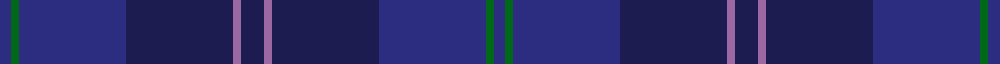

In pattern [BGBBRBRBBGB](/stripes/bgbbrbrbbgb/).

This was sourced from tartans-authority.  It is a [11 stripe tartan](/stripes/stripes11/).

Original link http://www.tartansauthority.com/tartan-ferret/display/7100/

## Attestations

This cloth appears in 2 source records; the oldest owns this page.

- May 2002 — Gravesend Grammar School (Corp) (tartans-authority, [record](http://www.tartansauthority.com/tartan-ferret/display/7100/))
- 01/02/2007 — Gravesend Grammar School for Girls (register-of-tartans, [record](https://www.tartanregister.gov.uk/tartanDetails.aspx?ref=1516))

## Register references

External register numbers recorded for this tartan.

- Scottish Register of Tartans: [1516](https://www.tartanregister.gov.uk/tartanDetails.aspx?ref=1516)
- Scottish Tartans Authority (ITI): 7100

## Thread count
DB/8 G5 DB72 DBa72 LP5 DBa16 LP5 DBa72 DB72 G5 DB/8

## Palette
Each colour and the base-6 reference it is a variant of.

| Colour | Shade | Base |
|---|---|---|
| DB | <code style="background-color:#2C2C80;">#2C2C80</code> `oklch(35.0% 0.138 276.6)` <small>#2C2C80</small> | B <code style="background-color:#2A418A;">#2A418A</code> |
| DBa | <code style="background-color:#1C1C50;">#1C1C50</code> `oklch(26.2% 0.093 277.9)` <small>#1C1C50</small> | B <code style="background-color:#2A418A;">#2A418A</code> |
| G | <code style="background-color:#006818;">#006818</code> `oklch(45.0% 0.142 145.0)` <small>#006818</small> | G <code style="background-color:#006100;">#006100</code> |
| LP | <code style="background-color:#9C68A4;">#9C68A4</code> `oklch(59.4% 0.107 322.0)` <small>#9C68A4</small> | R <code style="background-color:#CC0000;">#CC0000</code> |

## Nearest tartans

The nearest existing variants by ΔTartan distance.

1. [Hughes Welsh Name Tartan Tartan Number: 5756. Earliest known date: 2002 The tartan for this Welsh surname and its variations, Hugh, Hullin, Hullyn, Huws, Pugh, Tugh, Hoell, is actually woven in Wales at the Cambrian Woollen Mill, weaving on the same site since 1830. This tartan differs from many traditional patterns in that the warp and weft differ, giving the finished worsted wool cloth more of a predominant stripe, vertically noticeable in the finished Kilt, or Cilt in Wales. See products available Copyright © Blair Urquhart, Comrie, 2015](/setts/s11/g4db34dt20db4dt8db6r2db5dt2db3g4/) — ΔT 1.40
1. [Hopkins (Welsh Name)](/setts/s12/k5db2k2db2k2dt5db2dt1k1dt1db10k3~x4/) — ΔT 1.65
1. [Goldblatt, Joe Jeff (Personal)](/setts/s9/dp6db4db4db26db12dp3db42y4db4/) — ΔT 1.68
1. [Hughes of Wales](/setts/s20/db34dt20db4dt8db6r2db5dt2db3g4db3dt2db5r2db6dt8db4dt20db34g4/) — ΔT 1.74
1. [Argentina Argentinian District Tartan Tartan Number: 2487. Earliest known date: 1998 Original notes said: Designed by the St Andrew's Society of the River Plate for Scots living in Argentina. But in May 2005 notes were submitted by the designer Edward Macrae, a Scottish-Argentinian who designed the Argentina District Tartan in 1998. It is based in the sett of the Robertson tartan honouring John and William Robertson two Scotsmen from Kelso who started the first settlement of Scottish immigrants in Argentina. 220 emigrants left the port of Leith on board of the Symmetry and arrived in Buenos Aires on August 8, 1825 settling in a ranch 20 miles south-west of the city in the area of Monte Grande and called Santa Catalina. The tartan combines the colours of the Argentine and Scottish flags. Blue, navy blue and white are part of the iconography used in sports and national symbols representing Argentina. See products available Copyright © Blair Urquhart, Comrie, 2015](/setts/s12/db36db3db3db33w3db5w3db33db3db3db36db3~x2/) — ΔT 1.84
1. [Royal Delight](/setts/s11/dp3dp12dp12dp3db18dp3dp2dp3db18dp2r3~x2/) — ΔT 1.89
1. [Payne](/setts/s14/db2k1db4db5dp3db20k8db4k1db2k1db33k1db1~x2/) — ΔT 2.03
1. [Institute of Directors (Scotland)](/setts/s13/dp50lr4dp12dp4dp10dp8dp4dp6dp4dp10k12dp5k42/) — ΔT 2.14
1. [Spirit of Wales](/setts/s18/db24k2dt1db2dt1k2dt22dp2dt4dp2dt22k2dt1db2dt1k2db24w2~x2/) — ΔT 2.20
1. [Little Hunting](/setts/s8/db5db3db4db3db4k28db8r1~x2/) — ΔT 2.28

## Neighbour map

Every grey dot is one of 14299 variants placed by the first two principal components of the ΔTartan feature space (44% of its variance). Red is this tartan; blue dots are its nearest — click one to open its page.

<svg viewBox="0 0 640 380" role="img" style="max-width:100%;height:auto;border:1px solid #e0e0e0;border-radius:4px;display:block" xmlns="http://www.w3.org/2000/svg"><image href="/nn/cloud.v1.png" width="640" height="380"/><a href="/setts/s11/g4db34dt20db4dt8db6r2db5dt2db3g4/"><circle cx="477.4" cy="239.4" r="4" fill="#3465a4"><title>Hughes Welsh Name Tartan Tartan Number: 5756. Earliest known date: 2002 The tartan for this Welsh surname and its variations, Hugh, Hullin, Hullyn, Huws, Pugh, Tugh, Hoell, is actually woven in Wales at the Cambrian Woollen Mill, weaving on the same site since 1830. This tartan differs from many traditional patterns in that the warp and weft differ, giving the finished worsted wool cloth more of a predominant stripe, vertically noticeable in the finished Kilt, or Cilt in Wales. See products available Copyright © Blair Urquhart, Comrie, 2015</title></circle></a><a href="/setts/s12/k5db2k2db2k2dt5db2dt1k1dt1db10k3~x4/"><circle cx="384.7" cy="284.0" r="4" fill="#3465a4"><title>Hopkins (Welsh Name)</title></circle></a><a href="/setts/s9/dp6db4db4db26db12dp3db42y4db4/"><circle cx="384.8" cy="243.7" r="4" fill="#3465a4"><title>Goldblatt, Joe Jeff (Personal)</title></circle></a><a href="/setts/s20/db34dt20db4dt8db6r2db5dt2db3g4db3dt2db5r2db6dt8db4dt20db34g4/"><circle cx="514.7" cy="233.5" r="4" fill="#3465a4"><title>Hughes of Wales</title></circle></a><a href="/setts/s12/db36db3db3db33w3db5w3db33db3db3db36db3~x2/"><circle cx="448.6" cy="260.3" r="4" fill="#3465a4"><title>Argentina Argentinian District Tartan Tartan Number: 2487. Earliest known date: 1998 Original notes said: Designed by the St Andrew's Society of the River Plate for Scots living in Argentina. But in May 2005 notes were submitted by the designer Edward Macrae, a Scottish-Argentinian who designed the Argentina District Tartan in 1998. It is based in the sett of the Robertson tartan honouring John and William Robertson two Scotsmen from Kelso who started the first settlement of Scottish immigrants in Argentina. 220 emigrants left the port of Leith on board of the Symmetry and arrived in Buenos Aires on August 8, 1825 settling in a ranch 20 miles south-west of the city in the area of Monte Grande and called Santa Catalina. The tartan combines the colours of the Argentine and Scottish flags. Blue, navy blue and white are part of the iconography used in sports and national symbols representing Argentina. See products available Copyright © Blair Urquhart, Comrie, 2015</title></circle></a><a href="/setts/s11/dp3dp12dp12dp3db18dp3dp2dp3db18dp2r3~x2/"><circle cx="386.9" cy="275.6" r="4" fill="#3465a4"><title>Royal Delight</title></circle></a><a href="/setts/s14/db2k1db4db5dp3db20k8db4k1db2k1db33k1db1~x2/"><circle cx="491.8" cy="181.6" r="4" fill="#3465a4"><title>Payne</title></circle></a><a href="/setts/s13/dp50lr4dp12dp4dp10dp8dp4dp6dp4dp10k12dp5k42/"><circle cx="416.7" cy="246.6" r="4" fill="#3465a4"><title>Institute of Directors (Scotland)</title></circle></a><a href="/setts/s18/db24k2dt1db2dt1k2dt22dp2dt4dp2dt22k2dt1db2dt1k2db24w2~x2/"><circle cx="428.1" cy="184.0" r="4" fill="#3465a4"><title>Spirit of Wales</title></circle></a><a href="/setts/s8/db5db3db4db3db4k28db8r1~x2/"><circle cx="474.5" cy="230.1" r="4" fill="#3465a4"><title>Little Hunting</title></circle></a><circle cx="463.0" cy="264.4" r="5" fill="#c00000"/></svg>

ID: /setts/s11/db8g5db72db72m5db16m5db72db72g5db8/
