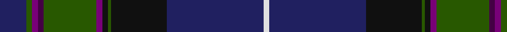

**Bands:** [BGBBGBKGKBW](/stripes/bgbbgbkgkbw/) · **Stripes:** [DB DG DP DP DG DP K DG K DB W](/stripes/stripes11/) DB DG DP DP DG DP K DG K DB W

This was sourced from tartans-authority.  It is a [11 band tartan](/bands/bands11/).

Original link http://www.tartansauthority.com/tartan-ferret/display/6477/

## Thread count
DB/18 G4 P4 DP4 G36 P4 K4 G2 K38 DB66 LN/4

## Palette
Each colour and its ΔE from the base-6 reference it is a variant of.

| Colour | Shade | Base | ΔE (OKLab) |
|---|---|---|---|
| DB | <code style="background-color:#202060;">#202060</code> `#202060` | B <code style="background-color:#2A418A;">#2A418A</code> | 0.11 |
| DP | <code style="background-color:#440044;">#440044</code> `#440044` | B <code style="background-color:#2A418A;">#2A418A</code> | 0.18 |
| G | <code style="background-color:#285800;">#285800</code> `#285800` | G <code style="background-color:#006100;">#006100</code> | 0.03 |
| K | <code style="background-color:#101010;">#101010</code> `#101010` | K <code style="background-color:#000000;">#000000</code> | 0.17 |
| LN | <code style="background-color:#E0E0E0;">#E0E0E0</code> `#E0E0E0` | W <code style="background-color:#F7F7F7;">#F7F7F7</code> | 0.07 |
| P | <code style="background-color:#780078;">#780078</code> `#780078` | B <code style="background-color:#2A418A;">#2A418A</code> | 0.17 |

## Nearest tartans

The nearest existing variants by ΔTartan distance.

1. [McGuirk (2013)](/setts/s12/dg4r1dg1r3dg16k12r1db27lb2db3lb1ly2~x2/) — ΔT 0.70
1. [Sidey Family Tartan (Name)](/setts/s10/db4w1k2db25k12b1k2g16k2r1~x2/) — ΔT 0.75
1. [Scottish Pride (Fashion)](/setts/s11/g6dp2dp2g2dp15g3k2g1k15db43w2~x2/) — ΔT 1.01
1. [McClafferty](/setts/s10/r3g10k12db3k2db2k2db30r4w1~x2/) — ΔT 1.03
1. [Scotland the Brave (Fashion)](/setts/s10/db6w1db40m1k12dg12m6dg2dp2dg4~x2/) — ΔT 1.06
1. [Glen Orchy (Fashion)](/setts/s15/dg5r4m1db36r4dg15r8y1db15r4dg36r4r1db5y1~x2/) — ΔT 1.09
1. [Unidentified #7](/setts/s11/db2r2db2r2db20k24dg12ly1k2dg2t2~x2/) — ΔT 1.12
1. [Rikaco Heirloom (Fashion)](/setts/s10/db3db3db1g26db10n1db3dp5db4lo2~x2/) — ΔT 1.14
1. [Rikaco Classic (Fashion)](/setts/s10/db4b4db1dg24db10r1db2r5b3r2~x2/) — ΔT 1.18
1. [Scragg Moran (Personal)](/setts/s10/g1dt28k11r5w1r5k11lr1k2g1~x2/) — ΔT 1.19

## Neighbour map

Every grey dot is one of 14313 variants placed by the first two principal components of the ΔTartan feature space (44% of its variance). Red is this tartan; blue dots are its nearest — click one to open its page.

<svg viewBox="0 0 640 380" role="img" style="max-width:100%;height:auto;border:1px solid #e0e0e0;border-radius:4px;display:block" xmlns="http://www.w3.org/2000/svg"><image href="/nn/cloud.v1.png" width="640" height="380"/><a href="/setts/s12/dg4r1dg1r3dg16k12r1db27lb2db3lb1ly2~x2/"><circle cx="257.3" cy="111.8" r="4" fill="#3465a4"><title>McGuirk (2013)</title></circle></a><a href="/setts/s10/db4w1k2db25k12b1k2g16k2r1~x2/"><circle cx="275.1" cy="129.6" r="4" fill="#3465a4"><title>Sidey Family Tartan (Name)</title></circle></a><a href="/setts/s11/g6dp2dp2g2dp15g3k2g1k15db43w2~x2/"><circle cx="314.0" cy="95.6" r="4" fill="#3465a4"><title>Scottish Pride (Fashion)</title></circle></a><a href="/setts/s10/r3g10k12db3k2db2k2db30r4w1~x2/"><circle cx="341.0" cy="140.0" r="4" fill="#3465a4"><title>McClafferty</title></circle></a><a href="/setts/s10/db6w1db40m1k12dg12m6dg2dp2dg4~x2/"><circle cx="338.9" cy="103.4" r="4" fill="#3465a4"><title>Scotland the Brave (Fashion)</title></circle></a><a href="/setts/s15/dg5r4m1db36r4dg15r8y1db15r4dg36r4r1db5y1~x2/"><circle cx="287.8" cy="96.8" r="4" fill="#3465a4"><title>Glen Orchy (Fashion)</title></circle></a><a href="/setts/s11/db2r2db2r2db20k24dg12ly1k2dg2t2~x2/"><circle cx="232.5" cy="118.2" r="4" fill="#3465a4"><title>Unidentified #7</title></circle></a><a href="/setts/s10/db3db3db1g26db10n1db3dp5db4lo2~x2/"><circle cx="276.2" cy="123.9" r="4" fill="#3465a4"><title>Rikaco Heirloom (Fashion)</title></circle></a><a href="/setts/s10/db4b4db1dg24db10r1db2r5b3r2~x2/"><circle cx="299.1" cy="153.7" r="4" fill="#3465a4"><title>Rikaco Classic (Fashion)</title></circle></a><a href="/setts/s10/g1dt28k11r5w1r5k11lr1k2g1~x2/"><circle cx="276.5" cy="116.0" r="4" fill="#3465a4"><title>Scragg Moran (Personal)</title></circle></a><circle cx="297.0" cy="119.6" r="5" fill="#c00000"/></svg>

ID: /setts/s11/db9dg2dp2dp2dg18dp2k2dg1k19db33w2~x2/
