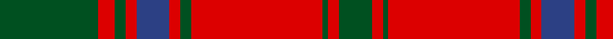

**Bands:** [GRGRGRBRGRG](/stripes/grgrgrbrgrg/) · **Stripes:** [DG R DG R DG R DB R DG R DG](/stripes/stripes11/) DG R DG R DG R DB R DG R DG

This was sourced from register-of-tartans.  It is a [11 band tartan](/bands/bands11/).

Original link https://www.tartanregister.gov.uk/tartanDetails.aspx?ref=2383

## Also known as

This cloth is also recorded under:

- MacDonell of Glengarry #4

## Register references

External register numbers recorded for this tartan.

- Scottish Register of Tartans: [2383](https://www.tartanregister.gov.uk/tartanDetails.aspx?ref=2383)
- Scottish Tartans World Register: 856

## Thread count
G/36 R6 G4 R4 B12 R4 G4 R48 G2 R4 G/12

## Palette
Each colour and its ΔE from the base-6 reference it is a variant of.

| Colour | Shade | Base | ΔE (OKLab) |
|---|---|---|---|
| B | <code style="background-color:#2C4084;">#2C4084</code> `#2C4084` | B <code style="background-color:#2A418A;">#2A418A</code> | 0.01 |
| G | <code style="background-color:#005020;">#005020</code> `#005020` | G <code style="background-color:#006100;">#006100</code> | 0.07 |
| R | <code style="background-color:#DC0000;">#DC0000</code> `#DC0000` | R <code style="background-color:#CC0000;">#CC0000</code> | 0.03 |

## Nearest tartans

The nearest existing variants by ΔTartan distance.

1. [Fraser, Wedding dress](/setts/s13/g2r3db2r48db60r21g2r21g60r48db2r3g2~x2/) — ΔT 0.81
1. [Drummond #3](/setts/s12/dg4r1dg1r28dg8k1dg1k1dg18r1dg1r4~x2/) — ΔT 0.84
1. [MacDonell of Glengarry](/setts/s11/g18r3g2r2db6r2g2r24g1r2g6~x2/) — ΔT 0.86
1. [Grant of Rothiemurchus](/setts/s13/r1g1r32db32r8g1r1g1r8g32r32g1r1~x2/) — ΔT 0.88
1. [Thomas of Wales](/setts/s8/r2db1g2db1g19db2r27g2~x2/) — ΔT 0.94
1. [Fraser, Isabella (Artefact)](/setts/s13/g2r3db2r48db60r21g2r21g60r48db2r3g2/) — ΔT 1.02
1. [Drummond #2](/setts/s12/db24r7dg7r39db4r2db2r5dg42r7db6r7~x2/) — ΔT 1.03
1. [Unidentified Cant #09](/setts/s8/r44db2g26r3db2/) — ΔT 1.03
1. [MacAlister of Glenbarr](/setts/s14/g20r3g6r6g6r8dp2r2g20r2dp2r46dp3r8~x2/) — ΔT 1.05
1. [Drummond](/setts/s12/db24r7g7r39db4r2db2r5g42r7db6r7~x2/) — ΔT 1.05

## Neighbour map

Every grey dot is one of 14299 variants placed by the first two principal components of the ΔTartan feature space (44% of its variance). Red is this tartan; blue dots are its nearest — click one to open its page.

<svg viewBox="0 0 640 380" role="img" style="max-width:100%;height:auto;border:1px solid #e0e0e0;border-radius:4px;display:block" xmlns="http://www.w3.org/2000/svg"><image href="/nn/cloud.v1.png" width="640" height="380"/><a href="/setts/s13/g2r3db2r48db60r21g2r21g60r48db2r3g2~x2/"><circle cx="366.8" cy="134.6" r="4" fill="#3465a4"><title>Fraser, Wedding dress</title></circle></a><a href="/setts/s12/dg4r1dg1r28dg8k1dg1k1dg18r1dg1r4~x2/"><circle cx="396.1" cy="120.3" r="4" fill="#3465a4"><title>Drummond #3</title></circle></a><a href="/setts/s11/g18r3g2r2db6r2g2r24g1r2g6~x2/"><circle cx="363.3" cy="147.3" r="4" fill="#3465a4"><title>MacDonell of Glengarry</title></circle></a><a href="/setts/s13/r1g1r32db32r8g1r1g1r8g32r32g1r1~x2/"><circle cx="389.6" cy="126.8" r="4" fill="#3465a4"><title>Grant of Rothiemurchus</title></circle></a><a href="/setts/s8/r2db1g2db1g19db2r27g2~x2/"><circle cx="404.9" cy="146.8" r="4" fill="#3465a4"><title>Thomas of Wales</title></circle></a><a href="/setts/s13/g2r3db2r48db60r21g2r21g60r48db2r3g2/"><circle cx="365.7" cy="133.1" r="4" fill="#3465a4"><title>Fraser, Isabella (Artefact)</title></circle></a><a href="/setts/s12/db24r7dg7r39db4r2db2r5dg42r7db6r7~x2/"><circle cx="306.7" cy="149.6" r="4" fill="#3465a4"><title>Drummond #2</title></circle></a><a href="/setts/s8/r44db2g26r3db2/"><circle cx="376.6" cy="170.3" r="4" fill="#3465a4"><title>Unidentified Cant #09</title></circle></a><a href="/setts/s14/g20r3g6r6g6r8dp2r2g20r2dp2r46dp3r8~x2/"><circle cx="408.9" cy="136.5" r="4" fill="#3465a4"><title>MacAlister of Glenbarr</title></circle></a><a href="/setts/s12/db24r7g7r39db4r2db2r5g42r7db6r7~x2/"><circle cx="307.4" cy="152.7" r="4" fill="#3465a4"><title>Drummond</title></circle></a><circle cx="360.9" cy="142.6" r="5" fill="#c00000"/></svg>

ID: /setts/s11/dg18r3dg2r2db6r2dg2r24dg1r2dg6~x2/
