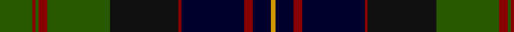

In pattern [GRGRGKRKRKY](/stripes/grgrgkrkrky/).

This was sourced from tartans-authority.  It is a [11 stripe tartan](/stripes/stripes11/).

Original link http://www.tartansauthority.com/tartan-ferret/display/3613/

## Thread count
G/22 DR2 G2 DR6 G42 K46 DR2 DB42 DR6 DB12 DY/3

## Palette
Each colour and its ΔE from the base-6 reference it is a variant of.

| Colour | Shade | Base | ΔE (OKLab) |
|---|---|---|---|
| DB | <code style="background-color:#00002C;">#00002C</code> `#00002C` | K <code style="background-color:#000000;">#000000</code> | 0.16 |
| DR | <code style="background-color:#880000;">#880000</code> `#880000` | R <code style="background-color:#CC0000;">#CC0000</code> | 0.15 |
| DY | <code style="background-color:#D09800;">#D09800</code> `#D09800` | Y <code style="background-color:#F2BF00;">#F2BF00</code> | 0.12 |
| G | <code style="background-color:#285800;">#285800</code> `#285800` | G <code style="background-color:#006100;">#006100</code> | 0.03 |
| K | <code style="background-color:#101010;">#101010</code> `#101010` | K <code style="background-color:#000000;">#000000</code> | 0.17 |

## Nearest tartans

The nearest existing variants by ΔTartan distance.

1. [Thomas, baron of Craigie, Robert (Personal)](/setts/s8/r2k4dt23k14dg16ly1k4ly2~x2/) — ΔT 0.84
1. [Black Gold (Corporate)](/setts/s9/dy3k3dy3k18n28lb1dg22k2dy2~x2/) — ΔT 0.89
1. [Thomas of Craigie (Personal)](/setts/s8/ly2k4ly1dg16k14db23k4r1~x2/) — ΔT 0.90
1. [Ogilvie of Inverarity (V.S.)](/setts/s14/db28ly1db2k26g24k1g2r3~x2/) — ΔT 1.04
1. [Wcwm 1873-5](/setts/s9/k1db8r1dy3r1dy8k4dg14r1~x4/) — ΔT 1.07
1. [Campbell Red](/setts/s13/r3k1dg21k19db19k3db3k3db19k19dg21k1w3~x2/) — ΔT 1.08
1. [Newman](/setts/s11/db10k10db10r2k20w1g10r2g4r2g4~x2/) — ΔT 1.10
1. [Clerke of Ulva Family Tartan Tartan Number: 168. Earliest known date: Unknown Said to have been copied from an old kilt. See products available Copyright © Blair Urquhart, Comrie, 2015](/setts/s11/t3g3k4g14k4g3k14db18m1db4m2~x2/) — ΔT 1.11
1. [Urquhart - 1842 (Clan)](/setts/s12/db4w2db24k3db3k3db8k24g48k3g3r2~x2/) — ΔT 1.14
1. [Lochaber Cameron](/setts/s11/db8t3db40r3k44t3r3g40r2k4r7~x2/) — ΔT 1.14

## Neighbour map

Every grey dot is one of 14299 variants placed by the first two principal components of the ΔTartan feature space (44% of its variance). Red is this tartan; blue dots are its nearest — click one to open its page.

<svg viewBox="0 0 640 380" role="img" style="max-width:100%;height:auto;border:1px solid #e0e0e0;border-radius:4px;display:block" xmlns="http://www.w3.org/2000/svg"><image href="/nn/cloud.v1.png" width="640" height="380"/><a href="/setts/s8/r2k4dt23k14dg16ly1k4ly2~x2/"><circle cx="236.4" cy="172.9" r="4" fill="#3465a4"><title>Thomas, baron of Craigie, Robert (Personal)</title></circle></a><a href="/setts/s9/dy3k3dy3k18n28lb1dg22k2dy2~x2/"><circle cx="222.3" cy="140.2" r="4" fill="#3465a4"><title>Black Gold (Corporate)</title></circle></a><a href="/setts/s8/ly2k4ly1dg16k14db23k4r1~x2/"><circle cx="235.2" cy="165.9" r="4" fill="#3465a4"><title>Thomas of Craigie (Personal)</title></circle></a><a href="/setts/s14/db28ly1db2k26g24k1g2r3~x2/"><circle cx="251.9" cy="123.7" r="4" fill="#3465a4"><title>Ogilvie of Inverarity (V.S.)</title></circle></a><a href="/setts/s9/k1db8r1dy3r1dy8k4dg14r1~x4/"><circle cx="197.4" cy="184.1" r="4" fill="#3465a4"><title>Wcwm 1873-5</title></circle></a><a href="/setts/s13/r3k1dg21k19db19k3db3k3db19k19dg21k1w3~x2/"><circle cx="216.6" cy="164.7" r="4" fill="#3465a4"><title>Campbell Red</title></circle></a><a href="/setts/s11/db10k10db10r2k20w1g10r2g4r2g4~x2/"><circle cx="218.7" cy="167.1" r="4" fill="#3465a4"><title>Newman</title></circle></a><a href="/setts/s11/t3g3k4g14k4g3k14db18m1db4m2~x2/"><circle cx="194.2" cy="166.4" r="4" fill="#3465a4"><title>Clerke of Ulva Family Tartan Tartan Number: 168. Earliest known date: Unknown Said to have been copied from an old kilt. See products available Copyright © Blair Urquhart, Comrie, 2015</title></circle></a><a href="/setts/s12/db4w2db24k3db3k3db8k24g48k3g3r2~x2/"><circle cx="268.3" cy="128.4" r="4" fill="#3465a4"><title>Urquhart - 1842 (Clan)</title></circle></a><a href="/setts/s11/db8t3db40r3k44t3r3g40r2k4r7~x2/"><circle cx="201.9" cy="131.4" r="4" fill="#3465a4"><title>Lochaber Cameron</title></circle></a><circle cx="231.0" cy="151.9" r="5" fill="#c00000"/></svg>

ID: /setts/s11/dg22r2dg2r6dg42k46r2k42r6k12lo3/
