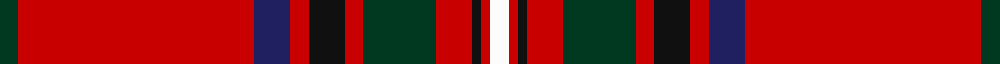

This page is one **sett** — a single exact thread-count. It belongs to the [tartan](/tartans/dg2r26db4r2k4r2dg8r4k1r1w2/)
(the same proportion at any scale), whose colour order is pattern [GRBRKRGRKRW](/stripes/grbrkrgrkrw/).

Sourced from register-of-tartans.  It is a [11 stripe tartan](/stripes/stripes11/).

Original link https://www.tartanregister.gov.uk/tartanDetails.aspx?ref=3954

## Also known as

This cloth is also recorded under:

- Stewart/Stuart of Rothesay

2 attestations — the source records this cloth was collapsed from (oldest owns this page)

<ul>
<li>01/01/1829 — Stewart/Stuart of Rothesay (Sobieski) (register-of-tartans, <a href="https://www.tartanregister.gov.uk/tartanDetails.aspx?ref=3954">record</a>)</li>
<li>1829 — Stewart of Rothesay - 1829 (C Mss) (tartans-authority, <a href="http://www.tartansauthority.com/tartan-ferret/display/847/">record</a>)</li>
</ul>

## Register references

External register numbers recorded for this tartan.

- Scottish Register of Tartans: [3954](https://www.tartanregister.gov.uk/tartanDetails.aspx?ref=3954)
- Scottish Tartans Authority (ITI): 847
- Scottish Tartans World Register: 847

## Thread count
DG/4 R52 DB8 R4 K8 R4 DG16 R8 K2 R2 W/4

## Palette
Each colour and the base-6 reference it is a variant of.

| Colour | Shade | Base |
|---|---|---|
| DB | <code style="background-color:#202060;">#202060</code> `oklch(28.9% 0.111 276.9)` <small>#202060</small> | B <code style="background-color:#2A418A;">#2A418A</code> |
| DG | <code style="background-color:#003820;">#003820</code> `oklch(30.0% 0.070 158.3)` <small>#003820</small> | G <code style="background-color:#006100;">#006100</code> |
| K | <code style="background-color:#101010;">#101010</code> `oklch(17.3% 0.000 89.9)` <small>#101010</small> | K <code style="background-color:#000000;">#000000</code> |
| R | <code style="background-color:#C80000;">#C80000</code> `oklch(52.3% 0.215 29.2)` <small>#C80000</small> | R <code style="background-color:#CC0000;">#CC0000</code> |
| W | <code style="background-color:#FCFCFC;">#FCFCFC</code> `oklch(99.1% 0.000 89.9)` <small>#FCFCFC</small> | W <code style="background-color:#F7F7F7;">#F7F7F7</code> |

## Nearest tartans

The nearest existing variants by ΔTartan distance, with this tartan at the top so the swatches line up against it.

ΔTartan

Tartan

Sett

—

<a href="/ttd/edit/#slug=dg2r26db4r2k4r2dg8r4k1r1w2~x2">Stewart/Stuart of Rothesay (Sobieski)</a> <a class="nn-out" href="/setts/s11/dg2r26db4r2k4r2dg8r4k1r1w2~x2/" title="open its dictionary page">↗</a>

0.56

<a href="/ttd/edit/#slug=g2r26db4r2k4r2g8r4k1r1w2~x2">Stewart of Rothesay</a> <a class="nn-out" href="/setts/s11/g2r26db4r2k4r2g8r4k1r1w2~x2/" title="open its dictionary page">↗</a>

0.76

<a href="/ttd/edit/#slug=r44db3k6lo2k2lo2k10r5k2r3w2~x2">Heritage Plaid</a> <a class="nn-out" href="/setts/s11/r44db3k6lo2k2lo2k10r5k2r3w2~x2/" title="open its dictionary page">↗</a>

0.78

<a href="/ttd/edit/#slug=dg6lb1dg12r4db4r2k4r32dg1r2~x2">Seton</a> <a class="nn-out" href="/setts/s10/dg6lb1dg12r4db4r2k4r32dg1r2~x2/" title="open its dictionary page">↗</a>

0.83

<a href="/ttd/edit/#slug=r23g3ly1g3r2db18r2w1g3r2db2r23~x2">Mair (Personal)</a> <a class="nn-out" href="/setts/s12/r23g3ly1g3r2db18r2w1g3r2db2r23~x2/" title="open its dictionary page">↗</a>

0.83

<a href="/ttd/edit/#slug=r33w1k3w1g13r7k3p3w1~x2">Leach, Leech, Leitch, dress</a> <a class="nn-out" href="/setts/s9/r33w1k3w1g13r7k3p3w1~x2/" title="open its dictionary page">↗</a>

0.84

<a href="/ttd/edit/#slug=r44t3k6k2k2k2k10r5k2r3w2~x2">Hilton Champion Corporate Golf Tartan Tartan Number: 2336. Earliest known date: c.1970 Originally called Hilton Champion, this tartan was designed by Kinloch Anderson for the officials and winning jacket for the Hilton-sponsored Heritage Classic golf tournament. The name was changed to Heritage Plaid in September 2000 See products available Copyright © Blair Urquhart, Comrie, 2015</a> <a class="nn-out" href="/setts/s11/r44t3k6k2k2k2k10r5k2r3w2~x2/" title="open its dictionary page">↗</a>

0.93

<a href="/ttd/edit/#slug=r4w2r3dg6r2dg2r2db16r2lb2r32w2~x2">1745 Trading (Corporate)</a> <a class="nn-out" href="/setts/s12/r4w2r3dg6r2dg2r2db16r2lb2r32w2~x2/" title="open its dictionary page">↗</a>

0.94

<a href="/ttd/edit/#slug=r6w1r24db6dg2k1dg2k1dg12r1~x2">Chisholm #2</a> <a class="nn-out" href="/setts/s10/r6w1r24db6dg2k1dg2k1dg12r1~x2/" title="open its dictionary page">↗</a>

1.02

<a href="/ttd/edit/#slug=r6lb1r24db6dg2k1dg2k1dg12r1">Chisholm VS</a> <a class="nn-out" href="/setts/s10/r6lb1r24db6dg2k1dg2k1dg12r1/" title="open its dictionary page">↗</a>

1.03

<a href="/ttd/edit/#slug=r36lb1db3ly1dg16r8db3lb5">Drummond of Perth</a> <a class="nn-out" href="/setts/s8/r36lb1db3ly1dg16r8db3lb5/" title="open its dictionary page">↗</a>

## Neighbour map

Every grey dot is one of 14299 variants placed by the first two principal components of the ΔTartan feature space (44% of its variance). Red is this tartan; blue dots are its nearest — click one to open its page.

<svg viewBox="0 0 640 380" role="img" style="max-width:100%;height:auto;border:1px solid #e0e0e0;border-radius:4px;display:block" xmlns="http://www.w3.org/2000/svg"><image href="/nn/cloud.v1.png" width="640" height="380"/><a href="/setts/s11/g2r26db4r2k4r2g8r4k1r1w2~x2/"><circle cx="368.8" cy="84.2" r="4" fill="#3465a4"><title>Stewart of Rothesay</title></circle></a><a href="/setts/s11/r44db3k6lo2k2lo2k10r5k2r3w2~x2/"><circle cx="407.7" cy="81.3" r="4" fill="#3465a4"><title>Heritage Plaid</title></circle></a><a href="/setts/s10/dg6lb1dg12r4db4r2k4r32dg1r2~x2/"><circle cx="369.1" cy="88.6" r="4" fill="#3465a4"><title>Seton</title></circle></a><a href="/setts/s12/r23g3ly1g3r2db18r2w1g3r2db2r23~x2/"><circle cx="390.1" cy="102.3" r="4" fill="#3465a4"><title>Mair (Personal)</title></circle></a><a href="/setts/s9/r33w1k3w1g13r7k3p3w1~x2/"><circle cx="375.1" cy="81.7" r="4" fill="#3465a4"><title>Leach, Leech, Leitch, dress</title></circle></a><a href="/setts/s11/r44t3k6k2k2k2k10r5k2r3w2~x2/"><circle cx="399.1" cy="78.5" r="4" fill="#3465a4"><title>Hilton Champion Corporate Golf Tartan Tartan Number: 2336. Earliest known date: c.1970 Originally called Hilton Champion, this tartan was designed by Kinloch Anderson for the officials and winning jacket for the Hilton-sponsored Heritage Classic golf tournament. The name was changed to Heritage Plaid in September 2000 See products available Copyright © Blair Urquhart, Comrie, 2015</title></circle></a><a href="/setts/s12/r4w2r3dg6r2dg2r2db16r2lb2r32w2~x2/"><circle cx="341.3" cy="94.8" r="4" fill="#3465a4"><title>1745 Trading (Corporate)</title></circle></a><a href="/setts/s10/r6w1r24db6dg2k1dg2k1dg12r1~x2/"><circle cx="340.8" cy="103.0" r="4" fill="#3465a4"><title>Chisholm #2</title></circle></a><a href="/setts/s10/r6lb1r24db6dg2k1dg2k1dg12r1/"><circle cx="331.5" cy="102.7" r="4" fill="#3465a4"><title>Chisholm VS</title></circle></a><a href="/setts/s8/r36lb1db3ly1dg16r8db3lb5/"><circle cx="373.1" cy="93.6" r="4" fill="#3465a4"><title>Drummond of Perth</title></circle></a><circle cx="379.6" cy="87.7" r="5" fill="#c00000"/></svg>

ID: /setts/s11/dg2r26db4r2k4r2dg8r4k1r1w2~x2/
