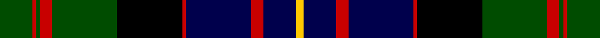

**Bands:** [YBRBRKGRGRG](/stripes/ybrbrkgrgrg/) · **Stripes:** [LY DB R DB R K DG R DG R DG](/stripes/stripes11/) LY DB R DB R K DG R DG R DG

This was sourced from weddslist.  It is a [11 band tartan](/bands/bands11/).

Original link http://www.weddslist.com/cgi-bin/tartans/pg.pl?source=rb

## Also known as

This cloth is also recorded under:

- Cameron of Erracht Regimental

## Attestations

This cloth appears in 2 source records; the oldest owns this page.

- undated — Cameron of Erracht (weddslist, [record](http://www.weddslist.com/cgi-bin/tartans/pg.pl?source=rb))
- undated — Cameron of Erracht (weddslist, [record](http://www.weddslist.com/cgi-bin/tartans/pg.pl?source=x))

## Register references

External register numbers recorded for this tartan.

- Scottish Register of Tartans: [1166](https://www.tartanregister.gov.uk/tartanDetails.aspx?ref=1166)
- Scottish Register of Tartans: [1758](https://www.tartanregister.gov.uk/tartanDetails.aspx?ref=1758)
- Scottish Register of Tartans: [2307](https://www.tartanregister.gov.uk/tartanDetails.aspx?ref=2307)
- Scottish Register of Tartans: [2540](https://www.tartanregister.gov.uk/tartanDetails.aspx?ref=2540)
- Scottish Register of Tartans: [2625](https://www.tartanregister.gov.uk/tartanDetails.aspx?ref=2625)
- Scottish Register of Tartans: [2666](https://www.tartanregister.gov.uk/tartanDetails.aspx?ref=2666)
- Scottish Register of Tartans: [2862](https://www.tartanregister.gov.uk/tartanDetails.aspx?ref=2862)
- Scottish Register of Tartans: [3808](https://www.tartanregister.gov.uk/tartanDetails.aspx?ref=3808)
- Scottish Register of Tartans: [982](https://www.tartanregister.gov.uk/tartanDetails.aspx?ref=982)
- Scottish Tartans Authority (ITI): 1429
- Scottish Tartans Authority (ITI): 218
- Scottish Tartans World Register: 1010
- Scottish Tartans World Register: 1042
- Scottish Tartans World Register: 127
- Scottish Tartans World Register: 1429
- Scottish Tartans World Register: 1585
- Scottish Tartans World Register: 218
- Scottish Tartans World Register: 2218
- Scottish Tartans World Register: 737
- Scottish Tartans World Register: 897

## Variants

Other setts woven to the same stripe pattern.

- [Cameron of Erracht](/setts/s11/dg8r1dg1r3dg16k16r1db16r3db8ly2~x2/)

## Thread count
G/8 R1 G1 R3 G16 K16 R1 DB16 R3 DB8 Y/2

## Palette
Each colour and its ΔE from the base-6 reference it is a variant of.

| Colour | Shade | Base | ΔE (OKLab) |
|---|---|---|---|
| DB | <code style="background-color:#00004C;">#00004C</code> `#00004C` | B <code style="background-color:#2A418A;">#2A418A</code> | 0.21 |
| G | <code style="background-color:#004C00;">#004C00</code> `#004C00` | G <code style="background-color:#006100;">#006100</code> | 0.07 |
| K | <code style="background-color:#000000;">#000000</code> `#000000` | K <code style="background-color:#000000;">#000000</code> | 0.00 |
| R | <code style="background-color:#C80000;">#C80000</code> `#C80000` | R <code style="background-color:#CC0000;">#CC0000</code> | 0.01 |
| Y | <code style="background-color:#FFC800;">#FFC800</code> `#FFC800` | Y <code style="background-color:#F2BF00;">#F2BF00</code> | 0.03 |

## Nearest tartans

The nearest existing variants by ΔTartan distance.

1. [Cameron of Erracht](/setts/s11/dg8r1dg1r3dg16k16r1db16r3db8ly2~x2/) — ΔT 0.49
1. [Clark of Ulva (Clan)](/setts/s11/lt3dg3k4dg14k4dg3k14db18lo1db4lo2~x2/) — ΔT 0.59
1. [MacDonell of Glengarry](/setts/s11/db8r4db12r1k12dg12r3dg2r1dg4lb1~x2/) — ΔT 0.64
1. [MacDonald of Clanranald](/setts/s13/dg8r1dg2r3dg12lb1k12r1db12r3db2r1db8~x2/) — ΔT 0.65
1. [Clerke of Ulva](/setts/s13/lt3dg3k4dg14k4dg3k14db18lo1db4lo2db4lo1~x2/) — ΔT 0.68
1. [MacDonell of Glengarry D](/setts/s13/db8r1db2r3db12r1k12dg12r3dg2r1dg4lb1/) — ΔT 0.73
1. [Clerke of Ulva](/setts/s11/t3g3k4g14k4g3k14db18r1db4r2~x2/) — ΔT 0.74
1. [Clanranald, MacDonald of](/setts/s13/dg16r2dg2r7dg31lb3k32r2db31r7db2r2db16~x2/) — ΔT 0.75
1. [MacDonell of Glengarry](/setts/s11/db8r4db12r1k12dg12r3dg2r1dg4lr1~x2/) — ΔT 0.78
1. [Cavan Irish County Tartan Tartan Number: 2274. Earliest known date: 1996 One of a series of Irish District tartans designed by Polly Wittering of the House of Edgar, with colours reminiscent of the Country with soft warm colours dominating. See products available Copyright © Blair Urquhart, Comrie, 2015](/setts/s10/k3r9k5k9o3k9k5dg24k2o3~x2/) — ΔT 0.79

## Neighbour map

Every grey dot is one of 14299 variants placed by the first two principal components of the ΔTartan feature space (44% of its variance). Red is this tartan; blue dots are its nearest — click one to open its page.

<svg viewBox="0 0 640 380" role="img" style="max-width:100%;height:auto;border:1px solid #e0e0e0;border-radius:4px;display:block" xmlns="http://www.w3.org/2000/svg"><image href="/nn/cloud.v1.png" width="640" height="380"/><a href="/setts/s11/dg8r1dg1r3dg16k16r1db16r3db8ly2~x2/"><circle cx="173.1" cy="161.5" r="4" fill="#3465a4"><title>Cameron of Erracht</title></circle></a><a href="/setts/s11/lt3dg3k4dg14k4dg3k14db18lo1db4lo2~x2/"><circle cx="151.0" cy="149.7" r="4" fill="#3465a4"><title>Clark of Ulva (Clan)</title></circle></a><a href="/setts/s11/db8r4db12r1k12dg12r3dg2r1dg4lb1~x2/"><circle cx="139.4" cy="168.0" r="4" fill="#3465a4"><title>MacDonell of Glengarry</title></circle></a><a href="/setts/s13/dg8r1dg2r3dg12lb1k12r1db12r3db2r1db8~x2/"><circle cx="146.3" cy="158.3" r="4" fill="#3465a4"><title>MacDonald of Clanranald</title></circle></a><a href="/setts/s13/lt3dg3k4dg14k4dg3k14db18lo1db4lo2db4lo1~x2/"><circle cx="161.7" cy="138.7" r="4" fill="#3465a4"><title>Clerke of Ulva</title></circle></a><a href="/setts/s13/db8r1db2r3db12r1k12dg12r3dg2r1dg4lb1/"><circle cx="153.4" cy="153.9" r="4" fill="#3465a4"><title>MacDonell of Glengarry D</title></circle></a><a href="/setts/s11/t3g3k4g14k4g3k14db18r1db4r2~x2/"><circle cx="148.3" cy="145.0" r="4" fill="#3465a4"><title>Clerke of Ulva</title></circle></a><a href="/setts/s13/dg16r2dg2r7dg31lb3k32r2db31r7db2r2db16~x2/"><circle cx="168.2" cy="143.4" r="4" fill="#3465a4"><title>Clanranald, MacDonald of</title></circle></a><a href="/setts/s11/db8r4db12r1k12dg12r3dg2r1dg4lr1~x2/"><circle cx="154.3" cy="176.2" r="4" fill="#3465a4"><title>MacDonell of Glengarry</title></circle></a><a href="/setts/s10/k3r9k5k9o3k9k5dg24k2o3~x2/"><circle cx="137.3" cy="167.7" r="4" fill="#3465a4"><title>Cavan Irish County Tartan Tartan Number: 2274. Earliest known date: 1996 One of a series of Irish District tartans designed by Polly Wittering of the House of Edgar, with colours reminiscent of the Country with soft warm colours dominating. See products available Copyright © Blair Urquhart, Comrie, 2015</title></circle></a><circle cx="159.7" cy="153.9" r="5" fill="#c00000"/></svg>

ID: /setts/s11/dg8r1dg1r3dg16k16r1db16r3db8ly2/
